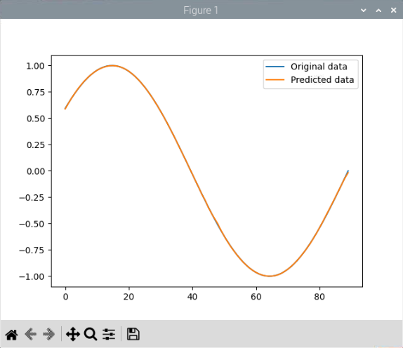

# 簡介 RNN

_想說既然介紹了其他的模型，這裡就隨手寫寫，同學可以無視。_


<br>


## 簡單範例

1. 安裝庫。

    ```bash
    pip install tensorflow numpy matplotlib
    ```

<br>

2. 完整程式碼：這個極簡模型在樹莓派訓練即可，一下就可以完成。

    ```python
    '''
    RNN
    '''
    import numpy as np
    import matplotlib.pyplot as plt
    import tensorflow as tf

    '''產生數據'''
    # 時間步長
    timesteps = 100
    x = np.linspace(0, 2 * np.pi, timesteps)
    y = np.sin(x)


    # 數據預處理
    def create_dataset(y, time_steps=1):
        Xs, ys = [], []
        for i in range(len(y) - time_steps):
            v = y[i: (i + time_steps)]
            Xs.append(v)
            ys.append(y[i + time_steps])
        return np.array(Xs), np.array(ys)


    time_steps = 10
    X, y = create_dataset(y, time_steps)

    # 重塑為 [樣本, 時間步長, 特徵]
    X = np.reshape(X, (X.shape[0], X.shape[1], 1))

    # 建立模型：RNN
    model = tf.keras.models.Sequential(
        [
            tf.keras.layers.SimpleRNN(
                50, activation="relu",
                input_shape=(time_steps, 1)
            ),
            tf.keras.layers.Dense(1),
        ]
    )

    # 編譯模型
    model.compile(
        optimizer="adam", loss="mean_squared_error"
    )

    # 訓練模型
    model.fit(X, y, epochs=100, batch_size=32, verbose=1)

    # 進行預測
    predicted = model.predict(X)

    # 繪製結果
    plt.plot(y, label="Original data")
    plt.plot(predicted, label="Predicted data")
    plt.legend()
    plt.show()

    ```

<br>

2. 繪製圖型。

    

<br>

## 進階範例

_補_

<br>

---

_END_