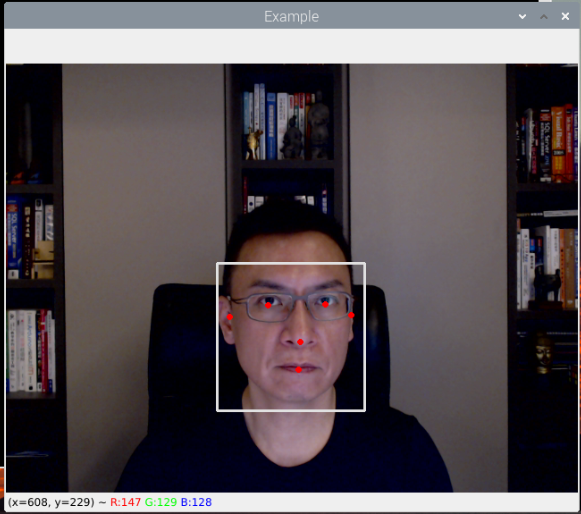
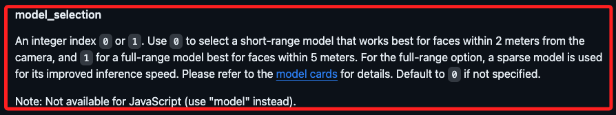

# MEDIAPIPE

_媒體機器學習框架，可訪問 [官網](https://developers.google.com/mediapipe) 進一步瞭解。_

<br>

## 簡介與特色

MediaPipe 是一個由 Google Research 開發的開源跨平台框架，專注於構建多媒體相關的機器學習管道，它提供了豐富的預建模組，使開發者能夠輕鬆地構建複雜的視覺和音頻處理管道。

1. 多平台支持：可在移動裝置、邊緣設備及雲端環境中運行。
2. 彈性設計：允許快速原型開發和實驗，同時也支持高效的生產部署。
3. 豐富的應用範例：包括臉部標記偵測、手勢識別、物體追蹤等。
4. 易於整合：能夠與其他機器學習框架如 TensorFlow 相結合。

<br>

## 準備工作

1. 建立虛擬環境。

   ```bash
   python -m venv envMediaPipe
   ```

<br>

2. 安裝套件。

   ```bash
   pip install opencv-python mediapipe tensorflow
   ```

<br>

3. 專案架構

   ```python
   '''
   1. 導入所需的函式庫
   '''

   '''
   2. 初始化：攝像頭、模型與工具
   '''

   '''
   3. 進行偵測
   '''

   '''
   4. 結束程序：釋放資源並關閉視窗
   '''
   ```

<br>

## 撰寫第一個範例

_以下將完整專案切割為局部程式碼區塊，並無缺漏部分，可嘗試進行組裝。_

<br>

1. 以下測試專案改寫自 [官網範例](https://github.com/google/mediapipe/blob/master/docs/solutions/face_detection.md) ，相關變數皆沿用官網範例的命名，方便同學實作時可與官方文件接軌。

<br>

2. 導入所需的函式庫。

   ```python
   # 導入所需的套件
   # OpenCV
   import cv2
   # MediaPipe
   import mediapipe as mp
   # 系統功能
   import sys
   ```

<br>

3. 初始化：攝像頭、模型與工具。

   ```python
   # 初始化攝像頭：index=0，設定為第一個設備
   cap = cv2.VideoCapture(0)
   # 初始化人臉偵測功能：使用 face_detection 模型
   mp_face_detection = mp.solutions.face_detection
   # 初始化繪圖工具
   mp_drawing = mp.solutions.drawing_utils
   ```

<br>

4. 進行偵測：先初始化偵測對象。

   ```python
   # 初始化 FaceDetection 類的對象
   with mp_face_detection.FaceDetection(
       # 表示選擇特定的人臉偵測模型
       model_selection=0,
       # 偵測的最小信心閾值，越高代表對偵測結果要求更嚴格
       min_detection_confidence=0.5) as face_detection:
           pass
           # 以下先空白 ...
   ```

<br>

5. 檢查攝像頭狀態。

   ```python
   # 檢查攝像頭是否開啟
   if not cap.isOpened():
       print("無法開啟攝像頭")
       # 結束程序：使用退出代碼「1」表示為異常退出
       sys.exit(1)
   ```

<br>

6. 透過附帶條件的無線迴圈捕捉影像。

   ```python
   # 假如攝像頭是開啟狀態
   # 透過附帶條件的無線迴圈捕捉影像
   while True:
       # 讀取影像，返回兩個值，第一個是布林值代表是否成功
       success, img = cap.read()
       # 假如不成功
       if not success:
           print("無法獲取畫面")
           # 中斷迴圈
           break
       # 假如成功 ....
       # 接續以下程序
   ```

<br>

7. 假如在該次迴圈中讀取影像成功。

   ```python
   # 轉換為 MediaPipe 可處理的格式
   # 將 writeable 屬性設置為 False 
   # 要將影像數據傳給函數進行大量處理或轉換時使用
   # 有助於提高性能和降低內存使用
   img.flags.writeable = False
   # 轉換格式 COLOR_BGR2RGB
   img = cv2.cvtColor(img, cv2.COLOR_BGR2RGB)

   # 進行人臉偵測
   results = face_detection.process(img)

   # 轉換為 OpenCV 可處理的格式
   img.flags.writeable = True
   # 轉換格式 COLOR_RGB2BGR
   img = cv2.cvtColor(img, cv2.COLOR_RGB2BGR)

   # 如果有偵測到人臉，進行標記
   if results.detections:
       # 輸出查看一下結果數
       print(f'偵測到 {len(results.detections)} 張臉')
       # 遍歷
       for detection in results.detections:
           mp_drawing.draw_detection(img, detection)

   # 顯示影像並設置標題
   cv2.imshow('Example', img)
    
    # 檢查是否有按下'ESC'、'q'鍵或關閉視窗
    key = cv2.waitKey(1) & 0xFF
    if (
        key == 27
        or key == ord("q")
        or cv2.getWindowProperty("Example", cv2.WND_PROP_VISIBLE) < 1
    ):
        break
   ```

<br>

8. 主動結束程序。

   ```python
   # 釋放攝像頭資源
   cap.release()
   # 關閉 OpenCV 視窗
   cv2.destroyAllWindows()
   ```

<br>

9. 成果顯示。

    

<br>

## 範例

1. 以下程式碼與上方切割區塊的程式碼有一個邏輯不一樣，就是將 `with mp_face_detection.FaceDetection` 進行例外捕捉，並將釋放程序放在 `finally` 的區塊中，這是為了更嚴謹地讓腳本無論在哪一種狀況下結束，都能利用 `finally` 機制進行資源釋放，無論腳本結束時是否自動釋放資源，就程序邏輯來說這樣是相對合理的撰寫。

   ```python
   try:
       '''
       進行偵測
       '''
       with mp_face_detection.FaceDetection() as face_detection:
           # 原本的程式碼...

   finally:
       # 將釋放資源與關閉視窗的區塊置入
       cap.release()
       cv2.destroyAllWindows()
   ```

<br>

2. 關於模型選擇的參數 `model_selection` 可參考 [官網說明](https://github.com/google/mediapipe/blob/master/docs/solutions/face_detection.md) ，參數有 0 或 1 兩個選項，模型 0 適合距離攝影機 2 公尺以內的短距離人臉偵測，模型 1 適合 2 - 5 公尺的人臉偵測。

    

<br>

3. 完整程式碼：加入例外捕捉，其餘皆相同。

    ```python
    """
    導入所需的函式庫
    """
    # 導入所需的套件
    # OpenCV
    import cv2

    # MediaPipe
    import mediapipe as mp

    # 系統功能
    import sys

    """
    初始化：攝像頭、模型與工具
    """
    # 初始化攝像頭：index=0，設定為第一個設備
    cap = cv2.VideoCapture(0)
    # 初始化人臉偵測功能：使用 face_detection 模型
    mp_face_detection = mp.solutions.face_detection
    # 初始化繪圖工具
    mp_drawing = mp.solutions.drawing_utils

    try:
        """
        進行偵測
        """
        # 初始化 FaceDetection 類的對象
        with mp_face_detection.FaceDetection(
            # 表示選擇特定的人臉偵測模型
            model_selection=0,
            # 偵測的最小信心閾值，越高代表對偵測結果要求更嚴格
            min_detection_confidence=0.5,
        ) as face_detection:
            # 檢查攝像頭是否開啟
            if not cap.isOpened():
                print("無法開啟攝像頭")
                # 結束程序：使用退出代碼「1」表示為異常退出
                sys.exit(1)

            # 假如攝像頭是開啟狀態
            # 透過附帶條件的無線迴圈捕捉影像
            while True:
                # 讀取影像，返回兩個值，第一個是布林值代表是否成功
                success, img = cap.read()
                # 假如不成功
                if not success:
                    print("無法獲取畫面")
                    # 中斷迴圈
                    break

                # 轉換為 MediaPipe 可處理的格式
                # 將 writeable 屬性設置為 False
                # 要將影像數據傳給函數進行大量處理或轉換時使用
                # 有助於提高性能和降低內存使用
                img.flags.writeable = False
                # 轉換格式 COLOR_BGR2RGB
                img = cv2.cvtColor(img, cv2.COLOR_BGR2RGB)

                # 進行人臉偵測
                results = face_detection.process(img)

                # 轉換為 OpenCV 可處理的格式
                img.flags.writeable = True
                # 轉換格式 COLOR_RGB2BGR
                img = cv2.cvtColor(img, cv2.COLOR_RGB2BGR)

                # 如果有偵測到人臉，進行標記
                if results.detections:
                    # 輸出查看一下結果數
                    print(f"偵測到 {len(results.detections)} 張臉")
                    # 遍歷
                    for detection in results.detections:
                        mp_drawing.draw_detection(img, detection)

                # 顯示影像並設置標題
                cv2.imshow("Example", img)

                # 檢查是否有按下'ESC'、'q'鍵或關閉視窗
                key = cv2.waitKey(1) & 0xFF
                if (
                    key == 27
                    or key == ord("q")
                    or cv2.getWindowProperty("Example", cv2.WND_PROP_VISIBLE) < 1
                ):
                    break
    finally:
        """
        結束程序：釋放資源並關閉視窗
        """
        # 釋放攝像頭資源
        cap.release()
        # 關閉 OpenCV 視窗
        cv2.destroyAllWindows()

    ```

<br>

4. 同學也可以參考 [官網的完整範例](https://github.com/google/mediapipe/blob/master/docs/solutions/face_detection.md) ，內容基本上是一樣的。


<br>

## 重點提示

1. 因為不同工具對影像顏色通道的處理方式不同，其中 OpenCV、MediaPipe 讀取影像時默認使用 BGR 格式，所以使用 OpenCV、MediaPipe 進行識別時，需將影像從 BGR 轉換成 RGB，這類轉換在後續腳本中會不斷地使用，在此統一說明後不再贅述。

<br>

2. 在使用 OpenCV 的 `cv2.resize()` 函數時，參數的順序是 `(寬度, 高度)`，如 `cv2.resize(img, (800, 600))`，而透過 Numpy 的 `.shape` 屬性來獲取影像尺寸時，返回的順序是 (高度, 寬度, 通道數)，兩者順序是不同的，要特別注意。

<br>

---

_END_
