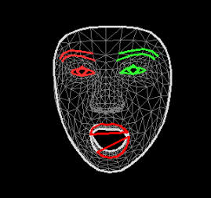
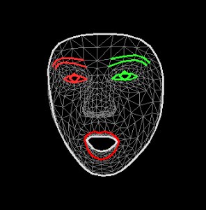
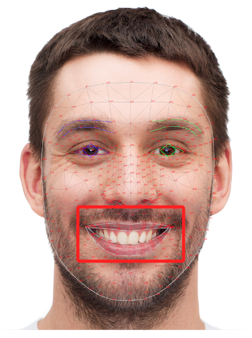
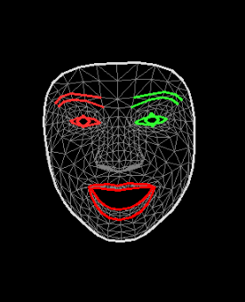
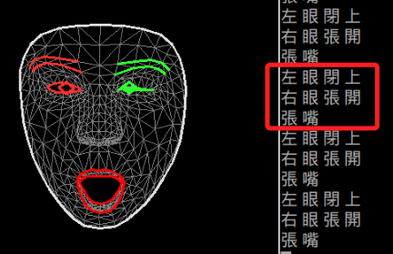

# 屏障人像

_這個範例以前一小節的腳本為基礎，添加一個黑色布幕，讓畫面僅顯示特徵網格。_

<br>

## 說明

_程式碼以前一個範例作為基礎_

<br>

1. 導入新的函數 `numpy` ，這將用在繪製布幕時調用 `.zeros` 使用。

    ```python
    import numpy as np
    ```

<br>


2. 添加黑色布幕遮蔽人像：先自訂視窗大小，然後建立一塊黑色布幕，在 `cap.read()` 確定取得影像後添加以下成始碼。

    ```python
    # 原本的程式碼 ...
    success, img = cap.read()
    if not success:
        print("無法開啟攝像頭")
        break
    
    # 取得影像之後添加以下程序 ...
    
    # 設置視窗尺寸為 寬x高 800x600
    img = cv2.resize(img, (800, 600))
    # 繪製 800x600 的黑色畫布
    # 特別注意 zeros 的參數是先 column(高) 然後 row(寬)，所以順序相反
    # 3 代表標準的 RGB 顏色模型，即紅色、綠色和藍色
    # dtype 指定陣列中數據的類型，uint8 表示範圍從 0 到 255
    black_cover = np.zeros((600, 800, 3), dtype='uint8')
    ```

<br>

3. 在取得 `multi_face_landmarks` 之後，調用自訂的繪圖函數，將黑色布幕及特徵作為參數傳入。

    ```python
    # 原本的程式碼 ...
    if results.multi_face_landmarks:
        for face_landmarks in results.multi_face_landmarks:

        # 添加以下部分 ...
        
        # 調用自訂函數：傳入布幕以及特徵
        draw_face_annotations(black_cover, face_landmarks)
    ```

<br>

4. 修改原本顯示影像時調用 `imshow` 的參數，第二個參數將黑幕傳入。

    ```python
    # 標題，背景使用黑幕
    cv2.imshow('Black Cover', black_cover)
    ```

<br>

## 完整範例

1. 程式碼。

    ```python
    """
    繪製臉部網格以及眉毛、眼睛
    """
    # 匯入 OpenCV-python 庫
    import cv2

    # 匯入 MediaPipe 庫，用於人臉偵測和網格繪製
    import mediapipe as mp
    import sys
    import numpy as np

    # 定義嘴巴上下唇的標記索引
    UPPER_LIP = [61, 40, 37, 0, 267, 269, 270, 409]
    LOWER_LIP = [291, 375, 321, 405, 314, 17, 84, 181]
    # 左右眼的上下眼瞼特徵的索引
    LEFT_EYE_UPPER = [386, 374, 373, 390, 388, 466]
    LEFT_EYE_LOWER = [263, 249, 390, 373, 374, 380]
    RIGHT_EYE_UPPER = [159, 145, 144, 163, 161, 246]
    RIGHT_EYE_LOWER = [33, 133, 163, 144, 145, 153]

    # 設定繪製網格點和連接線等標記的工具
    mp_drawing = mp.solutions.drawing_utils
    # mediapipe 繪圖樣式
    mp_drawing_styles = mp.solutions.drawing_styles
    # 引入人臉網格偵測功能，其中屬性 face_mesh 是一個用來識別並繪製人臉高精度網格點的模型
    mp_face_mesh = mp.solutions.face_mesh

    # 自訂繪圖參數：調用 draw_face_annotations() 函數時可使用預設值，也可傳入自訂的參數
    # 兩個參數都是整數
    MY_DRAWING_SPEC = mp_drawing.DrawingSpec(thickness=1, circle_radius=1)


    # 自訂函數：檢測眼睛是否閉合
    def is_eye_closed(eye_upper, eye_lower, landmarks, threshold=0.02):
        upper_points = [landmarks.landmark[i] for i in eye_upper]
        lower_points = [landmarks.landmark[i] for i in eye_lower]

        distance = sum(
            [abs(upper.y - lower.y) for upper, lower in zip(
                upper_points, lower_points
            )]
        ) / len(upper_points)
        return distance < threshold


    # 偵測嘴巴是否開啟
    def is_mouth_open(face_landmarks):
        # 計算嘴唇開合的平均距離
        mouth_open = 0
        for i in range(len(UPPER_LIP)):
            mouth_open += abs(
                face_landmarks.landmark[UPPER_LIP[i]].y
                - face_landmarks.landmark[LOWER_LIP[i]].y
            )

        mouth_open /= len(UPPER_LIP)
        # print("嘴形閉合的閥值：", mouth_open)
        # 根據實際情況設定閾值，
        return mouth_open > 0.03


    # 封裝繪製臉部標示的函數
    def draw_face_annotations(_image, _landmarks, _drawing_spec=None):
        # 繪製網格
        mp_drawing.draw_landmarks(
            image=_image,
            landmark_list=_landmarks,
            connections=mp_face_mesh.FACEMESH_TESSELATION,
            # 預設為 None
            landmark_drawing_spec=_drawing_spec,
            connection_drawing_spec=mp_drawing_styles.
            get_default_face_mesh_tesselation_style(),
        )

        # 繪製輪廓
        mp_drawing.draw_landmarks(
            image=_image,
            landmark_list=_landmarks,
            connections=mp_face_mesh.FACEMESH_CONTOURS,
            landmark_drawing_spec=_drawing_spec,
            connection_drawing_spec=mp_drawing_styles.
            get_default_face_mesh_contours_style(),
        )

        # 繪製眼睛
        mp_drawing.draw_landmarks(
            image=_image,
            landmark_list=_landmarks,
            connections=mp_face_mesh.FACEMESH_IRISES,
            landmark_drawing_spec=_drawing_spec,
            connection_drawing_spec=mp_drawing_styles.
            get_default_face_mesh_iris_connections_style(),
        )


    # 初始化攝像頭：index=0，設定為第一個設備
    cap = cv2.VideoCapture(0)

    # 啟用人臉網格偵測，設定相關參數
    with mp_face_mesh.FaceMesh(
        # 一次偵測最多幾個人臉
        max_num_faces=1,
        refine_landmarks=True,
        min_detection_confidence=0.5,
        min_tracking_confidence=0.5,
    ) as face_mesh:
        if not cap.isOpened():
            print("無法開啟攝像頭")
            sys.exit(1)

        while True:
            success, img = cap.read()
            if not success:
                print("無法開啟攝像頭")
                break
            #
            # 設置視窗尺寸為 寬x高 800x600
            img = cv2.resize(img, (800, 600))
            # 繪製 800x600 的黑色畫布
            # 特別注意 zeros 的參數是先 column(高) 然後 row(寬)，所以順序相反
            # 3 代表標準的 RGB 顏色模型，即紅色、綠色和藍色
            # dtype 指定陣列中數據的類型，uint8 表示範圍從 0 到 255
            black_cover = np.zeros((600, 800, 3), dtype='uint8')

            # 顏色 BGR 轉換為 RGB
            img2 = cv2.cvtColor(img, cv2.COLOR_BGR2RGB)
            # 取得人臉網格資訊
            results = face_mesh.process(img2)
            if results.multi_face_landmarks:
                for face_landmarks in results.multi_face_landmarks:
                    # 調用自訂函數：傳入布幕以及特徵
                    draw_face_annotations(black_cover, face_landmarks)
                    # 左右眼分開判斷
                    left_eye_closed = is_eye_closed(
                        LEFT_EYE_UPPER, LEFT_EYE_LOWER,
                        face_landmarks, threshold=0.005
                    )
                    right_eye_closed = is_eye_closed(
                        RIGHT_EYE_UPPER, RIGHT_EYE_LOWER,
                        face_landmarks, threshold=0.005
                    )

                    # 輸出結果
                    # 這裡僅是將結果輸出，在應用的專案中可連動其他邏輯程序
                    if left_eye_closed:
                        print("左眼閉上")
                    else:
                        print("左眼張開")

                    if right_eye_closed:
                        print("右眼閉上")
                    else:
                        print("右眼張開")
                    # 調用自訂函數
                    # 調用自訂函數 is_mouth_open
                    if is_mouth_open(face_landmarks):
                        print("張嘴")
                    else:
                        print("閉嘴")

                    # 使用預設值
                    draw_face_annotations(img, face_landmarks)
                    # 使用自訂參數設定值
                    # draw_face_annotations(img, face_landmarks, MY_DRAWING_SPEC)

            # 顯示影像並設置標題
            cv2.imshow("Black Cover", black_cover)
            # 檢查是否有按下'ESC'、'q'鍵或關閉視窗
            key = cv2.waitKey(1) & 0xFF
            if (
                key == 27
                or key == ord("q")
                or cv2.getWindowProperty("Black Cover", cv2.WND_PROP_VISIBLE) < 1
            ):
                break

    cap.release()
    cv2.destroyAllWindows()

    ```

<br>

## 補充

_繪製嘴唇外輪廓_

<br>

## 說明

1. 添加一個繪製唇形外輪廓的函數。

    ```python
    # 自定義繪製嘴唇外輪廓的函數
    def draw_lips(
        image, landmarks, upper_lip_indices, lower_lip_indices,
        color=(0, 0, 255), thickness=2
    ):
        # 獲取上下唇的點座標
        upper_lip = [landmarks.landmark[i] for i in upper_lip_indices]
        lower_lip = [landmarks.landmark[i] for i in lower_lip_indices]

        # 將landmark 座標轉換為圖像上的像素座標
        img_height, img_width, _ = image.shape
        upper_lip_points = [
            (
                int(point.x * img_width), int(point.y * img_height)
            ) for point in upper_lip
        ]
        lower_lip_points = [
            (
                int(point.x * img_width), int(point.y * img_height)
            ) for point in lower_lip
        ]

        # 繪製上下唇輪廓
        cv2.polylines(
            image, [np.array(upper_lip_points, dtype=np.int32)],
            isClosed=True, color=color, thickness=thickness
        )
        cv2.polylines(
            image, [np.array(lower_lip_points, dtype=np.int32)],
            isClosed=True, color=color, thickness=thickness
        )
    ```

<br>

2. 在最後面調用。

    ```python
    # 封裝繪製臉部標示的函數
    def draw_face_annotations(_image, _landmarks, _drawing_spec=None):
        
        # 其他不變 ...
        
        # 在最後面調用添加的函數

        # 繪製嘴唇輪廓
        draw_lips(_image, _landmarks, UPPER_LIP, LOWER_LIP)
    ```

<br>

3. 使用原本的嘴唇特徵索引，發現有細部的錯誤，這細微錯誤在偵測嘴巴閉合的時候影響不大。

    ```python
    # 原有的唇形特徵索引
    UPPER_LIP = [61, 40, 37, 0, 267, 269, 270, 409]
    LOWER_LIP = [291, 375, 321, 405, 314, 17, 84, 181]
    ```

    

<br>

4. 力求精準，修正唇形的索引，不過繪製結果缺少內輪廓。

    ```python
    # 更新的唇形特徵索引
    UPPER_LIP = [
        61, 185, 40, 39, 37, 0, 267, 269, 270, 409,
        291, 375, 321, 405, 314, 17, 84, 181, 91, 146
    ]
    LOWER_LIP = [
        146, 91, 181, 84, 17, 314, 405, 321, 375, 291,
        409, 270, 269, 267, 0, 37, 39, 40, 185, 61
    ]
    ```

    

<br>

5. 想要更精準地繪製如同 [官網說明](https://developers.google.com/mediapipe/solutions/vision/face_landmarker/) 相片中的特徵，需進一步修改特徵索引以及繪製函數。

    

<br>

6. 首先修正特徵索引，將上下唇都分做內外輪廓。

    ```python
    # 上唇外輪廓
    UPPER_LIP_OUTER = [
        61, 185, 40, 39, 37, 0, 267, 269, 270, 409,
        291, 375, 321, 405, 314, 17, 84, 181, 91, 146
    ]
    # 上唇內輪廓
    UPPER_LIP_INNER = [
        78, 95, 88, 178, 87, 14, 317, 402, 318, 324,
        308, 324, 318, 402, 317, 14, 87, 178, 88, 95
    ]
    # 下唇外輪廓
    LOWER_LIP_OUTER = [
        146, 91, 181, 84, 17, 314, 405, 321, 375, 291,
        409, 270, 269, 267, 0, 37, 39, 40, 185, 61
    ]
    # 下唇內輪廓
    LOWER_LIP_INNER = [
        78, 191, 80, 81, 82, 13, 312, 311, 310, 415,
        308, 415, 310, 311, 312, 13, 82, 81, 80, 191
    ]
    ```

<br>

7. 修改繪製唇形的函數，重新命名為 `draw_lips_new()` 。

    ```python
    # 重新定義繪製上下唇輪廓的函數
    def draw_lips_new(
        image, landmarks,
        upper_outer_indices, lower_outer_indices,
        upper_inner_indices, lower_inner_indices,
        color=(0, 0, 255), thickness=2
    ):
        # 上唇外輪廓點點座標
        upper_lip_outer = [landmarks.landmark[i] for i in upper_outer_indices]
        # 下唇外輪廓點點座標
        lower_lip_outer = [landmarks.landmark[i] for i in lower_outer_indices]
        # 上唇內輪廓點點座標
        upper_lip_inner = [landmarks.landmark[i] for i in upper_inner_indices]
        # 下唇內輪廓點點座標
        lower_lip_inner = [landmarks.landmark[i] for i in lower_inner_indices]

        # 將 landmark 座標轉換為圖像上的像素座標
        img_height, img_width, _ = image.shape
        ul_outer_points = [
            (
                int(point.x * img_width), int(point.y * img_height)
            ) for point in upper_lip_outer
        ]
        ll_outer_points = [
            (
                int(point.x * img_width), int(point.y * img_height)
            ) for point in lower_lip_outer
        ]
        ul_inner_points = [
            (
                int(point.x * img_width), int(point.y * img_height)
            ) for point in upper_lip_inner
        ]
        ll_inner_points = [
            (
                int(point.x * img_width), int(point.y * img_height)
            ) for point in lower_lip_inner
        ]

        # 繪製上唇外輪廓
        cv2.polylines(
            image, [np.array(ul_outer_points, dtype=np.int32)],
            isClosed=True, color=color, thickness=thickness
        )
        # 繪製下唇外輪廓
        cv2.polylines(
            image, [np.array(ll_outer_points, dtype=np.int32)],
            isClosed=True, color=color, thickness=thickness
        )
        # 繪製上唇內輪廓
        cv2.polylines(
            image, [np.array(ul_inner_points, dtype=np.int32)],
            isClosed=True, color=color, thickness=thickness
        )
        # 繪製下唇內輪廓
        cv2.polylines(
            image, [np.array(ll_inner_points, dtype=np.int32)],
            isClosed=True, color=color, thickness=thickness
        )
    ```

<br>

8. 將原本調用的 `draw_lips()` 註解，改調用新制定的函數 `draw_lips_new()` 。

    ```python
    # 繪製嘴唇輪廓原本的
        # draw_lips(_image, _landmarks, UPPER_LIP, LOWER_LIP)
        # 調用新的繪製唇形輪廓函數
        draw_lips_new(
            image=_image,
            landmarks=_landmarks,
            upper_outer_indices=UPPER_LIP_OUTER,
            lower_outer_indices=LOWER_LIP_OUTER,
            upper_inner_indices=UPPER_LIP_INNER,
            lower_inner_indices=LOWER_LIP_INNER,
            # 顏色
            color=(0, 0, 255),
            # 線條粗細
            thickness=2
        )
    ```

<br>

9. 完成圖示。

    

<br>

10. 也可以偵測眼睛與嘴巴的閉合。

    

<br>

11. 關於其他更多的特徵關鍵索引可參考 [官網說明](https://github.com/google/mediapipe/tree/a908d668c730da128dfa8d9f6bd25d519d006692/mediapipe) ，或參考 [這裡](https://github.com/tensorflow/tfjs-models/blob/838611c02f51159afdd77469ce67f0e26b7bbb23/face-landmarks-detection/src/mediapipe-facemesh/keypoints.ts) 。

<br>

12. 完整程式碼：這個練習先到這裡打住，程式碼太長已經不方便閱讀了。

    ```python
    """
    繪製臉部網格以及眉毛、眼睛
    """
    # 匯入 OpenCV-python 庫
    import cv2

    # 匯入 MediaPipe 庫，用於人臉偵測和網格繪製
    import mediapipe as mp
    import sys
    import numpy as np

    # 定義嘴巴上下唇的標記索引
    # UPPER_LIP = [61, 40, 37, 0, 267, 269, 270, 409]
    # LOWER_LIP = [291, 375, 321, 405, 314, 17, 84, 181]
    # 更新的唇形特徵索引
    UPPER_LIP = [
        61, 185, 40, 39, 37, 0, 267, 269, 270, 409,
        291, 375, 321, 405, 314, 17, 84, 181, 91, 146
    ]
    LOWER_LIP = [
        146, 91, 181, 84, 17, 314, 405, 321, 375, 291,
        409, 270, 269, 267, 0, 37, 39, 40, 185, 61
    ]
    # 上唇外輪廓
    UPPER_LIP_OUTER = [
        61, 185, 40, 39, 37, 0, 267, 269, 270, 409,
        291, 375, 321, 405, 314, 17, 84, 181, 91, 146
    ]
    # 上唇內輪廓
    UPPER_LIP_INNER = [
        78, 95, 88, 178, 87, 14, 317, 402, 318, 324,
        308, 324, 318, 402, 317, 14, 87, 178, 88, 95
    ]
    # 下唇外輪廓
    LOWER_LIP_OUTER = [
        146, 91, 181, 84, 17, 314, 405, 321, 375, 291,
        409, 270, 269, 267, 0, 37, 39, 40, 185, 61
    ]
    # 下唇內輪廓
    LOWER_LIP_INNER = [
        78, 191, 80, 81, 82, 13, 312, 311, 310, 415,
        308, 415, 310, 311, 312, 13, 82, 81, 80, 191
    ]
    # 左右眼的上下眼瞼特徵的索引
    LEFT_EYE_UPPER = [386, 374, 373, 390, 388, 466]
    LEFT_EYE_LOWER = [263, 249, 390, 373, 374, 380]
    RIGHT_EYE_UPPER = [159, 145, 144, 163, 161, 246]
    RIGHT_EYE_LOWER = [33, 133, 163, 144, 145, 153]

    # 設定繪製網格點和連接線等標記的工具
    mp_drawing = mp.solutions.drawing_utils
    # mediapipe 繪圖樣式
    mp_drawing_styles = mp.solutions.drawing_styles
    # 引入人臉網格偵測功能，其中屬性 face_mesh 是一個用來識別並繪製人臉高精度網格點的模型
    mp_face_mesh = mp.solutions.face_mesh

    # 自訂繪圖參數：調用 draw_face_annotations() 函數時可使用預設值，也可傳入自訂的參數
    # 兩個參數都是整數
    MY_DRAWING_SPEC = mp_drawing.DrawingSpec(thickness=1, circle_radius=1)


    # 重新定義繪製上下唇輪廓的函數
    def draw_lips_new(
        image, landmarks,
        upper_outer_indices, lower_outer_indices,
        upper_inner_indices, lower_inner_indices,
        color=(0, 0, 255), thickness=2
    ):
        # 上唇外輪廓點點座標
        upper_lip_outer = [landmarks.landmark[i] for i in upper_outer_indices]
        # 下唇外輪廓點點座標
        lower_lip_outer = [landmarks.landmark[i] for i in lower_outer_indices]
        # 上唇內輪廓點點座標
        upper_lip_inner = [landmarks.landmark[i] for i in upper_inner_indices]
        # 下唇內輪廓點點座標
        lower_lip_inner = [landmarks.landmark[i] for i in lower_inner_indices]

        # 將 landmark 座標轉換為圖像上的像素座標
        img_height, img_width, _ = image.shape
        ul_outer_points = [
            (
                int(point.x * img_width), int(point.y * img_height)
            ) for point in upper_lip_outer
        ]
        ll_outer_points = [
            (
                int(point.x * img_width), int(point.y * img_height)
            ) for point in lower_lip_outer
        ]
        ul_inner_points = [
            (
                int(point.x * img_width), int(point.y * img_height)
            ) for point in upper_lip_inner
        ]
        ll_inner_points = [
            (
                int(point.x * img_width), int(point.y * img_height)
            ) for point in lower_lip_inner
        ]

        # 繪製上唇外輪廓
        cv2.polylines(
            image, [np.array(ul_outer_points, dtype=np.int32)],
            isClosed=True, color=color, thickness=thickness
        )
        # 繪製下唇外輪廓
        cv2.polylines(
            image, [np.array(ll_outer_points, dtype=np.int32)],
            isClosed=True, color=color, thickness=thickness
        )
        # 繪製上唇內輪廓
        cv2.polylines(
            image, [np.array(ul_inner_points, dtype=np.int32)],
            isClosed=True, color=color, thickness=thickness
        )
        # 繪製下唇內輪廓
        cv2.polylines(
            image, [np.array(ll_inner_points, dtype=np.int32)],
            isClosed=True, color=color, thickness=thickness
        )


    # 自定義繪製嘴唇外輪廓的函數
    def draw_lips(
        image, landmarks, upper_lip_indices, lower_lip_indices,
        color=(0, 0, 255), thickness=2
    ):
        # 獲取上下唇的點座標
        upper_lip = [landmarks.landmark[i] for i in upper_lip_indices]
        lower_lip = [landmarks.landmark[i] for i in lower_lip_indices]

        # 將landmark 座標轉換為圖像上的像素座標
        img_height, img_width, _ = image.shape
        upper_lip_points = [
            (
                int(point.x * img_width), int(point.y * img_height)
            ) for point in upper_lip
        ]
        lower_lip_points = [
            (
                int(point.x * img_width), int(point.y * img_height)
            ) for point in lower_lip
        ]

        # 繪製上下唇輪廓
        cv2.polylines(
            image, [np.array(upper_lip_points, dtype=np.int32)],
            isClosed=True, color=color, thickness=thickness
        )
        cv2.polylines(
            image, [np.array(lower_lip_points, dtype=np.int32)],
            isClosed=True, color=color, thickness=thickness
        )


    # 自訂函數：檢測眼睛是否閉合
    def is_eye_closed(eye_upper, eye_lower, landmarks, threshold=0.02):
        upper_points = [landmarks.landmark[i] for i in eye_upper]
        lower_points = [landmarks.landmark[i] for i in eye_lower]

        distance = sum(
            [abs(upper.y - lower.y) for upper, lower in zip(
                upper_points, lower_points
            )]
        ) / len(upper_points)
        return distance < threshold


    # 偵測嘴巴是否開啟
    def is_mouth_open(face_landmarks):
        # 計算嘴唇開合的平均距離
        mouth_open = 0
        for i in range(len(UPPER_LIP)):
            mouth_open += abs(
                face_landmarks.landmark[UPPER_LIP[i]].y
                - face_landmarks.landmark[LOWER_LIP[i]].y
            )

        mouth_open /= len(UPPER_LIP)
        # print("嘴形閉合的閥值：", mouth_open)
        # 根據實際情況設定閾值，
        return mouth_open > 0.03


    # 封裝繪製臉部標示的函數
    def draw_face_annotations(_image, _landmarks, _drawing_spec=None):
        # 繪製網格
        mp_drawing.draw_landmarks(
            image=_image,
            landmark_list=_landmarks,
            connections=mp_face_mesh.FACEMESH_TESSELATION,
            # 預設為 None
            landmark_drawing_spec=_drawing_spec,
            connection_drawing_spec=mp_drawing_styles.
            get_default_face_mesh_tesselation_style(),
        )

        # 繪製輪廓
        mp_drawing.draw_landmarks(
            image=_image,
            landmark_list=_landmarks,
            connections=mp_face_mesh.FACEMESH_CONTOURS,
            landmark_drawing_spec=_drawing_spec,
            connection_drawing_spec=mp_drawing_styles.
            get_default_face_mesh_contours_style(),
        )

        # 繪製眼睛
        mp_drawing.draw_landmarks(
            image=_image,
            landmark_list=_landmarks,
            connections=mp_face_mesh.FACEMESH_IRISES,
            landmark_drawing_spec=_drawing_spec,
            connection_drawing_spec=mp_drawing_styles.
            get_default_face_mesh_iris_connections_style(),
        )

        # 繪製嘴唇輪廓
        # draw_lips(_image, _landmarks, UPPER_LIP, LOWER_LIP)
        # 繪製嘴唇輪廓原本的
        # draw_lips(_image, _landmarks, UPPER_LIP, LOWER_LIP)
        # 調用新的繪製唇形輪廓函數
        draw_lips_new(
            image=_image,
            landmarks=_landmarks,
            upper_outer_indices=UPPER_LIP_OUTER,
            lower_outer_indices=LOWER_LIP_OUTER,
            upper_inner_indices=UPPER_LIP_INNER,
            lower_inner_indices=LOWER_LIP_INNER,
            # 顏色
            color=(0, 0, 255),
            # 線條粗細
            thickness=2
        )


    # 初始化攝像頭：index=0，設定為第一個設備
    cap = cv2.VideoCapture(0)

    # 啟用人臉網格偵測，設定相關參數
    with mp_face_mesh.FaceMesh(
        # 一次偵測最多幾個人臉
        max_num_faces=1,
        refine_landmarks=True,
        min_detection_confidence=0.5,
        min_tracking_confidence=0.5,
    ) as face_mesh:
        if not cap.isOpened():
            print("無法開啟攝像頭")
            sys.exit(1)

        while True:
            success, img = cap.read()
            if not success:
                print("無法開啟攝像頭")
                break
            #
            # 設置視窗尺寸為 寬x高 800x600
            img = cv2.resize(img, (800, 600))
            # 繪製 800x600 的黑色畫布
            # 特別注意 zeros 的參數是先 column(高) 然後 row(寬)，所以順序相反
            # 3 代表標準的 RGB 顏色模型，即紅色、綠色和藍色
            # dtype 指定陣列中數據的類型，uint8 表示範圍從 0 到 255
            black_cover = np.zeros((600, 800, 3), dtype='uint8')

            # 顏色 BGR 轉換為 RGB
            img2 = cv2.cvtColor(img, cv2.COLOR_BGR2RGB)
            # 取得人臉網格資訊
            results = face_mesh.process(img2)
            if results.multi_face_landmarks:
                for face_landmarks in results.multi_face_landmarks:
                    # 調用自訂函數：傳入布幕以及特徵
                    draw_face_annotations(black_cover, face_landmarks)
                    # 左右眼分開判斷
                    left_eye_closed = is_eye_closed(
                        LEFT_EYE_UPPER, LEFT_EYE_LOWER,
                        face_landmarks, threshold=0.005
                    )
                    right_eye_closed = is_eye_closed(
                        RIGHT_EYE_UPPER, RIGHT_EYE_LOWER,
                        face_landmarks, threshold=0.005
                    )

                    # 輸出結果
                    # 這裡僅是將結果輸出，在應用的專案中可連動其他邏輯程序
                    if left_eye_closed:
                        print("左眼閉上")
                    else:
                        print("左眼張開")

                    if right_eye_closed:
                        print("右眼閉上")
                    else:
                        print("右眼張開")
                    # 調用自訂函數
                    # 調用自訂函數 is_mouth_open
                    if is_mouth_open(face_landmarks):
                        print("張嘴")
                    else:
                        print("閉嘴")

                    # 使用預設值
                    draw_face_annotations(img, face_landmarks)
                    # 使用自訂參數設定值
                    # draw_face_annotations(img, face_landmarks, MY_DRAWING_SPEC)

            # 顯示影像並設置標題
            cv2.imshow("Black Cover", black_cover)
            # 檢查是否有按下'ESC'、'q'鍵或關閉視窗
            key = cv2.waitKey(1) & 0xFF
            if (
                key == 27
                or key == ord("q")
                or cv2.getWindowProperty("Black Cover", cv2.WND_PROP_VISIBLE) < 1
            ):
                break

    cap.release()
    cv2.destroyAllWindows()

```

<br>

---

_END_