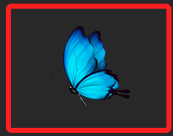

# 優化虛實互動

_加入圖片進一步優化虛實互動的腳本。_

<br>

## 準備工作

1. 從素材資料夾下載圖片檔案 `butterfly.png` 並拖曳到專案資料夾內。

    

<br>

## 說明

1. 封裝一個圖片去背的功能。

    ```python
    # 處理圖片去背
    def overlay_transparent_image(background_img, overlay_img, pos):
        # 這裡預設尺寸為 80x80，可進一步優化作為參數
        overlay_img = cv2.resize(overlay_img, (80, 80))
        # 座標
        x, y = pos
        alpha_overlay = overlay_img[:, :, 3] / 255.0
        alpha_background = 1.0 - alpha_overlay
        #
        for c in range(0, 3):
            background_img[y:y+80, x:x+80, c] = (
                alpha_overlay * overlay_img[:, :, c] +
                alpha_background * background_img[y:y+80, x:x+80, c]
            )
        #
        return background_img
    ```

<br>

2. 添加一個微小移動的功能。

    ```python
    # 微小移動
    def update_touch_area(touch_area, width, height, touched):
        # 設定大幅度與小幅度移動
        move_L = 8
        move_S = 3 
        # 被觸碰時，進行較大幅度的隨機移動
        if touched:
            dx = random.randint(-move_L, move_L)
            dy = random.randint(-move_L, move_L)
        # 進行微小隨機移動
        else:
            dx = random.randint(-move_S, move_S)
            dy = random.randint(-move_S, move_S)
        
        # 新的座標
        new_x = touch_area[0] + dx
        new_y = touch_area[1] + dy
        
        # 確保座標不超過邊界
        if new_x < 0 or new_x > width - LENGTH:
            new_x = touch_area[0]
        if new_y < 0 or new_y > height - LENGTH:
            new_y = touch_area[1]
        print(f'變動：{dx}, {dy}，新的座標：{new_x}, {new_y}')
        return [new_x, new_y]
    ```

<br>

## 範例

1. 完整程式碼。

    ```python
    '''
    這是一個動態的腳本，畫面中央顯示一個紅色框
    手勢觸碰可觸發邏輯
    '''

    import cv2
    import mediapipe as mp
    import random
    import sys

    # 常數
    LENGTH = 80

    # 繪圖方法
    mp_drawing = mp.solutions.drawing_utils
    # 繪圖樣式
    mp_drawing_styles = mp.solutions.drawing_styles
    # 初始化手掌偵測對象
    mp_hands = mp.solutions.hands
    # 初始化攝像頭
    cap = cv2.VideoCapture(0)

    # 獲取攝像頭原始分辨率
    original_width = cap.get(cv2.CAP_PROP_FRAME_WIDTH)
    original_height = cap.get(cv2.CAP_PROP_FRAME_HEIGHT)
    # 計算比率
    aspect_ratio = original_height / original_width
    # 設定指定寬度
    new_width = 600
    # 依據寬度設定高度
    new_height = int(new_width * aspect_ratio)

    # 載入蝴蝶圖片
    butterfly_image = cv2.imread('butterfly.png', cv2.IMREAD_UNCHANGED)


    # 處理圖片去背
    def overlay_transparent_image(background_img, overlay_img, pos):
        overlay_img = cv2.resize(overlay_img, (LENGTH, LENGTH))
        x, y = pos
        alpha_overlay = overlay_img[:, :, 3] / 255.0
        alpha_background = 1.0 - alpha_overlay

        for c in range(0, 3):
            background_img[y:y+LENGTH, x:x+LENGTH, c] = (
                alpha_overlay * overlay_img[:, :, c] +
                alpha_background * background_img[y:y+LENGTH, x:x+LENGTH, c]
            )
        return background_img


    # 微小移動
    def update_touch_area(touch_area, width, height, touched):
        # 設定大幅度與小幅度移動
        move_L = 8
        move_S = 3
        # 被觸碰時，進行較大幅度的隨機移動
        if touched:
            dx = random.randint(-move_L, move_L)
            dy = random.randint(-move_L, move_L)
        # 進行微小隨機移動
        else:
            dx = random.randint(-move_S, move_S)
            dy = random.randint(-move_S, move_S)

        # 新的座標
        new_x = touch_area[0] + dx
        new_y = touch_area[1] + dy

        # 確保座標不超過邊界
        if new_x < 0 or new_x > width - LENGTH:
            new_x = touch_area[0]
        if new_y < 0 or new_y > height - LENGTH:
            new_y = touch_area[1]
        print(f'變動：{dx}, {dy}，新的座標：{new_x}, {new_y}')
        return [new_x, new_y]


    # 自定義觸碰偵測函數
    def check_if_touched(hand_landmarks, touch_area, width, height):
        # 食指座標
        finger_X = hand_landmarks.landmark[7].x * width
        finger_Y = hand_landmarks.landmark[7].y * height
        # 假如食指指尖在 80x80 範圍內
        if touch_area[0] < finger_X < touch_area[0] + LENGTH \
                and touch_area[1] < finger_Y < touch_area[1] + LENGTH:
            # 觸發觸碰事件
            return True
        return False


    # mediapipe 啟用偵測手掌
    with mp_hands.Hands(
        model_complexity=0,
        min_detection_confidence=0.5,
            min_tracking_confidence=0.5) as hands:

        if not cap.isOpened():
            print("無法找到攝像頭")
            sys.exit(1)

        # 預設觸碰區域，可自訂
        touch_area = [100, 100]

        # 設定是否觸碰狀態為 True
        is_Touched = True
        # 計算幀數
        frame_count = 0
        while True:
            success, img = cap.read()

            if not success:
                print("無法獲取畫面")
                break
            # 水平翻轉
            img = cv2.flip(img, 1)

            # 調整畫面尺寸(寬度, 高度)
            img = cv2.resize(img, (new_width, new_height))
            # 取得攝影機影像尺寸(高度, 寬度, 通道數)
            size = img.shape
            # 取得畫面寬度、高度
            _width, _height = img.shape[1], img.shape[0]

            if is_Touched or frame_count % 10 == 0:
                # 每 20 幀或被觸碰時更新位置
                touch_area = update_touch_area(
                    touch_area, _width, _height, is_Touched
                )
                frame_count = 0
                # 重置觸碰狀態
                is_Touched = False
            #
            frame_count += 1
            # 將 BGR 轉換成 RGB
            img2 = cv2.cvtColor(img, cv2.COLOR_BGR2RGB)
            # 偵測手掌
            results = hands.process(img2)

            if results.multi_hand_landmarks:
                for hand_landmarks in results.multi_hand_landmarks:
                    if check_if_touched(
                        hand_landmarks, touch_area, _width, _height
                    ):
                        is_Touched = True
                    # 將節點和骨架繪製到影像中
                    mp_drawing.draw_landmarks(
                        img,
                        hand_landmarks,
                        mp_hands.HAND_CONNECTIONS,
                        mp_drawing_styles.get_default_hand_landmarks_style(),
                        mp_drawing_styles.get_default_hand_connections_style())

            # 將蝴蝶圖片放置在觸碰區域
            img = overlay_transparent_image(
                img, butterfly_image, (touch_area[0], touch_area[1])
            )

            # 顯示影像並設置標題
            cv2.imshow('Gesture_Touch', img)
            # 檢查是否有按下'ESC'、'q'鍵或關閉視窗
            key = cv2.waitKey(1) & 0xFF
            if (
                key == 27
                or key == ord("q")
                or cv2.getWindowProperty("Gesture_Touch", cv2.WND_PROP_VISIBLE) < 1
            ):
                break

    cap.release()
    cv2.destroyAllWindows()

    ```

<br>

---

_END_
