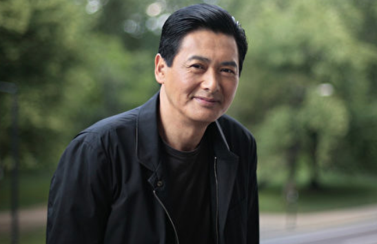
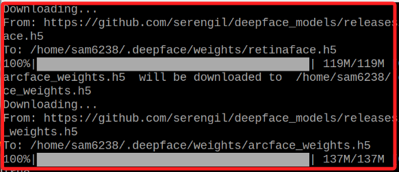
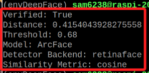
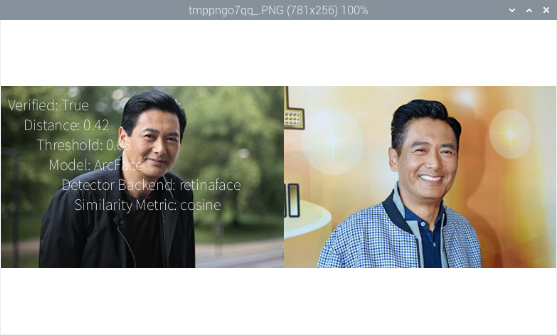
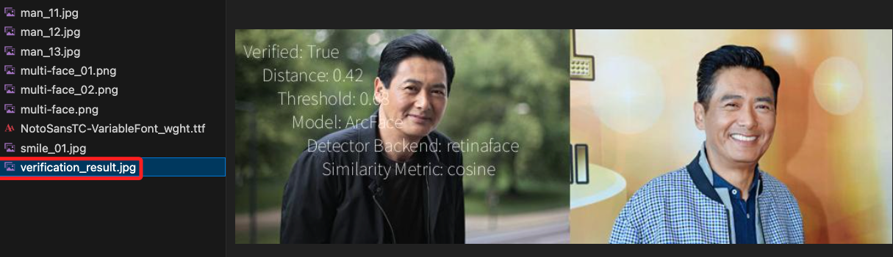
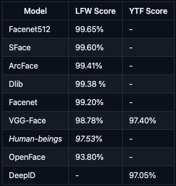
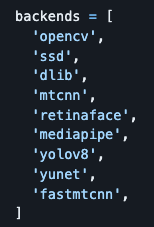

# 人臉辨識

_DeepFace 的人臉辨識_

<br>

## 說明

參考 [官網](https://github.com/serengil/retinaface) 說明所製作並優化的腳本。

<br>

## 範例

1. 請自行下載兩張相片，或在 `素材` 資料夾內下載。

    

    

<br>

2. 官網範例如下。

    ```python
    from deepface import DeepFace

    obj = DeepFace.verify(
        "man_11.jpg", "man_12.jpg",
        model_name="ArcFace",
        detector_backend="retinaface"
    )
    # 輸出結果
    print("Verified:", obj["verified"])
    print("Distance:", obj["distance"])
    print("Threshold:", obj["threshold"])
    print("Model:", obj["model"])
    print("Detector Backend:", obj["detector_backend"])
    print("Similarity Metric:", obj["similarity_metric"])
    ```

<br>

3. 第一次運行後會下載模型到以下路徑。

    

<br>

4. 顯示比對結果。

    

<br>

## 優化

1. 完整程式碼。

    ```python
    from deepface import DeepFace
    from PIL import Image, ImageDraw, ImageFont

    # 進行比對
    obj = DeepFace.verify(
        "man_11.jpg", "man_12.jpg",
        model_name="ArcFace",
        detector_backend="retinaface"
    )

    # 顯示結果
    print("Verified:", obj["verified"])
    print("Distance:", obj["distance"])
    print("Threshold:", obj["threshold"])
    print("Model:", obj["model"])
    print("Detector Backend:", obj["detector_backend"])
    print("Similarity Metric:", obj["similarity_metric"])

    # 載入圖片
    img1 = Image.open("man_11.jpg")
    img2 = Image.open("man_12.jpg")

    # 調整為相同尺寸
    base_height = 256
    img1 = img1.resize(
        (int(base_height * img1.width / img1.height), base_height)
    )
    img2 = img2.resize(
        (int(base_height * img2.width / img2.height), base_height)
    )

    # 建立新的圖片，然後貼上原本的兩張圖片
    total_width = img1.width + img2.width
    combined_img = Image.new("RGB", (total_width, base_height))
    combined_img.paste(img1, (0, 0))
    combined_img.paste(img2, (img1.width, 0))

    # 添加文字敘述
    draw = ImageDraw.Draw(combined_img)
    font = ImageFont.truetype("NotoSansTC-VariableFont_wght.ttf", 20)
    text = f"Verified: {obj['verified']}\n \
        Distance: {obj['distance']:.2f}\n \
            Threshold: {obj['threshold']}\n \
                Model: {obj['model']}\n \
                    Detector Backend: {obj['detector_backend']}\n \
                        Similarity Metric: {obj['similarity_metric']}"
    draw.text((10, 10), text, (255, 255, 255), font=font)

    # 顯示
    combined_img.show()
    # 儲存
    combined_img.save('verification_result.jpg')

    ```

<br>

2. 顯示結果。

    

<br>

3. 並且儲存一張圖片。

    

<br>

## 補充說明

1. DeepFace 支持多種不同的模型，如下表中的 Facenet, Facenet512, OpenFace, DeepFace, DeepID, Dlib 和 ArcFace 等，同學可以根據需求和實驗結果選擇最適合的模型，這個選擇可能會基於準確性、速度或模型訓練的數據集。

    

<br>

2. 另外，腳本中的 `detector_backend` 參數指的是用於檢測臉部的 `後端技術`，同學可以更換測試，如 `OpenCV`、`SSD`、`Dlib`、`MTCNN`、`Faster MTCNN`、`RetinaFace`、`MediaPipe`、`YOLOv8 Face`、`YuNet` 等，每種檢測器的準確性和速度也有所不同。

    

<br>

## distance_metric

參數 `distance_metric` 有 `cosine` 、 `euclidean` 和 `euclidean_l2` 三個值，在人臉辨識系統中， 是用來計算兩個臉部特徵向量之間相似度差異的方法。

<br>

1. `Cosine Similarity` ：餘弦相似度，這個方法計算兩個特徵向量之間的夾角餘弦值，餘弦值越接近 1，代表兩個向量越相似。這個度量方法對向量的長度不敏感，主要關注方向的相似性。

<br>

2. `Euclidean Distance` ：歐幾里得距離，這是最直接的距離度量，計算兩個點在歐幾里得空間中的直線距離。在人臉辨識中，較小的歐幾里得距離表示較高的相似度。

<br>

3. `Euclidean Distance L2 Normalized` ：L2 正規化的歐幾里得距離，這是歐幾里得距離的變體，其中特徵向量在計算距離之前會進行 L2 正規化，就是讓每個特徵向量的長度為 1，這樣的正規化有助於減少不同圖片之間照明、對比等因素的影響，使距離計算更加穩定。

<br>

## 進一步優化

1. 修改

<br>

2. 完整程式碼

    ```python
    # 導入必要庫
    from deepface import DeepFace
    from PIL import Image, ImageDraw, ImageFont

    # 常數
    IMG_1 = "Hsiao_1.jpg"
    IMG_2 = "Liao_1.jpg"
    MODEL = "ArcFace"
    BACKEND = "opencv"
    METRIC = "cosine"

    # 指定圖片的顯示尺寸
    BASE_SIZE = 256

    # 進行比對
    obj = DeepFace.verify(
        IMG_1, IMG_2,
        model_name=MODEL,
        detector_backend=BACKEND,
        distance_metric=METRIC
    )

    # 在終端機顯示結果
    # print("Verified:", obj["verified"])
    # print("Distance:", obj["distance"])
    # print("Threshold:", obj["threshold"])
    # print("Model:", obj["model"])
    # print("Detector Backend:", obj["detector_backend"])
    # print("Similarity Metric:", obj["similarity_metric"])

    # 載入圖片
    img1 = Image.open("Hsiao_1.jpg")
    img2 = Image.open("Liao_1.jpg")


    # 確保圖片的最小邊為 BASE_SIZE，並保持比例縮放後裁剪
    def resize_and_crop(img):
        # 如果寬度是較小的邊，則縮放寬度到 BASE_SIZE
        if img.width < img.height:
            # 寬度等於基本尺寸
            _new_width = BASE_SIZE
            # 高度依寬度同比例調整
            _new_height = int(_new_width * img.height / img.width)
            # 重新調整尺寸
            img = img.resize((_new_width, _new_height), Image.LANCZOS)
            # 垂直置中
            top = (_new_height - BASE_SIZE) / 2
            # 裁切
            img = img.crop((0, top, _new_width, top + BASE_SIZE))
        # 假如高度是小邊
        else:
            # 高度等於基本尺寸
            _new_height = BASE_SIZE
            # 寬度依高度同比例調整
            _new_width = int(_new_height * img.width / img.height)
            # 相片
            img = img.resize((_new_width, _new_height), Image.LANCZOS)
            # 水平置中
            left = (_new_width - BASE_SIZE) / 2
            # 裁切
            img = img.crop((left, 0, left + BASE_SIZE, _new_height))
        return img


    # 調用自訂函數處理相片
    img1 = resize_and_crop(img1)
    img2 = resize_and_crop(img2)


    # 因為要寫字在底部，所以建立新的圖片，然後貼上原本的兩張相片
    total_width = BASE_SIZE * 2
    # 增加文字區域的高度
    total_height = BASE_SIZE + 200

    # 創建新的圖片並合併兩張圖片(總寬、總高)
    combined_img = Image.new("RGB", (total_width, total_height), "white")
    combined_img.paste(img1, (0, 0))
    # 向右偏移一張相片寬
    combined_img.paste(img2, (BASE_SIZE, 0))

    # 添加文字敘述
    draw = ImageDraw.Draw(combined_img)
    font = ImageFont.truetype("NotoSansTC-VariableFont_wght.ttf", 20)
    text = f"\
        Verified: {obj['verified']}\n\
        Distance: {obj['distance']:.2f}\n\
        Threshold: {obj['threshold']}\n\
        Model: {obj['model']}\n\
        Detector Backend: {obj['detector_backend']}\n\
        Similarity Metric: {obj['similarity_metric']}"
    # 將文字放在圖片下方且向左對齊
    draw.text(
        (0, BASE_SIZE + 10),  # 文字座標偏移量
        text,
        (0, 0, 0),  # 文字顏色
        font=font
    )

    # 顯示相片
    combined_img.show()
    # 將結果儲存為相片
    combined_img.save('verification_result.jpg')

    ```

<br>

---

_END_