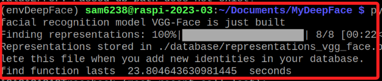

# 實時資料庫比對

_對於樹莓派來說，這個腳本有點吃力_

<br>

## 說明

1. 參考 [官網](https://github.com/serengil/deepface) 說明實作。

<br>

2. 先在專案資料夾內建立資料庫。

    ```bash
    mkdir database
    ```

<br>

3. 接著準備好資料圖片，

    

<br>

4. 分別建立子資料夾，並將相片放入個別資料夾中，結構如下。

    ```bash
    .
    ├── Chow
    │   ├── Chow_1.jpg
    │   └── Chow_2.jpg
    ├── Hsiao
    │   ├── Hsiao_1.jpg
    │   └── Hsiao_2.jpg
    ├── Leung
    │   ├── Leung_1.jpeg
    │   └── Leung_2.jpg
    ├── Liao
    │   ├── Liao_1.jpg
    │   └── Liao_2.jpg
    ```

<br>

5. 完整程式碼。

    ```python
    from deepface import DeepFace

    # 指定資料庫的路徑
    db_path = "./database"

    # 調用 stream 函數，啟動實時臉部識別和分析
    # enable_face_analysis 參數設為 False 可以關閉臉部屬性分析，只進行臉部識別
    DeepFace.stream(db_path=db_path, enable_face_analysis=False)

    ```

<br>

6. 運行後會下載模型。

    

<br>

7. 成果圖：啟動後若偵測到人臉開始進行資料庫比對，約等待約五秒顯示比對結果，若在資料庫中有比對到相似的資料就會顯示縮圖在螢幕上，若沒有比對成功，重新啟動後再次偵測人臉。

    


<br>

---

_END_