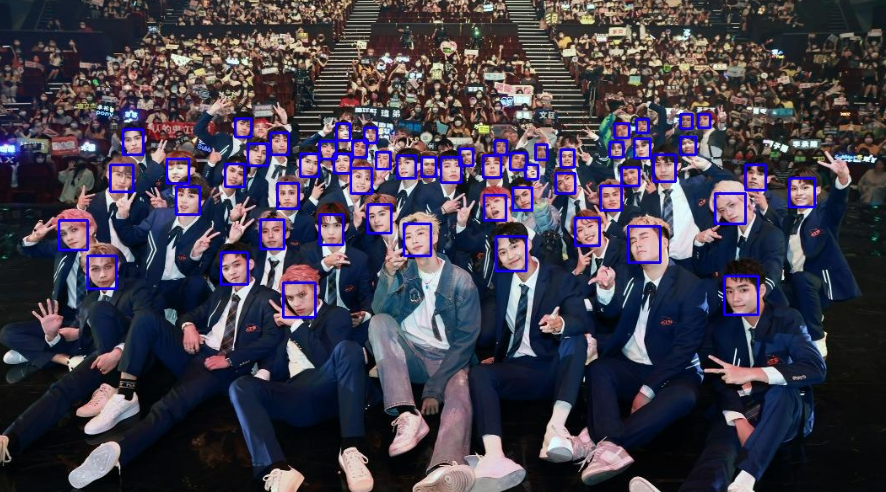
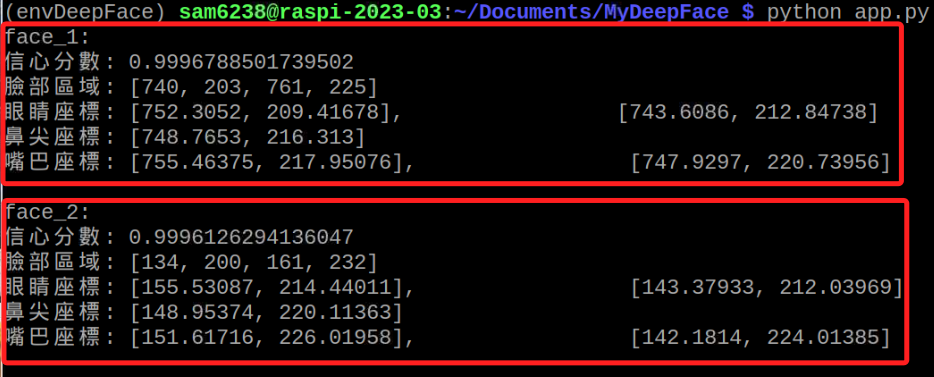

# 多人臉偵測

_官網範例_

<br>

## 說明

1. 自行尋找圖片或在 '素材' 資料夾中下載圖片 `crowd.jpg` 。

    

<br>

2. 完整程式碼。

    ```python
    from retinaface import RetinaFace
    import cv2

    # 載入圖片
    img_path = "crowd.jpg"
    img = cv2.imread(img_path)

    # 偵測人臉
    resp = RetinaFace.detect_faces(img_path)

    # 標註偵測到的人臉
    for face in resp.keys():
        facial_area = resp[face]["facial_area"]
        cv2.rectangle(
            img,
            (facial_area[0], facial_area[1]),
            (facial_area[2], facial_area[3]),
            (255, 0, 0), 2
        )

    # 儲存標註過的圖片
    output_path = "output.jpg"
    cv2.imwrite(output_path, img)

    # 顯示圖片
    cv2.imshow("Faces", img)
    # 任意鍵關閉
    cv2.waitKey(0)
    cv2.destroyAllWindows()

    ```

<br>

3. 成果圖。

    

<br>

## 輸出偵測到的內容

1. 可透過添加以下程序，依序將偵測到的人臉資訊列印。

    ```python    
    # 標註偵測到的人臉
    for face in resp.keys():
        facial_area = resp[face]["facial_area"]
        cv2.rectangle(
            img,
            (facial_area[0], facial_area[1]),
            (facial_area[2], facial_area[3]),
            (255, 0, 0), 2
        )
    # 以上是相同的 ...
    
    # 原本的腳本偵測並完成標註人臉之後，添加以下程序 ...

    # 確認是否有偵測到臉部
    if resp is not None:
        # 遍歷偵測結果，透過 enumerate 提取索引
        for i, (key, value) in enumerate(resp.items()):
            # 僅列出前 10 個
            if i > 9:
                break
            # 輸出
            print(f"{key}:")
            print(f"信心分數: {value['score']}")
            print(f"臉部區域: {value['facial_area']}")
            print(
                f"眼睛座標: {value['landmarks']['left_eye']}, \
                    {value['landmarks']['right_eye']}"
            )
            print(f"鼻尖座標: {value['landmarks']['nose']}")
            print(
                f"嘴巴座標: {value['landmarks']['mouth_left']}, \
                    {value['landmarks']['mouth_right']}"
            )
            # 空一行
            print()
    else:
        print("沒有偵測到臉部")

    # 以下不變 ...
    # 儲存標註過的圖片
    output_path = "output.jpg"
    ```

<br>

2. 完整程式碼。

    ```python
    from retinaface import RetinaFace
    import cv2

    # 載入圖片
    img_path = "crowd.jpg"
    img = cv2.imread(img_path)

    # 偵測人臉
    resp = RetinaFace.detect_faces(img_path)

    # 標註偵測到的人臉
    for face in resp.keys():
        facial_area = resp[face]["facial_area"]
        cv2.rectangle(
            img,
            (facial_area[0], facial_area[1]),
            (facial_area[2], facial_area[3]),
            (255, 0, 0), 2
        )

    # 確認是否有偵測到臉部
    if resp is not None:
        # 遍歷偵測結果，透過 enumerate 提取索引
        for i, (key, value) in enumerate(resp.items()):
            # 僅列出前 10 個
            if i > 9:
                break
            # 輸出
            print(f"{key}:")
            print(f"信心分數: {value['score']}")
            print(f"臉部區域: {value['facial_area']}")
            print(
                f"眼睛座標: {value['landmarks']['left_eye']}, \
                    {value['landmarks']['right_eye']}"
            )
            print(f"鼻尖座標: {value['landmarks']['nose']}")
            print(
                f"嘴巴座標: {value['landmarks']['mouth_left']}, \
                    {value['landmarks']['mouth_right']}"
            )
            # 空一行
            print()
    else:
        print("沒有偵測到臉部")

    # 儲存標註過的圖片
    output_path = "output.jpg"
    cv2.imwrite(output_path, img)

    # 顯示圖片
    cv2.imshow("Faces", img)
    # 任意鍵關閉
    cv2.waitKey(0)
    cv2.destroyAllWindows()

    ```

<br>

3. 成果圖。

    

<br>

---

_END_