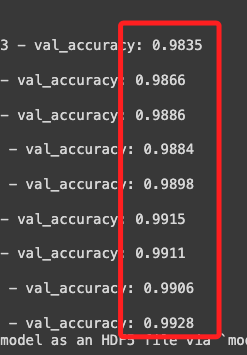

# 優化 D05 的訓練模型

<br>

## 說明

_基於前次範例的模型識別績效不佳，嘗試進行以下優化，更新後模型命名為 `mnist_model_new.h5` 。_

<br>

1. 更換優化器為 Adam。

   原本的優化器是 `Adadelta`，這是一種基於梯度的優化方法，因為它會根據梯度的變化自動調整學習率，所以不需設定默認的學習率。

   而 Adam 優化器是一種結合了Momentum (動量) 和 RMSprop (均方根傳播法，Root Mean Square Propagation) 的優化方法，它保持了梯度的方向和大小的一個滑動平均，使得優化過程更加平穩和快速。

<br>

1. 加入 EarlyStopping 回調監測驗證損失（validation loss），如果損失在一定的週期（epoch）內沒有改善，則訓練會提前停止，有助於在驗證損失不再改善時停止訓練，防止過擬合（overfitting）而失去泛化能力（Generalization Ability）。

<br>

## 範例

1. 觀察訓練過程，訓練集的準確率已達 99%，而驗證集的準確率也有 99%。

   

<br>

2. 完整程式碼。

   ```python
   # 導入所需函式庫
   import tensorflow as tf
   from tensorflow.keras.datasets import mnist
   from tensorflow.keras.models import Sequential
   from tensorflow.keras.layers import Dense, Dropout, Flatten, Conv2D, MaxPooling2D
   from tensorflow.keras.callbacks import EarlyStopping
   import numpy as np

   # 設定參數
   num_classes = 10
   img_rows, img_cols = 28, 28

   # 讀取 MNIST 手寫數字資料集
   (x_train, y_train), (x_test, y_test) = mnist.load_data()

   # 重塑資料以適應 CNN 輸入要求
   x_train = x_train.reshape(x_train.shape[0], img_rows, img_cols, 1)
   x_test = x_test.reshape(x_test.shape[0], img_rows, img_cols, 1)
   input_shape = (img_rows, img_cols, 1)

   # 正規化資料
   x_train = x_train.astype('float32') / 255
   x_test = x_test.astype('float32') / 255

   # 將目標變數進行 one-hot 編碼
   y_train = tf.keras.utils.to_categorical(y_train, num_classes)
   y_test = tf.keras.utils.to_categorical(y_test, num_classes)

   # 建立模型
   model = Sequential()
   # 第一卷積層，使用 32 個 3x3 的濾鏡
   model.add(Conv2D(32, kernel_size=(3, 3), activation='relu', input_shape=input_shape))
   # 第二卷積層，使用 64 個 3x3 的濾鏡
   model.add(Conv2D(64, (3, 3), activation='relu'))
   # 最大池化層，使用 2x2 的池化窗口
   model.add(MaxPooling2D(pool_size=(2, 2)))
   # Dropout 層，減少過擬合
   model.add(Dropout(0.25))
   # Flatten 層，將多維輸入一維化
   model.add(Flatten())
   # 全連接層，使用 128 個神經元
   model.add(Dense(128, activation='relu'))
   # 再次 Dropout，減少過擬合
   model.add(Dropout(0.5))
   # 輸出層，使用 softmax 激活函數
   model.add(Dense(num_classes, activation='softmax'))

   # 編譯模型，使用 Adam 優化器和交叉熵損失函數
   model.compile(loss=tf.keras.losses.categorical_crossentropy, optimizer=tf.keras.optimizers.Adam(), metrics=['accuracy'])

   # 設定早期停止，防止過擬合
   early_stopping = EarlyStopping(monitor='val_loss', patience=3)

   # 訓練模型，並使用驗證集
   model.fit(x_train, y_train, batch_size=128, epochs=10, validation_data=(x_test, y_test), callbacks=[early_stopping])

   # 儲存模型
   model.save('mnist_model_new.h5')

   ```

---

_END_
