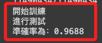
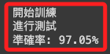

# 使用 KNN

_K-近鄰演算_

<br>

## 說明

1. 這個模型初次訓練成果不佳，但 KNN 是一種基於實例的學習，它直接基於訓練數據進行預測，而不是學習一個映射函數，所以模型的優化空間也相對有限，僅提供給同學參考比較。

<br>

2. 使用以下訓練腳本在 Colab 進行模型訓練，訓練完畢下載模型檔案 `mnist_knn.xml` 到電腦中，若想要保留模型檔案，可在 Colab 中將檔案保存在雲端硬碟。

<br>

3. 特別注意，由於 KNN 模型檔案超過 Github 規定的上限 100 M，同學若下載後會放在有版本控制的資料夾內，請務必先將檔案加入 `.gitignore` ，不然會陷入一連串的除錯阿鼻地獄，關於大型檔案的管理另做說明。

<br>

4. 完成排除設定後，將下載的模型拖曳到樹莓派的專案資料夾內。

<br>

## 訓練模型

_第一版_

<br>

1. 完整程式碼：第一版。

    ```python
    import cv2
    import numpy as np
    # 載入資料集
    from keras.datasets import mnist

    # 載入 MNIST 數據集：包含手寫數字的訓練集和測試集
    (x_train, y_train), (x_test, y_test) = mnist.load_data()  

    # 將訓練集的圖像數據 x_train 重塑為二維數組，方便 KNN 處理
    x_train = x_train.reshape(x_train.shape[0], -1)  
    # 將訓練集的圖像數據 x_train 轉換為 float32 型別並進行歸一化處理
    x_train = x_train.astype('float32')/255
    # 將訓練集的標籤 y_train 轉換為 float32 型別
    y_train = y_train.astype(np.float32)


    # 將測試集的圖像數據 x_test 重塑為二維數組
    x_test = x_test.reshape(x_test.shape[0], -1)     
    # 將測試集的圖像數據 x_test 轉換為 float32 型別並進行歸一化處理
    x_test = x_test.astype('float32')/255
    # 將測試集的標籤 y_test 轉換為 float32 型別
    y_test = y_test.astype(np.float32)

    # 使用 K-Nearest Neighbors (KNN) 建立模型
    knn = cv2.ml.KNearest_create()                    
    # 設定 KNN 模型的參數，默認鄰居數為 5
    knn.setDefaultK(5)
    # 設置為分類器模式                           
    knn.setIsClassifier(True)

    print('開始訓練')
    # 使用訓練集訓練 KNN 模型
    knn.train(x_train, cv2.ml.ROW_SAMPLE, y_train)  
    # 使用 KNN 儲存訓練模型，OpenCV 支持 XML 或 YAML 格式
    knn.save('mnist_knn.xml')                       

    print('進行測試')
    # 使用測試集的圖像數據 x_test 進行預測
    test_pre = knn.predict(x_test)
    # 獲取預測結果
    test_ret = test_pre[1]
    # 重塑預測結果為一維數組
    test_ret = test_ret.reshape(-1,)
    # 比較預測結果與真實標籤，計算正確的數量
    test_sum = (test_ret == y_test)
    # 得到準確率
    acc = test_sum.mean()                           
    # 輸出準確率
    print(f'準確率為：{acc}')

    ```

<br>

2. 顯示結果。

    

<br>

## 優化

_對初版腳本稍作優化_

<br>

1. 在前一個版本中，數據預處理步驟較多，包含將圖像數據重塑為二維數組，然後轉換為 float32 再進行歸一化，優化後將在一行之中完成，對於模型的易讀性來說是有幫助的。

<br>

2. 修正 KNN 模型中的 K 值，這個數值表示對於每個預測點，算法將查找幾個近鄰，也就是進行決策時考慮最近鄰的數量，這個數值太小時會過於敏感，太大時會過於泛化，需要針對資料集特性進行多次測試。

<br>

3. 完整程式碼：優化版。

    ```python
    import cv2
    import numpy as np
    from keras.datasets import mnist

    # 載入 MNIST 數據集
    (x_train, y_train), (x_test, y_test) = mnist.load_data()

    # 數據預處理
    # 將圖像數據轉換為一維數組並進行歸一化
    x_train = x_train.reshape(x_train.shape[0], -1).astype('float32') / 255
    x_test = x_test.reshape(x_test.shape[0], -1).astype('float32') / 255

    # 將標籤轉換為 float32 型別
    y_train = y_train.astype(np.float32)
    y_test = y_test.astype(np.float32)

    # 建立 KNN 模型
    knn = cv2.ml.KNearest_create()

    # 設定 K 值
    knn.setDefaultK(3)

    # 設置為分類器模式
    knn.setIsClassifier(True)

    # 使用訓練集訓練模型
    print('開始訓練')
    knn.train(x_train, cv2.ml.ROW_SAMPLE, y_train)

    # 儲存模型
    knn.save('mnist_knn.xml')

    # 測試模型
    print('進行測試')
    ret, result, neighbours, dist = knn.findNearest(x_test, k=3)

    # 計算準確率
    matches = result == y_test.reshape(-1, 1)
    correct = np.count_nonzero(matches)
    accuracy = correct / result.size

    # 輸出準確率
    print(f'準確率: {accuracy * 100}%')

    ```

<br>

4. 顯示結果：稍作提升，改善不大。

    

<br>

## 辨識字卡

1. 完整程式碼。

    ```python
    import cv2
    import numpy as np
    import sys

    # 載入先前訓練好的 KNN 模型
    try:
        knn = cv2.ml.KNearest_load("mnist_knn.xml")
        print("模型載入成功。")
    except Exception as e:
        print("模型載入失敗：", e)
        sys.exit(1)

    # 啟用攝影鏡頭
    cap = cv2.VideoCapture(0)
    if not cap.isOpened():
        print("無法開啟攝像頭")
        sys.exit(1)

    while True:
        success, img = cap.read()
        if not success:
            print("無法取得影像")
            break

        img = cv2.resize(img, (450, 300))
        x, y, w, h = 300, 150, 150, 150

        img_num = img[y: y + h, x: x + w]
        img_num = cv2.cvtColor(img_num, cv2.COLOR_BGR2GRAY)
        _, img_num = cv2.threshold(img_num, 127, 255, cv2.THRESH_BINARY_INV)

        kernel = np.ones((3, 3), np.uint8)
        img_num = cv2.dilate(img_num, kernel, iterations=1)

        display = cv2.resize(img_num, (w, h))
        img[img.shape[0] - h: img.shape[0], 0:w] = \
            cv2.cvtColor(display, cv2.COLOR_GRAY2BGR)

        img_num = \
            cv2.resize(img_num, (28, 28)).reshape(1, -1).astype('float32') / 255

        ret, result, neighbours, dist = knn.findNearest(img_num, k=5)

        text = f"Number: {result[0][0]}, Distance: {dist[0][0]}"
        org = (10, 30)
        fontFace = cv2.FONT_HERSHEY_SIMPLEX
        fontScale = 0.7
        color = (255, 255, 255)
        thickness = 2
        lineType = cv2.LINE_AA
        cv2.putText(
            img, text, org, fontFace, fontScale, color, thickness, lineType
        )

        cv2.rectangle(img, (x, y), (x + w, y + h), (0, 0, 255), 3)
        cv2.imshow("Minist KNN", img)

        if cv2.waitKey(1) == ord("q"):
            break

    cap.release()
    cv2.destroyAllWindows()

    ```

<br>

---

_END_