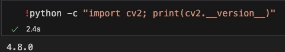

# OpenCV

<br>

## 安裝

1. 更新

    ```bash
    sudo apt update && sudo apt upgrade -y
    ```

<br>

2. 完整安裝

    ```bash
    pip install opencv-python
    ```

<br>

3. 驗證安裝

    ```bash
    python -c "import cv2; print(cv2.__version__)"
    ```

    

<br>

## 說明

1. 假如要直接運行 cv2.imshow() 要在樹莓派執行，否則會顯示 kernel 已毀損。
   
    

2. 假如透過 matplotlib 運行可以在本地的 Jupyter 執行。

<br>


---

_END_