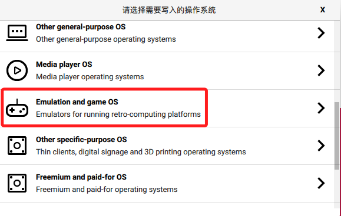
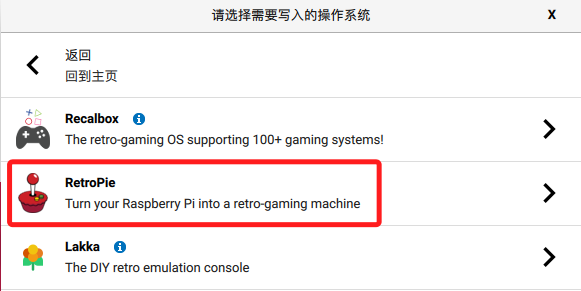

# RetroPie

 

## 參考

這篇 [文章](https://zhuanlan.zhihu.com/p/406926099) 說得挺清楚，可以參考。

 

# 硬體
1. 樹莓派＋記憶卡
2. 視訊訊號線
3. 搖桿
4. 鍵盤

 

# 步驟

1. 選擇作業系統

    

 

2. 選擇

    

 

3. 依照硬體版本選擇合適的版本。

    

 

---

_待續_