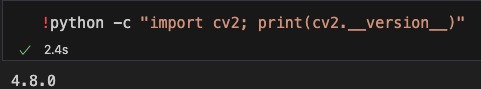
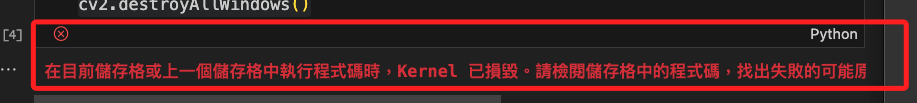

# OpenCV

_Open Source Computer Vision Library，是一個跨平台的電腦視覺庫。_

<br>

## 準備工作

1. 建立虛擬環境。

    ```bash
    python -m venv envOpenCV
    ```

<br>

2. 更新。

    ```bash
    sudo apt update && sudo apt upgrade -y
    ```

<br>

3. 安裝套件 `opencv-python` 。

    ```bash
    pip install opencv-python
    ```

<br>

4. 驗證 `opencv-python` 確實安裝完成，直接在終端機中運行指令即可。

    ```bash
    python -c "import cv2; print(cv2.__version__)"
    ```

    

<br>

## 封裝鍵盤事件

_將監測鍵盤事件的功能封裝在獨立的模組內方便重用_

<br>

1. 建立模組。

    ```bash
    touch cv_utils.py
    ```
<br>

2. 編輯模組。

    ```python
    import cv2

    def should_exit(window_name):
        '''
        檢查是否應該退出程序
        :param window_name: 視窗名稱。
        :return: 如果應該退出，則返回 True；否則返回 False。
        '''
        key = cv2.waitKey(1) & 0xFF
        if key == 27 or key == ord('q') or \ 
                cv2.getWindowProperty(window_name, cv2.WND_PROP_VISIBLE) < 1:
            return True
        return False
    ```

<br>

3. 在其他腳本中調用函數。

    ```python
    # 導入自定義的模組
    from cv_utils import should_exit

    # 主循環
    while True:
        # 其他代碼 ...

        if should_exit('video'):
            break

    cv2.destroyAllWindows()
    ```

<br>

## 注意事項

1. 必須在樹莓派上運行 cv2.imshow()，若在 VSCode 筆記本中以遠端運行會顯示 kernel 已毀損，在 VSCode 終端機中運行則無任何反應。
   
    

2. 若要在本地的 Jupyter 中執行，需藉由 matplotlib 函式庫運行，詳見下一節說明。

<br>

---

_END_