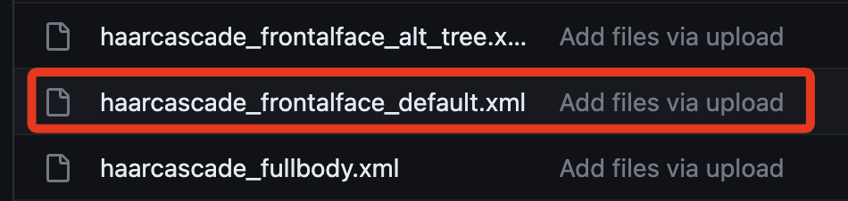
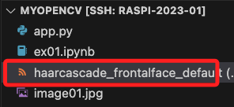
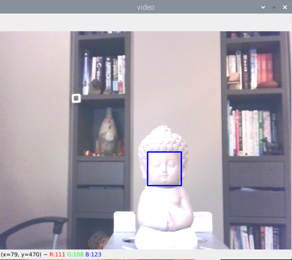
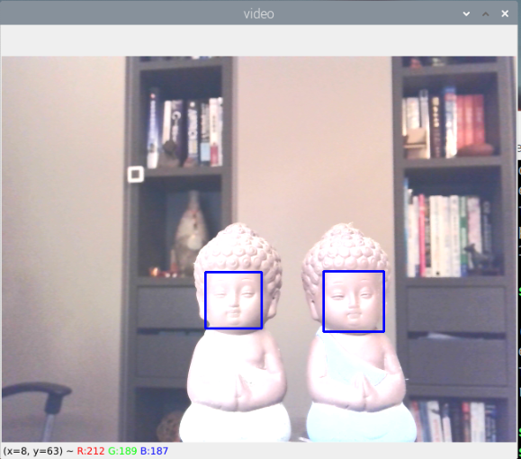
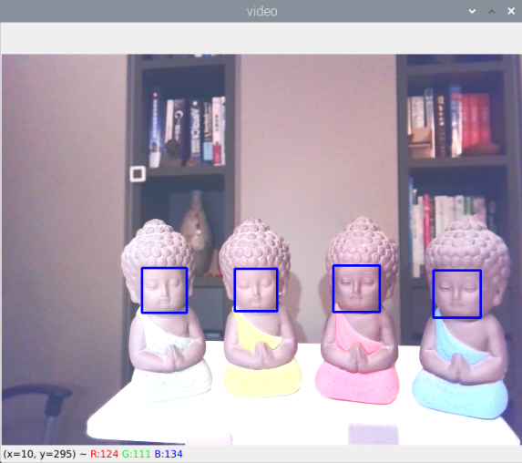

# 臉部偵測

<br>

## 模型

1. [模型載點](https://github.com/anaustinbeing/haar-cascade-files/tree/master) ，依據要使用的模型檔案 `xml` 來下載模型。

    

<br>

2. 選取進入後，可點擊右上角下載圖標。

    

<br>

3. 拖曳進入樹莓派，暫時置於同層目錄即可。

    

<br>

## 範例

1. 臉部正面偵測，要在樹莓派運行，按下 `ESC` 可以退出程序。

    ```python
    # 載入庫
    import numpy as np
    import cv2
    
    # 多個 Haar cascades: https://github.com/Itseez/opencv/tree/master/data/haarcascades
    
    # 讀入 Haar cascades 臉部檢測模型
    # 暫時使用絕對路徑
    faceCascade = cv2.CascadeClassifier('haarcascade_frontalface_default.xml')
    # 開啟攝像頭
    cap = cv2.VideoCapture(0)
    # 設定影像寬度
    cap.set(3,640) 
    # 設定影像高度
    cap.set(4,480) 
    # 持續讀取攝像頭影像，直到 'ESC' 鍵被按下或程式被終止
    while True:
        ret, img = cap.read()
        # 不要翻轉影像
        img = cv2.flip(img, +1)
        # 將彩色影像轉換為灰階，這是作為辨識使用，不是要顯示出來的
        gray = cv2.cvtColor(img, cv2.COLOR_BGR2GRAY)
        # 利用 Haar cascades 進行臉部檢測
        faces = faceCascade.detectMultiScale(
            gray,
            scaleFactor=1.2,
            minNeighbors=5,     
            minSize=(20, 20)
        )
        # 畫出每一個檢測到的臉部範圍
        for (x,y,w,h) in faces:
            cv2.rectangle(img,(x,y),(x+w,y+h),(255,0,0),2)
            roi_gray = gray[y:y+h, x:x+w]
            roi_color = img[y:y+h, x:x+w]
        # 顯示含有標出臉部的影像
        cv2.imshow('video',img)
        # 檢查是否有按下 'ESC' 鍵
        k = cv2.waitKey(30) & 0xff
        # 如果按下 'ESC' 鍵，則離開迴圈
        if k == 27: 
            break
    # 釋放攝像頭資源並關閉所有 OpenCV 視窗
    cap.release()
    cv2.destroyAllWindows()
    ```

<br>

    _獨照_
    

<br>

    _雙人合照_
    

<br>

    _大合照_
    


<br>

---

_END_

