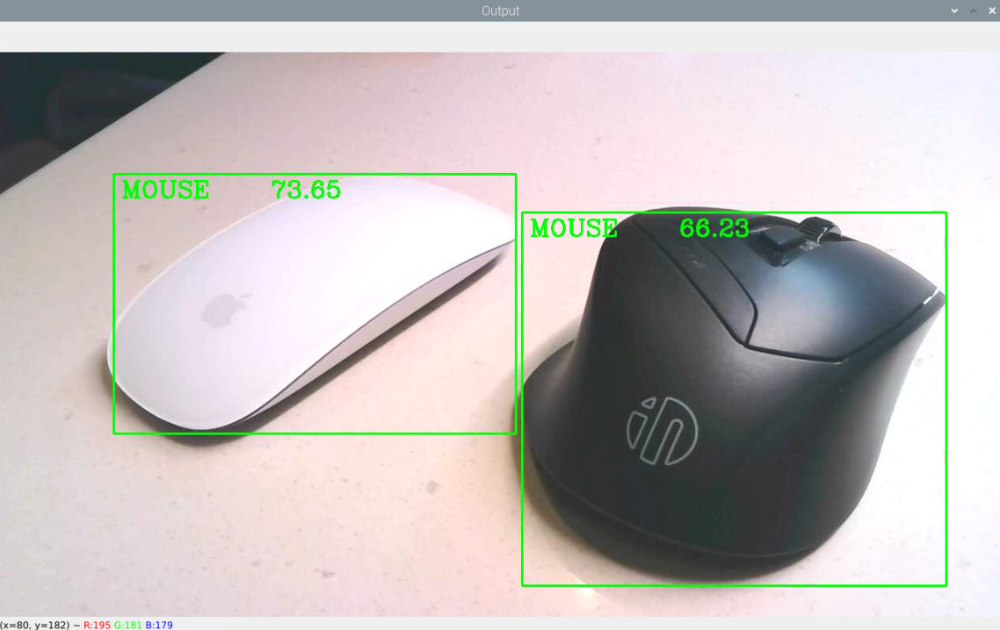

# 物件偵測

以下範例使用 OpenCV 的 DNN 深度神經網絡模組和 SSD MobileNet 模型進行實時物件偵測，可從攝像頭捕捉視訊畫面，然後透過模型進行識別和標記畫面中的物件。

<br>

## 成果示意

1. 剪刀

    

<br>

2. 手機

    

<br>

3. 滑鼠

    

<br>

## 準備工作

1. 在這個範例中，需要使用以下三個文件，請在 `素材與模型` 資料夾內進行下載，存放在腳本同層路徑中即可。特別說明，若自行在網路上下載相關檔案，務必確保資料是正確的，尤其是模型權重文件 `.pd` 這個檔案。

<br>

2. `ssd_mobilenet_v3_large_coco_2020_01_14.pbtxt`：模型的配置文件，包含了模型的架構和層的信息。

<br>

3. `frozen_inference_graph.pb`：儲存訓練模型權重的文件，這包含了權重和偏差。

<br>

4. `coco.names`：標籤文件。特別注意，可自行將標籤改寫為更適合的文字敘述，但僅支持英文，並確保修改後的標籤順序與原本一致，因為模型返回的類別 ID 是基於標籤的順序傳回。

<br>

## 範例

1. 完整程式碼：基於方便理解，以下腳本先以程序導向撰寫。

    ```python
    # 導入OpenCV庫
    import cv2

    # 物件偵測的臨界值 (Threshold)
    thres = 0.5
    # 初始化攝像頭
    cap = cv2.VideoCapture(0)
    # 寬度
    cap.set(3, 1280)
    # 高度
    cap.set(4, 720)
    # 亮度
    cap.set(10, 70)
    # 初始化一個列表
    classNames = []
    # COCO 數據集的標籤文件
    classFile = "coco.names"

    # 打開標籤文件
    with open(classFile, "rt") as f:
        # 讀取所有標籤名
        classNames = f.read().rstrip("\n").split("\n")
    # 模型配置文件和權重文件的路徑
    configPath = "ssd_mobilenet_v3_large_coco_2020_01_14.pbtxt"
    weightsPath = "frozen_inference_graph.pb"

    # 加載深度學習模型
    net = cv2.dnn_DetectionModel(weightsPath, configPath)
    # 設定輸入大小
    net.setInputSize(320, 320)
    # 設定輸入比率
    net.setInputScale(1.0 / 127.5)
    # 設定輸入平均值
    net.setInputMean((127.5, 127.5, 127.5))
    # 轉換藍色和紅色通道
    net.setInputSwapRB(True)

    # 持續從攝像頭讀取影像
    while True:
        # 讀取一幀影像
        success, img = cap.read()
        # 進行物件偵測
        classIds, confs, bbox = net.detect(img, confThreshold=thres)
        # 輸出偵測到的物件ID和邊界框
        print(classIds, bbox)
        # 如果偵測到物件，則在影像上標記
        if len(classIds) != 0:
            for classId, confidence, box in zip(
                classIds.flatten(), confs.flatten(), bbox
            ):
                # 畫出邊界框
                cv2.rectangle(img, box, color=(0, 255, 0), thickness=2)
                # 標記類別名稱
                cv2.putText(
                    img,
                    classNames[classId - 1].upper(),
                    (box[0] + 10, box[1] + 30),
                    cv2.FONT_HERSHEY_COMPLEX,
                    1,
                    (0, 255, 0),
                    2,
                )
                # 標記置信度
                cv2.putText(
                    img,
                    str(round(confidence * 100, 2)),
                    (box[0] + 200, box[1] + 30),
                    cv2.FONT_HERSHEY_COMPLEX,
                    1,
                    (0, 255, 0),
                    2,
                )
        # 顯示處理後的影像
        # cv2.imshow("Output",img)
        # 等待1毫秒，並檢查是否有按鍵輸入
        # cv2.waitKey(1)

        cv2.imshow("Output", img)
        # 檢查是否有按下 'ESC' 或 'q' 鍵
        key = cv2.waitKey(1) & 0xFF
        if (
            key == 27
            or key == ord("q")
            or cv2.getWindowProperty("Output", cv2.WND_PROP_VISIBLE) < 1
        ):
            break

    # 釋放攝像頭資源並關閉所有 OpenCV 視窗
    cap.release()
    cv2.destroyAllWindows()

    ```

<br>

2. 完整程式碼：封裝為函數導向。

    ```python
    import cv2


    # 攝像頭
    def setup_camera(width=1280, height=720, brightness=70):
        cap = cv2.VideoCapture(0)
        cap.set(3, width)
        cap.set(4, height)
        cap.set(10, brightness)
        return cap


    # 載入模型
    def load_model(configPath, weightsPath):
        net = cv2.dnn_DetectionModel(weightsPath, configPath)
        net.setInputSize(320, 320)
        net.setInputScale(1.0 / 127.5)
        net.setInputMean((127.5, 127.5, 127.5))
        net.setInputSwapRB(True)
        return net


    # 偵測物件
    def detect_and_draw_box(img, net, classNames, thres):
        classIds, confs, bbox = net.detect(img, confThreshold=thres)
        if len(classIds) != 0:
            for classId, confidence, box in zip(
                classIds.flatten(), confs.flatten(), bbox
            ):
                cv2.rectangle(img, box, color=(0, 255, 0), thickness=2)
                cv2.putText(
                    img, classNames[classId - 1].upper(),
                    (box[0] + 10, box[1] + 30),
                    cv2.FONT_HERSHEY_COMPLEX, 1, (0, 255, 0), 2
                )
                cv2.putText(
                    img, str(round(confidence * 100, 2)),
                    (box[0] + 200, box[1] + 30),
                    cv2.FONT_HERSHEY_COMPLEX, 1, (0, 255, 0), 2
                )


    # 是否退出
    def should_exit(window_name):
        key = cv2.waitKey(1) & 0xFF
        if key == 27 or key == ord('q') or \
                cv2.getWindowProperty(window_name, cv2.WND_PROP_VISIBLE) < 1:
            return True
        return False


    # 初始化攝像頭和模型
    cap = setup_camera()
    net = load_model(
        "ssd_mobilenet_v3_large_coco_2020_01_14.pbtxt", "frozen_inference_graph.pb"
    )

    # 讀取標籤名
    classNames = []
    with open("coco.names", "rt") as f:
        classNames = f.read().rstrip("\n").split("\n")

    # 主循環
    while True:
        # 讀取攝像頭
        success, img = cap.read()
        # 讀取成功
        if success:
            # 偵測物件
            detect_and_draw_box(img, net, classNames, 0.5)
            # 顯示畫面
            cv2.imshow("Output", img)
            # 是否退出
            if should_exit("Output"):
                break

    # 釋放資源
    cap.release()
    cv2.destroyAllWindows()

    ```

<br>

---

_END_