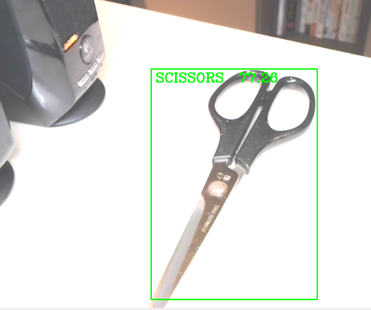
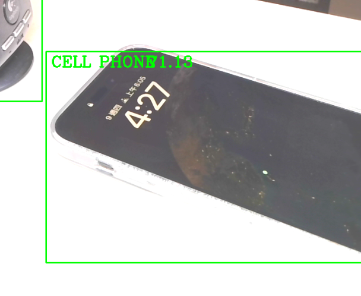

# 物件偵測

以下範例使用 OpenCV 的 DNN 深度神經網絡模組和 SSD MobileNet 模型進行實時物件偵測，可從攝像頭捕捉視訊畫面，然後透過模型進行識別和標記畫面中的物件。

<br>

## 成果示意

_剪刀_


<br>

_手機_


<br>

## 準備工作

1. 在這個範例中，需要使用以下三個文件，要下載並存放於腳本同層路徑中。
2. `ssd_mobilenet_v3_large_coco_2020_01_14.pbtxt`：模型的配置文件，包含了模型的架構和層的信息。
3. `frozen_inference_graph.pb`：儲存訓練模型權重的文件，這包含了權重和偏差。
4. `coco.names`：標籤文件。特別注意，可自行將標籤改寫為更適合的文字敘述，但僅支持英文，並確保修改後的標籤順序與原本一致，因為模型返回的類別 ID 是基於標籤的順序傳回。

<br>

## 範例

1. 程式碼

    ```python
    # 導入OpenCV庫
    import cv2
    # 物件偵測的臨界值 (Threshold)
    thres = 0.5
    cap = cv2.VideoCapture(0)
    # 寬度
    cap.set(3,1280)
    # 高度
    cap.set(4,720)
    # 亮度
    cap.set(10,70)
    # 初始化一個列表
    classNames= []
    # COCO 數據集的標籤文件
    classFile = 'coco.names'

    # 打開標籤文件
    with open(classFile,'rt') as f:
        # 讀取所有標籤名
        classNames = f.read().rstrip('\n').split('\n')
    # 模型配置文件和權重文件的路徑
    configPath = 'ssd_mobilenet_v3_large_coco_2020_01_14.pbtxt'
    weightsPath = 'frozen_inference_graph.pb'

    # 加載深度學習模型
    net = cv2.dnn_DetectionModel(weightsPath,configPath)
    # 設定輸入大小
    net.setInputSize(320,320)
    # 設定輸入比率
    net.setInputScale(1.0/ 127.5)
    # 設定輸入平均值
    net.setInputMean((127.5, 127.5, 127.5))
    # 轉換藍色和紅色通道
    net.setInputSwapRB(True)

    # 持續從攝像頭讀取影像
    while True:
        # 讀取一幀影像
        success,img = cap.read()
        # 進行物件偵測
        classIds, confs, bbox = net.detect(img,confThreshold=thres)
        # 輸出偵測到的物件ID和邊界框
        print(classIds,bbox)
        # 如果偵測到物件，則在影像上標記
        if len(classIds) != 0:
            for classId, confidence,box in zip(classIds.flatten(),confs.flatten(),bbox):
                # 畫出邊界框
                cv2.rectangle(img,box,color=(0,255,0),thickness=2)
                # 標記類別名稱
                cv2.putText(img,classNames[classId-1].upper(),(box[0]+10,box[1]+30),
                            cv2.FONT_HERSHEY_COMPLEX,1,(0,255,0),2)
                # 標記置信度
                cv2.putText(img,str(round(confidence*100,2)),(box[0]+200,box[1]+30),
                            cv2.FONT_HERSHEY_COMPLEX,1,(0,255,0),2)
        # 顯示處理後的影像
        cv2.imshow("Output",img)
        # 等待1毫秒，並檢查是否有按鍵輸入
        cv2.waitKey(1)
    ```


<br>

---

_END_