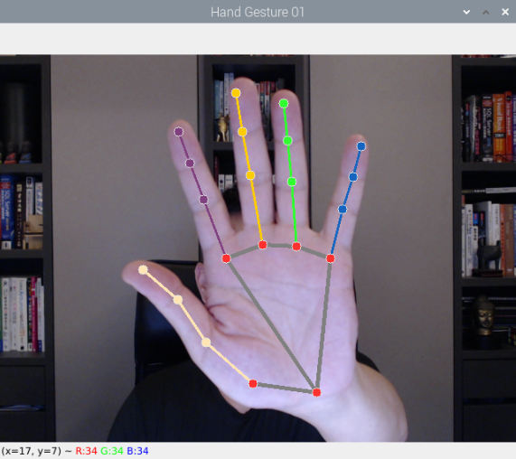
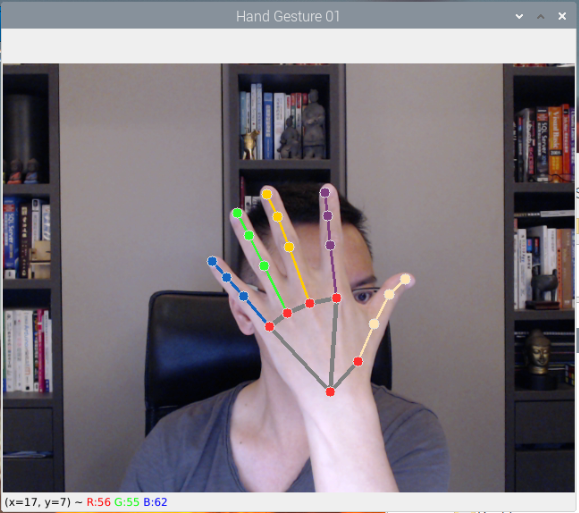

# 手勢關節辨識

1. 正面

    

<br>

2. 反面

    

<br>

## 說明

進行手掌手勢辨識時，初始化模式都是相同的，與之前兩種臉部辨識主要在使用的偵測方式對象上不同。

1. 人臉辨識時是使用 `mediapipe.solutions.face_detection`。

<br>

2. 建立臉部特徵網格時使用的是 `mediapipe.solutions.face_mesh`。

<br>

3. 手掌手勢使用的是 `mediapipe.solutions.hands`。

<br>

## 範例

1. 完整程式碼。

    ```python
    import cv2
    import mediapipe as mp
    import sys

    # 初始化繪圖功能
    mp_drawing = mp.solutions.drawing_utils
    # 初始化繪圖樣式
    mp_drawing_styles = mp.solutions.drawing_styles
    # 初始化手掌偵測對象
    mp_hands = mp.solutions.hands
    # 啟用攝像頭
    cap = cv2.VideoCapture(0)

    '''以上邏輯都是一樣的，僅使用的偵測方式對象'''

    # 啟用手掌偵測
    with mp_hands.Hands(
        # 模型複雜度，使用最簡易的設置 0
        model_complexity=0,
        # 手部檢測成功閥值，0.0~1.0
        min_detection_confidence=0.5,
        # 手部標記追蹤閥值，0.0~1.0
        min_tracking_confidence=0.5) as hands:

        if not cap.isOpened():
            print("無法找到攝像頭")
            sys.exit(1)
        
        while True:
            # 讀取影像，傳出兩個值
            success, img = cap.read()
            if not success:
                print("無法獲取畫面")
                break

            # 將 BGR 轉換成 RGB，提供辨識使用
            img2 = cv2.cvtColor(img, cv2.COLOR_BGR2RGB)
            # 偵測手掌
            results = hands.process(img2)
            # 同樣使用 andmarks
            if results.multi_hand_landmarks:
                for hand_landmarks in results.multi_hand_landmarks:
                    # 將節點和骨架繪製到影像中
                    mp_drawing.draw_landmarks(
                        img,
                        hand_landmarks,
                        mp_hands.HAND_CONNECTIONS,
                        mp_drawing_styles.get_default_hand_landmarks_style(),
                        mp_drawing_styles.get_default_hand_connections_style())

            # 顯示影像並設置標題
            cv2.imshow('Hand_Gesture', img)
            # 檢查是否有按下'ESC'、'q'鍵或關閉視窗
            key = cv2.waitKey(1) & 0xFF
            if (
                key == 27
                or key == ord("q")
                or cv2.getWindowProperty("Hand_Gesture", cv2.WND_PROP_VISIBLE) < 1
            ):
                break

    # 釋放資源
    cap.release()
    cv2.destroyAllWindows()
    ```

<br>

---

_END_