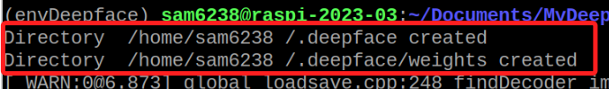
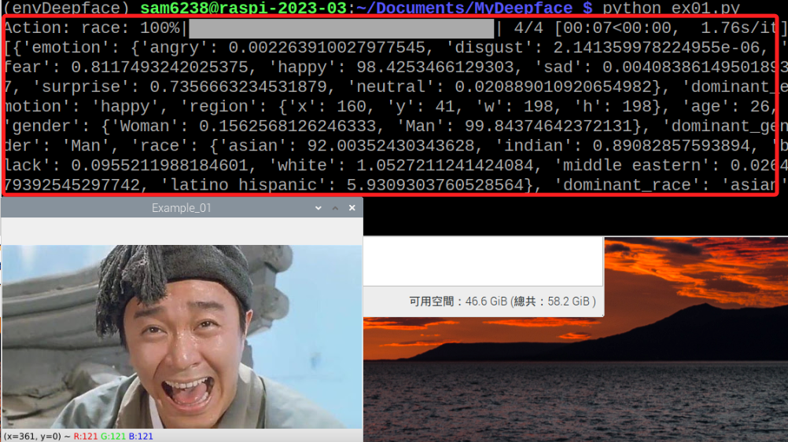

# Deepface

_可參考 [官網](https://viso.ai/computer-vision/deepface/) 或 [官方 Github](https://github.com/serengil/deepface) 更多詳情_

<br>

## 準備工作

1. 建立新的虛擬環境：當然不是一定得建立新的虛擬環境，在講義中這樣做的主要目的是要建立一個全新、乾淨的環境，避免與其他環境形成干擾，造成閱讀講義時操作錯誤。

    ```bash
    python -m venv envDeepface
    ```

<br>

2. 安裝 `opencv-python、deepface` ，同時會自動安裝依賴 `numpy` ，需要一點時間。

    ```bash
    pip install opencv-python deepface
    ```

<br>

3. 準備一張笑臉圖片 `smile_01.jpg` ，或在講義的 `素材` 資料夾內下載。

    

<br>

4. 第一次運行以下腳本會自動下載模型，需要一點時間。

    

<br>

5. 程式碼

    ```python
    import cv2
    from deepface import DeepFace
    import numpy as np

    # 讀取圖片
    _img = cv2.imread('smile_01.jpg')     

    try:
        # 辨識圖片人臉資訊
        analyze = DeepFace.analyze(_img)  
        print(analyze)
    except:
        pass

    cv2.imshow('Example_01', _img)
    cv2.waitKey(0)
    cv2.destroyAllWindows()
    ```

<br>

6. 不用在意運行的結果，在準備工作階段只是要透過運行下載模型。

    

<br>

7. 下載字型，在後續的專案中會使用到，可透過以下網址下載，或在講義的 `素材` 資料夾內下載。

    ```html
    https://fonts.google.com/noto/specimen/Noto+Sans+TC
    ```

<br>

8. 下載辨識模型 `haarcascade_frontalface_default.xml` ，在講義的 `素材` 資料夾內。

<br>

---

_END_