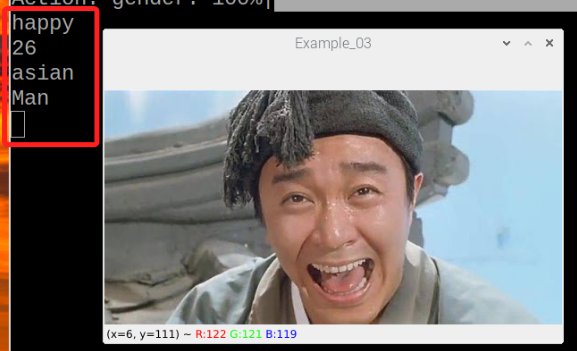
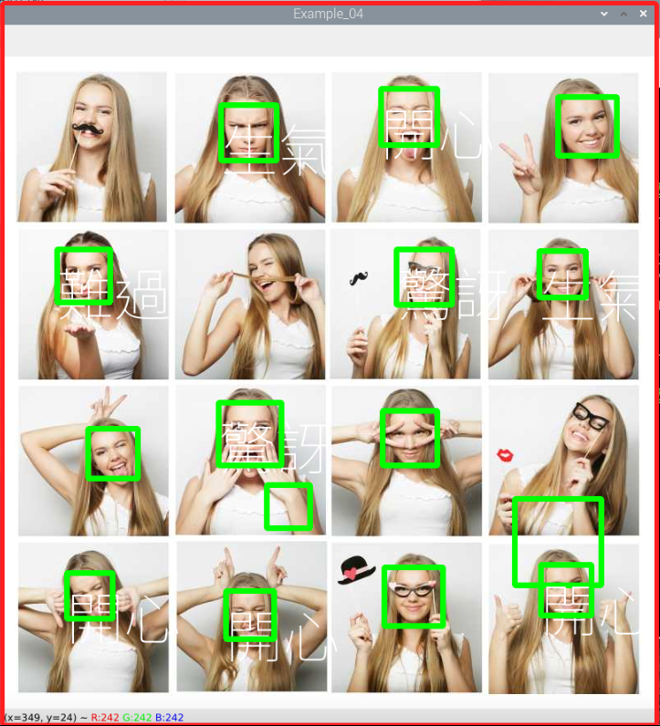
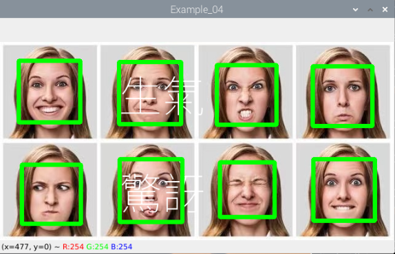

# 情緒識別

<br>

## 範例

1. 這個模型的使用很簡單，在調用 `analyze` 後，可透過使用 `actions` 參數萃取必要資訊，在以下腳本中，分別透過 `emotion`、`age`、`race`、`gender` 四個參數萃取情緒、年齡、人種、性別，執行腳本後可在終端機中觀察結果。

    

<br>

2. 完整程式碼。

    ```python
    import cv2
    from deepface import DeepFace

    _img = cv2.imread('smile_01.jpg')
    try:
        # 情緒
        emotion = DeepFace.analyze(_img, actions=['emotion'])
        # 年齡
        age = DeepFace.analyze(_img, actions=['age'])
        # 人種
        race = DeepFace.analyze(_img, actions=['race'])
        # 性別
        gender = DeepFace.analyze(_img, actions=['gender'])
        #
        print(emotion[0]['dominant_emotion'])
        print(age[0]['age'])
        print(race[0]['dominant_race'])
        print(gender[0]['dominant_gender'])
    except Exception as e:
        print(f'出現錯誤：{e}')

    # 顯示圖片
    cv2.imshow('Example', _img)
    # 按任意鍵關閉
    cv2.waitKey(0)
    cv2.destroyAllWindows()

    ```

<br>

## 多人臉圖片

_可以是相同人或不同人，不同的圖片可能會有不同效果，同學可以試試能否找到更合適的圖片_

1. 效果圖。

    

<br>

2. 完整程式碼。

    ```python
    '''
    多人臉
    '''
    import cv2
    from deepface import DeepFace
    import numpy as np
    from PIL import ImageFont, ImageDraw, Image

    # Mapping
    text_obj={
        'angry': '生氣',
        'disgust': '噁心',
        'fear': '害怕',
        'happy': '開心',
        'sad': '難過',
        'surprise': '驚訝',
        'neutral': '正常'
    }

    # 定義加入文字函式
    def putText(x,y,text,size=70,color=(255,255,255)):
        # 全局變數
        global img
        # 若要使用中文，要下載
        fontpath = 'NotoSansTC-VariableFont_wght.ttf'            
        # 定義字型與文字大小
        font = ImageFont.truetype(fontpath, size)      
        # 轉換成 PIL 影像物件
        imgPil = Image.fromarray(img)                  
        # 定義繪圖物件
        draw = ImageDraw.Draw(imgPil)                  
        # 加入文字
        draw.text((x, y), text, fill=color, font=font) 
        # 轉換成 np.array
        img = np.array(imgPil)                         

    # 載入圖片
    img = cv2.imread('multi-face_03.png')                    
    # 將圖片轉成灰階
    gray = cv2.cvtColor(img, cv2.COLOR_BGR2GRAY)       
    # 載入人臉模型
    face_cascade = cv2.CascadeClassifier("haarcascade_frontalface_default.xml")   
    # 偵測人臉
    faces = face_cascade.detectMultiScale(gray)        
    for (x, y, w, h) in faces:
        # 可調整偵測範圍，避免無法辨識情緒，以下略為擴大像素範圍
        x1 = x-60
        x2 = x+w+60
        y1 = y-20
        y2 = y+h+60
        # 取出人臉範圍
        face = img[x1:x2, y1:y2]  
        try:
            # 辨識情緒
            emotion = DeepFace.analyze(face, actions=['emotion'])  
            # 放入文字
            putText(x,y,text_obj[emotion[0]['dominant_emotion']])
        except:
            # print("發生錯誤")
            pass
        
        # 利用 for 迴圈，抓取每個人臉屬性，繪製方框
        cv2.rectangle(
            img, 
            (x, y), 
            (x+w, y+h), 
            (0, 255, 0),
            5
        )    
    
    # 顯示圖片
    cv2.imshow('Example_04', img)
    # 按任意鍵退出
    cv2.waitKey(0)
    cv2.destroyAllWindows()
    ```


<br>

3. 換一張圖片試試，只辨識出其中兩個表情。

    

<br>

---

_END_