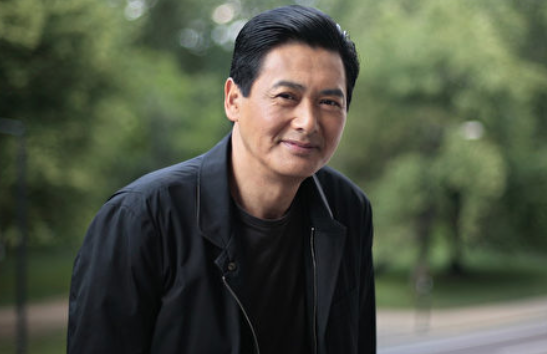
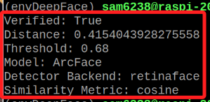
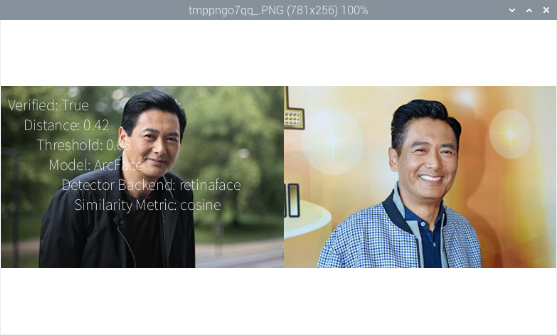
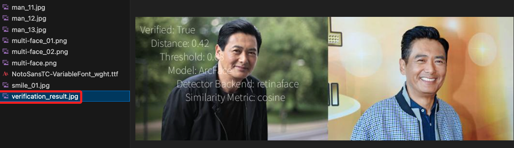

# 人臉辨識

_DeepFace 的人臉辨識_

<br>

## 說明

參考 [官網](https://github.com/serengil/retinaface) 說明所製作並優化的腳本。

<br>

## 範例

1. 請自行下載兩張相片，或在 `素材` 資料夾內下載。

    

    

<br>

2. 官網範例如下。

    ```python
    from deepface import DeepFace

    obj = DeepFace.verify(
        "man_11.jpg", "man_12.jpg",
        model_name="ArcFace",
        detector_backend="retinaface"
    )
    # 輸出結果
    print("Verified:", obj["verified"])
    print("Distance:", obj["distance"])
    print("Threshold:", obj["threshold"])
    print("Model:", obj["model"])
    print("Detector Backend:", obj["detector_backend"])
    print("Similarity Metric:", obj["similarity_metric"])
    ```

<br>

3. 顯示比對結果。

    

<br>

## 優化

1. 完整程式碼。

    ```python
    from deepface import DeepFace
    from PIL import Image, ImageDraw, ImageFont

    # 進行比對
    obj = DeepFace.verify(
        "man_11.jpg", "man_12.jpg",
        model_name="ArcFace",
        detector_backend="retinaface"
    )

    # 顯示結果
    print("Verified:", obj["verified"])
    print("Distance:", obj["distance"])
    print("Threshold:", obj["threshold"])
    print("Model:", obj["model"])
    print("Detector Backend:", obj["detector_backend"])
    print("Similarity Metric:", obj["similarity_metric"])

    # 載入圖片
    img1 = Image.open("man_11.jpg")
    img2 = Image.open("man_12.jpg")

    # 調整為相同尺寸
    base_height = 256
    img1 = img1.resize(
        (int(base_height * img1.width / img1.height), base_height)
    )
    img2 = img2.resize(
        (int(base_height * img2.width / img2.height), base_height)
    )

    # 建立新的圖片，然後貼上原本的兩張圖片
    total_width = img1.width + img2.width
    combined_img = Image.new("RGB", (total_width, base_height))
    combined_img.paste(img1, (0, 0))
    combined_img.paste(img2, (img1.width, 0))

    # 添加文字敘述
    draw = ImageDraw.Draw(combined_img)
    font = ImageFont.truetype("NotoSansTC-VariableFont_wght.ttf", 20)
    text = f"Verified: {obj['verified']}\n \
        Distance: {obj['distance']:.2f}\n \
            Threshold: {obj['threshold']}\n \
                Model: {obj['model']}\n \
                    Detector Backend: {obj['detector_backend']}\n \
                        Similarity Metric: {obj['similarity_metric']}"
    draw.text((10, 10), text, (255, 255, 255), font=font)

    # 顯示
    combined_img.show()
    # 儲存
    combined_img.save('verification_result.jpg')

    ```

<br>

2. 顯示結果。

    

<br>

3. 並且儲存一張圖片。

    

<br>

---

_END_