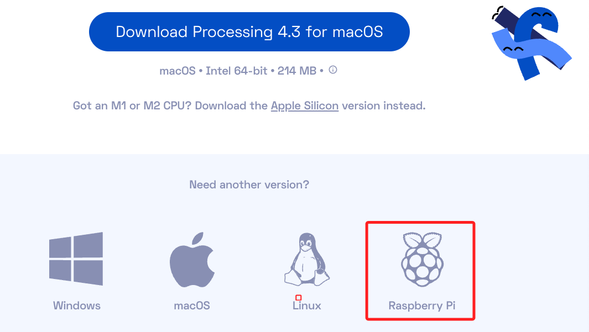
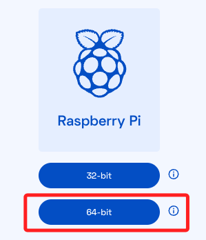
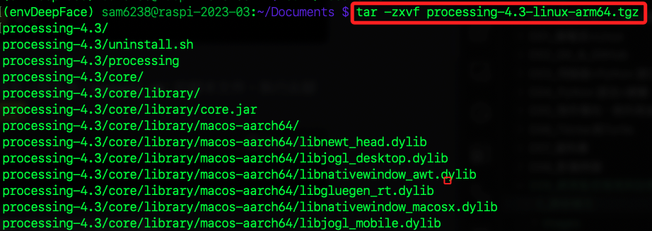
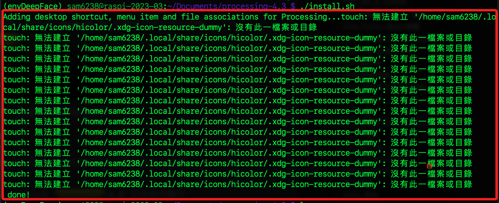
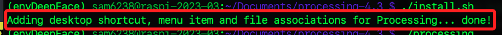
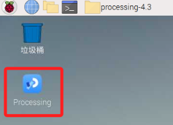
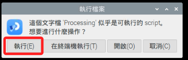
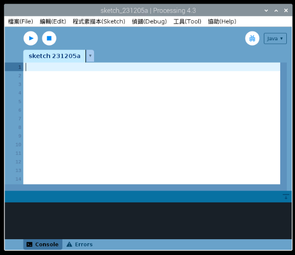

# Processin

<br>

## 下載安裝

1. 前往 [官網下載頁面](https://processing.org/download) 點擊樹莓派使用的版本。

    

<br>

2. 選擇跟樹莓派系統匹配的64位元版本。

    

<br>

3. 下載後可拖曳複製到樹莓派，Mac 可使用 scp 指令進行複製。

    ```bash
    scp processing-4.3-linux-arm64.tgz sam6238@raspi-2023-03:~/Documents
    ```

<br>

4. 連線樹莓派，進入複製壓縮檔案的資料夾，我是使用 `Documents` ，進入後進行解壓縮，需要一點時間。

    ```bash
    tar -zxvf processing-4.3-linux-arm64.tgz
    ```

    

<br>

5. 進入解壓縮後所建立的的資料夾 `processing-4.3` 。

    ```bash
    cd processing-4.3
    ```

<br>

6. 執行安裝腳本。

    ```bash
    ./install.sh
    ```

<br>

7. 出現一連串的 `無法建立` 訊息。

    

<br>

8. 非常詭異，再次執行安裝指令後沒任何錯誤提示，顯示完成。

    ```bash
    ./install.sh
    ```

    

<br>

9. 可透過終端機起動 Processing。

    ```bash
    ./processing
    ```

<br>

10. 另外安裝程序也會建立桌面捷徑。

    

<br>

11. 點擊後會提示，選擇 `執行` 。

    

<br>

12. 完成安裝。

    


<br>

---

_END_