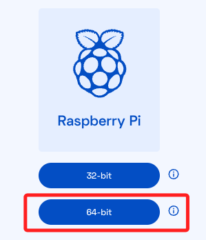

# Processing

<br>

## 下載安裝

1. 前往 [官網下載頁面](https://processing.org/download) 點擊樹莓派使用的版本。

    

<br>

2. 選擇跟樹莓派系統匹配的64位元版本。

    

<br>

3. 下載後可拖曳複製到樹莓派，Mac 可使用 scp 指令進行複製。

    ```bash
    scp processing-4.3-linux-arm64.tgz sam6238@raspi-2023-03:~/Documents
    ```

<br>

4. 連線樹莓派，進入複製壓縮檔案的資料夾，我是使用 `Documents` ，進入後進行解壓縮，需要一點時間。

    ```bash
    tar -zxvf processing-4.3-linux-arm64.tgz
    ```

    

<br>

5. 進入解壓縮過程自動建立的資料夾 `processing-4.3` 。

    ```bash
    cd processing-4.3
    ```

<br>

6. 執行安裝腳本。

    ```bash
    sudo ./install.sh
    ```

<br>

7. 完成安裝，訊息表示會建立桌面捷徑，但有一定的機率會沒有添加。

    

<br>

8. 可手動添加到桌面。

    

<br>

9. 進行授權。

    ```bash
    sudo chmod +x processing
    ```

<br>

9. 這時與主執行檔位在同層路徑，可直接終端機啟動 Processing。

    ```bash
    ./processing
    ```

<br>

10. 另外，安裝程序也會建立桌面捷徑。

    

<br>

11. 點擊後會跳出提示視窗，選擇 `執行` 進行啟動。

    

<br>

12. 至此完成安裝。

    


<br>

## 切換到 Python 模式

_雖然 Java 與 Processing 的結合更好，但呼應課程主題，這裡將使用 Python 模式_

<br>

1. 啟動後預設是 `Java` 。

    

<br>

2. 展開 `Java` 可點擊 `Manage modes...` 。

    

<br>

3. 選取 `Python` 後進行 `Install` 。

    

<br>

4. 完成後關閉安裝視窗，便可建立或開啟 `Python` 的 `Processing` 專案。

    

<br>

## 加入環境參數

_將執行路徑加入環境參數，便於啟動主程式。_

<br>

1. 編輯設定檔案。

    ```bash
    sudo nano ~/.bashrc
    ```

<br>

2. 添加以下內容，同學要依據自己的安裝路徑進行設置。

    ```ini
    # 加入 Processing
    export PROCESSING_HOME=/home/sam6238/Documents/processing-4.3
    export PATH=$PATH:$PROCESSING_HOME
    ```

<br>

3. 記得重新載入。

    ```bash
    source ~/.bashrc
    ```

<br>

---

_END_