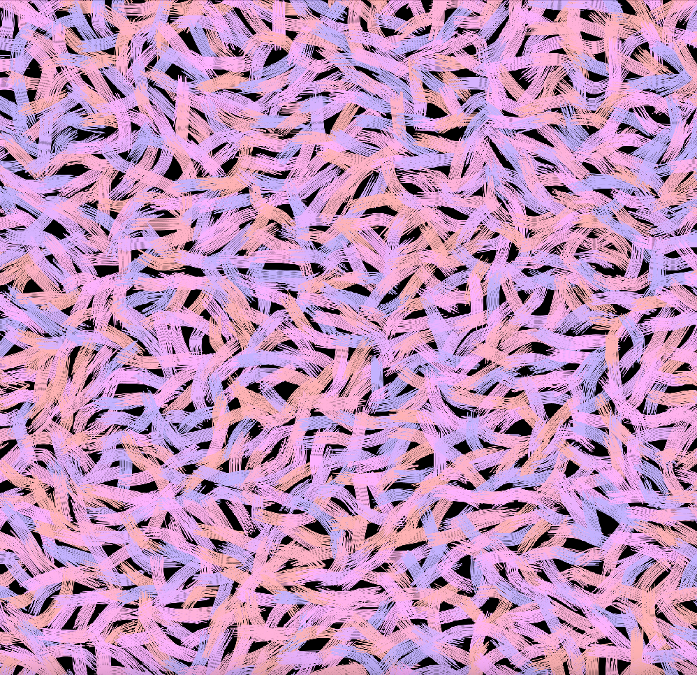

# 基本範例

<br>

## 多個完整範例參考

1. 完整程式碼_01。

    ```python
    def setup():
        # 初始化畫布設置，大小為 1000x1000 像素
        size(1000, 1000)
        
        # 設定背景顏色為白色，RGB 值為 (255, 255, 255)
        background(255, 255, 255)
        
        # 使用 for 迴圈重複繪製 1000 次
        for c in range(1000):
            # 隨機生成圓心的 x 軸座標，範圍從 100 到 900
            center_x = random(100, 900)
            # 隨機生成圓心的 y 軸座標，範圍從 100 到 900
            center_y = random(100, 900)
            # 設定圓的直徑為 50 像素
            cs = 50
            
            # 繪製陰影，不使用邊線
            noStroke()
            # 設定填充色為半透明的黑色，透明度為 2（範圍是 0 到 255）
            fill(15, 15, 15, 2)
            # 繪製一系列圓形來創造陰影效果，每個圓形的直徑逐漸減小
            for i in range(30):
                circle(center_x, center_y, cs - i*5)
                
            # 繪製主要的圓形
            # 設定邊線顏色為深灰色，RGB 值為 (30, 30, 30)
            stroke(30, 30, 30)
            # 隨機填充顏色，紅綠值隨機範圍是 50 到 255，藍色值隨機範圍是 200 到 255
            fill(random(50, 255), random(50, 255), random(200, 255))
            # 繪製圓形，圓心向左上角偏移 25 像素，直徑為 50 像素
            circle(center_x - 25, center_y - 25, cs)

    ```

    

<br>

2. 完整程式碼_02

    ```python
    def setup():
        size(1000, 1000)
        background(255, 255, 255)
        rectWidth = 50
        rectHeight = 50
        
        
        for c in range(1300):
            center_x = random(100, 900)
            center_y = random(100, 900)
            cs = 50
            
            # Draw Shadow
            noStroke()
            fill(15, 15, 15, 13)
            x_direct = random(0, 1)
            y_direct = random(0, 1)
            x_flag = 1 if x_direct > 0.5 else -1
            y_flag = 1 if y_direct > 0.5 else -1
            for i in range(17):
                rect(center_x, center_y, x_flag * (rectWidth - i*5), y_flag * (rectHeight - i*5))
                
            
            # Draw Circle
            stroke(30, 30, 30)
            fill(random(50, 255), random(50, 255), random(200, 255))
            _scale = random(0.6, 1)
            rect(center_x - 25, center_y - 25, rectWidth*_scale, rectHeight*_scale)

    ```

    

<br>

3. 完整程式碼_03。

    ```python
    # Size 寬 高
    w, h = 1000, 1000

    # Circle 直徑
    cs = 40

    def setup():
        #
        size(w, h)
        # 背景色
        background(30, 30, 30)
        # 用於設置高像素密度顯示器的
        pixelDensity(2)


        # 2000個
        for c in range(2000):
            # 圓心
            center_x = random(w/10, w - w/10)
            center_y = random(h/10, h - h/10)
            
            # 畫陰影
            noStroke()
            fill(15, 15, 15, 5)
            for i in range(30):
                circle(center_x + 20, center_y + 20, cs - i*5)
            
            # 畫圓
            stroke(30, 30, 30)
            fill(random(200, 255), random(50, 255), random(200, 255), random(150, 255))
            circle(center_x, center_y, cs)
            
        # 這裡是生成一個隨機數用來儲存檔案
        seed = int(random(10000))
        #save("Examples/redbias-" + str(seed) + ".png")

    ```

    

<br>

4. 完整程式碼_04：可以用滑鼠動態製圖。

    ```python
    def setup():
        size(500, 500)
        noStroke()
        background(200)


    def draw():
        if mousePressed:
            fill(random(255),random(255),random(255))
            # circle(mouseX, mouseY, random(10, 50));
            ellipse(mouseX, mouseY, random(10, 50),random(10, 50))

    ```
    
    

<br>

5. 完整程式碼_05。

    ```python
    #
    w, h = 1000, 1000

    # Number of blobs
    grid_x = 40
    grid_y = 40

    grid_x_pixels = 1.1 * w
    grid_y_pixels = 1.1 * h

    sep_x = float(grid_x_pixels) / (grid_x - 1)
    sep_y = float(grid_y_pixels) / (grid_y - 1)

    #
    colors = []

    def get_midpoint(x1, y1, x2, y2):
        return [(x1 + x2)/2, (y1 + y2)/2]

    def get_distance(x1, y1, x2, y2):
        return sqrt(pow(x2 - x1, 2) + pow(y2 - y1, 2))
        
    def brush_points(x1, y1, x2, y2, brush_height, brush_sat, brush_drift, brush_tips, c, lo, ho):
        pushMatrix()
        
        translate(x1, y1)
        a = atan2(x2, y2);
        translate(-x1, -y1)
        
        #
        mp = get_midpoint(x1, y1, x2, y2)
        translate(x1, y1)

        d = get_distance(x1, y1, x2, y2)

        
        rotate(noise(mp[0] * .02, mp[1] * .02) * TWO_PI)
        #
        fi = random(-brush_drift, brush_drift)
        se = random(-brush_drift, brush_drift)
        th = random(-brush_drift, brush_drift)
        
        for i in range(-brush_height, brush_height, brush_sat):
            strokeWeight(1)
            stroke(c[0], c[1], c[2])
            beginShape()
            
            be = random(-brush_tips, brush_tips)
            curveVertex(-d/2 + be, i + fi)
            curveVertex(-d/2 + be, i + fi)
            
            curveVertex(0, i + se)
            
            en = random(-brush_tips, brush_tips)
            curveVertex(d/2 + en, i + th)
            curveVertex(d/2 + en, i + th)
            #
            endShape()
        popMatrix()

    def setup():
        size(w, h)
        
        colorMode(HSB, 360, 100, 100)
        
        background(0, 0, 0)
        
        pixelDensity(2)
        
        strokeWeight(4)
        noFill()
        
        stroke(random(360), 80, 100)
        
        start_c = random(360)
        for i in range(8):
            colors.append(
                        (start_c, 30, 100))
            start_c += 15
            start_c = start_c%360
        
        current_x = w/2.0 - grid_x_pixels/2.0
        current_y = h/2.0 - grid_y_pixels/2.0
        for i in range(grid_x):
            for j in range(grid_y):
                diff = random(sep_y/2)
                brush_points(current_x, current_y, current_x + sep_x * random(1, 2), current_y + sep_y * random(1, 2), int(sep_x/3), 1, 7, 8, colors[int(random(len(colors)))], 100, 200)
                
                current_y += sep_y
            current_y = h/2.0 - grid_y_pixels/2.0
            current_x += sep_x    
        
        #save("Examples/" + str(int(random(1000))) + ".png")

    ```

    

<br>

6. 完整程式碼_06。

    ```python
    w, h = 1000, 1000
    line_points = []
    colors_list=[['#b7b7a4','#ddbea9','#6b705c','#cb997e'],['#d4e09b','#f6f4d2','#cbdfbd','#f19c79','#a44a3f'],['#2b2d42','#8d99ae','#edf2f4','#ef233c','#d90429'],['#f4f1de','#e07a5f','#3d405b','#81b29a','#f2cc8f'],['#50514f','#f25f5c','#ffe066','#247ba0','#70c1b3'],['#8cb369','#f4e285','#f4a259','#5b8e7d','#bc4b51'],['#fe938c','#e6b89c','#ead2ac','#9cafb7','#4281a4'],['#177e89','#084c61','#db3a34','#ffc857','#323031'],['#e93e49','#fcf5e5'],['#000000','#ffffff'],["#f14d42","#f4fdec","#4fbe5d","#265487","#f6e916","#f9a087","#2e99d6"],["#f04924","#fcce09","#408ac9"],["#e95145","#f8b917","#b8bdc1","#ffb2a2"],['#a63d40','#e9b872','#90a959','#6494aa'],["#b8b8d1","#5b5f97","#ffc145","#fffffb","#ff6b6c"],["#edae49","#d1495b","#00798c","#30638e","#003d5b"],["#efbc9b","#725d68","#a8b4a5"],["#cad2c5","#84a98c","#52796f"],["#0d3b66","#faf0ca","#f4d35e"],["#885053","#fe5f55"],["#ac8887","#9f4a54","#6f8695"],["#f79256","#fbd1a2","#7dcfb6"],["#fc7a57","#ffd65c","#5e5b52","#98d9c2"],["#083d77","#ebebd3","#da4167","#f4d35e","#f78764","#a09ebb"],["#bee9e8","#62b6cb","#1b4965","#cae9ff","#5fa8d3"],["#41afc8","#84c0c6","#9fb7b9","#bcc1ba","#f2e2d2"],["#5bc0eb","#fde74c"],["#ab9787","#92b9bd","#a8d4ad","#f2f79e"],["#adc698","#c05746","#d0e3c4"],["#094074","#164b7d","#235586","#305f8f","#3c6997"],["#e01a4f","#f15946","#f9c22e","#53b3cb"],["#383d3b","#4f5251","#666767","#7d7c7d","#939192","#aaa6a8","#c1bbbe","#d8d0d4","#eee5e9"],["#f9e5c8","#f96273","#89b2bd"],["#ffc759","#ff7b9c","#607196"],["#628395","#96897b","#dbad6a"],["#e8d6cb","#d0ada7","#ad6a6c"],["#95b8d1","#f09d51","#394053"],["#ee6c4d","#58a4b0","#58a4b0","#f38d68"],["#ad343e","#474747","#f2af29"],["#be7c4d","#5d737e"],["#c05746","#1778b5","#adc698"]]

    cols = colors_list[int(random(len(colors_list)))]

    def get_random_color():
        return cols[int(random(len(cols)))]

    step = 60

    # 
    def draw_cool_line(pts, bo, bi, fo, fi, dc):
        #
        for i in range(bi):
            for p in pts:
                #
                p[0] += random(-bo, bo)
                p[1] += random(-bo, bo)
        
        #
        bts = pts
        for i in range(fi):
            for b in bts:
                # 
                b[0] += random(-fo, fo)
                b[1] += random(-fo, fo)
            beginShape()
            for b in bts:
                curveVertex(*b)
            endShape()
            
            strokeWeight(1)
            #
            for j in range(1, len(bts) - 2):
                for d in range(dc):
                    spot = random(1)
                    dot_x = (1 - spot)* bts[j][0] + spot * bts[j + 1][0]
                    dot_y = (1 - spot)* bts[j][1] + spot * bts[j + 1][1]
                    
                    circle(dot_x, dot_y, 1)
                
    #
    def draw_block(lc, pc):
        for i in range(lc):
            stroke(get_random_color())
            pts = []
            
            current = [random(0, w), random(0, h)]
            for i in range(pc):
                pts.append([current[0], current[1]])
                
                if (random(1) < .5):
                    if (random(1) < .5):
                        current[0] += step
                    else:
                        current[0] -= step
                else:
                    if (random(1) < .5):
                        current[1] += step
                    else:
                        current[1] -= step
                
            draw_cool_line(pts, 2, 2, 10, 2, 10)
            
    
    def setup():
        size(w, h)
        background("#f1faee")
        pixelDensity(2)
        strokeWeight(2)
        stroke(0, 0, 0, 120)
        noFill()

        for k in range(200):
            draw_block(5, 100)
        
        # save("Examples/" + str(int(random(100000))) + ".png")

    ```

    

<br>

7. 完整程式碼_07。

    ```python
    #
    w, h = 1000, 1000

    colors_list = [[(127, 199, 175), (218, 216, 167), (167, 219, 216), (237, 118, 112)],
            [(230, 57, 70), (241, 250, 238), (29, 53, 87)],
            [(183, 183, 164), (221, 190, 169), (107, 112, 92), (203, 153, 126)],
            [(212, 224, 155), (246, 244, 210), (203, 223, 189), (241, 156, 121), (164, 74, 63)]] 

    colors = []

    cube_size = random(4,15)
    fill_deform = random(2,12)
    outline_deform = random(2,12)

    border_size = 40


    def get_random_element(l):
        return l[int(random(len(l)))]

    def draw_border():
        noStroke()
        fill(252, 245, 229)
        
        rect(0, 0, w, border_size)
        rect(0, 0, border_size, h)
        rect(w - border_size, 0, border_size, h)
        rect(0, h - border_size, w, border_size) 
        stroke(0)
        strokeWeight(2)
        noFill()
        rect(border_size, border_size, w - border_size * 2, h - border_size * 2)
        

    # Center of the quad, size, deform strength,outline, fill color
    def draw_rect(x, y, x_s, y_s, d, o, f):

        stroke(*o)
        fill(*f)
        strokeJoin(ROUND)
        beginShape()
        
        vertex(x - x_s - random(-d, d), y - y_s - random(-d, d))
        vertex(x + x_s - random(-d, d), y - y_s - random(-d, d))
        vertex(x + x_s - random(-d, d), y + y_s - random(-d, d))
        vertex(x - x_s - random(-d, d), y + y_s - random(-d, d))
        
        endShape(CLOSE)
        
        
    def setup():
        size(w, h)
        randomSeed(int(random(10010)))
        pixelDensity(2)
        colors = get_random_element(colors_list)
        # colors = colors_list[4]
        background(252, 245, 229)
        # background(*get_random_element(colors))
        
        
        strokeWeight(2)
        for r in range(30):
            draw_cube_layer(5, get_random_element(colors))
        draw_border()
        
        # Go Outside the border
        if (random(1) < .9):
            for r in range(7):
                draw_cube_layer(5, get_random_element(colors))
        # save('Examples/Great/' + str(int(random(10000))) + '.png')
        
    def draw_cube_layer(o, layer_color):
        first_cube = [random(0, h), random(0, 1000)]
        
        cubes = []
        choose_cubes = []
        drawing_cubes = []
        
        cubes.append(first_cube)
        drawing_cubes.append(first_cube)
        choose_cubes.append(first_cube)
        
        for j in range(2000):
            c = cubes[int(random(len(cubes)))]
            
            next_cube = c[:]
            if (random(1) < .5):
                if (random(1) < .5):
                    next_cube[0] += cube_size
                    next_cube[1] -= cube_size*2
                else:
                    next_cube[0] -= cube_size
                    next_cube[1] -= cube_size*2
            else:
                if (random(1) < .5):
                    next_cube[0] += cube_size
                    next_cube[1] += cube_size*2
                else:
                    next_cube[0] -= cube_size
                    next_cube[1] += cube_size*2
                
            if ((next_cube in drawing_cubes) == False):
                cubes.append(next_cube)
                choose_cubes.append(next_cube)
                drawing_cubes.append(next_cube)
                
                # Symmetry mode?
                if (random(1) < 0):
                    sym_cube = next_cube[:]
                    sym_cube[0] += (w/2 - next_cube[0])*2
                    
                    cubes.append(sym_cube)
                    choose_cubes.append(sym_cube)
                
                    drawing_cubes.append(sym_cube)
                    
            if j%2 == 0 and len(cubes) > 3:
                cubes.pop(0)
        
        drawing = True
        for c in drawing_cubes:
            if (drawing == True):
                draw_rect(c[0], c[1], cube_size, cube_size, fill_deform, (0, 0, 0, 0), layer_color)
                draw_rect(c[0], c[1], cube_size, cube_size, outline_deform, (0, 0, 0, 255), (0, 0, 0, 0))
            if (random(1) < .06):
                drawing = False
            
            if (drawing == False and random(1) < .1):
                drawing = True
            
    ```

    

<br>

8. 完整程式碼_08。

    ```python
    #
    w, h = 1400, 1400

    # Number of birds
    grid_x = 5
    grid_y = 5

    # The birds will draw inside this rectangle
    grid_x_pixels = .8 * w
    grid_y_pixels = .8 * h

    # Distance between the birds
    sep_x = grid_x_pixels / (grid_x - 1)
    sep_y = grid_y_pixels / (grid_y - 1)

    # Background Color
    bc = (255, 255, 255)

    # Global bird variables

    colors = [(189, 208, 196), (154,183,211), (245,210,211), (247,225,211), (223,204,241)]
    feet_length = 40
    body_height = 100
    line_thickness = 7

    body_fill_chance = .3
    head_fill_chance = .3
    tail_chance = .3
    arc_chance = .4

    min_shape_lines = 1
    max_shape_lines = 5

    def get_random_element(l):
        return l[int(random(len(l)))]

    # Adds shading to some of the randomly drawn triangles
    def draw_lines(point_list):

        p1 = point_list.pop(point_list.index(get_random_element(point_list)))
        p2 = point_list.pop(point_list.index(get_random_element(point_list)))
        p3 = point_list.pop(point_list.index(get_random_element(point_list)))
        
        # Create lines
        lines = int(random(min_shape_lines, max_shape_lines))
        print(lines)
        
        if (p3[0] - p1[0] == 0):
            first_x_adj = 1
        else:
            first_x_adj = (p3[0] - p1[0])/abs(p3[0] - p1[0])
            
        if (p3[1] - p1[1] == 0):
            first_y_adj = 1
        else:
            first_y_adj = (p3[1] - p1[1])/abs(p3[1] - p1[1])
            
        first_x_sep = sqrt(pow(p1[0] - p3[0], 2))/lines * first_x_adj
        first_y_sep = sqrt(pow(p1[1] - p3[1], 2))/lines * first_y_adj
        
        if (p3[0] - p2[0] == 0):
            second_x_adj = 1
        else:
            second_x_adj = (p3[0] - p2[0])/abs(p3[0] - p2[0])
            
        if (p3[1] - p2[1] == 0):
            second_y_adj = 1
        else:
            second_y_adj = (p3[1] - p2[1])/abs(p3[1] - p2[1])
            
        second_x_sep = sqrt(pow(p2[0] - p3[0], 2))/lines * second_x_adj
        second_y_sep = sqrt(pow(p2[1] - p3[1], 2))/lines * second_y_adj

        for i in range(lines):
            line(p1[0] + first_x_sep * i, p1[1] + first_y_sep * i, p2[0] + second_x_sep * i, p2[1] + second_y_sep * i)


    def draw_bird_base(x, y, pc, dc):
        
        ###########
        # Draw Legs
        ###########
        stroke(0)
        strokeCap(ROUND)
        line(x - feet_length, y, x + feet_length, y)
        line(x - feet_length/3.0, y, x - feet_length/3.0 - feet_length/2.0, y - feet_length)
        line(x + feet_length/3.0, y, x + feet_length/3.0 - feet_length/2.0, y - feet_length)
        
        ###########
        # Draw Body
        ###########
        stroke(*dc)
        body_bottom = y - feet_length/2.0
        
        body_one = (int(x - feet_length * 2.0), int(body_bottom))
        body_two = (int(x + feet_length*1.5), int(body_bottom))
        body_three = (int(x + feet_length*2.1), int(body_bottom - body_height))
        body_four = (int(x), int(body_bottom - body_height * 1.3))
        
        left_midpoint = ((body_four[0] + body_one[0]) / 2, (body_four[1] + body_one[1]) / 2)
        top_midpoint = ((body_four[0] + body_three[0]) / 2, (body_four[1] + body_three[1]) / 2)
        right_midpoint = ((body_two[0] + body_three[0]) / 2, (body_two[1] + body_three[1]) / 2)
        bottom_midpoint = ((body_one[0] + body_two[0]) / 2, (body_one[1] + body_two[1]) / 2)
        
        true_midpoint = ((left_midpoint[0] + right_midpoint[0]) / 2, (left_midpoint[1] + right_midpoint[1]) / 2)
        
        
        body_points = [ body_one, body_three, body_four, left_midpoint, top_midpoint, bottom_midpoint]
        
        fill(*bc)
        beginShape()
        vertex(*body_one)
        vertex(*body_two)
        vertex(*body_three)
        vertex(*body_four)
        endShape(CLOSE)
        
        for i in range(int(random(1, 4))):
            point_one = get_random_element(body_points)
            point_two = get_random_element(body_points)
            point_three = get_random_element(body_points)
            point_four = get_random_element(body_points)
            
            
            fill(pc[0], pc[1], pc[2])
            beginShape()
            vertex(*point_one)
            vertex(*point_two)
            vertex(*point_three)
            endShape(CLOSE)
            noFill()
            
            if (random(1) < .5):
                draw_lines([point_one, point_two, point_three])
        
        head_x = x + feet_length
        head_y = body_bottom - body_height * 1.1
        head_size = 90
        
        ###########
        # Draw Tail
        ###########
        if (random(1) < tail_chance):
            stroke(*dc)
            fill(*pc)
            var_width = random(15, 30)
            var_x = random(-25, -15)
            var_y = random(-50, -30)
            if (random(1) < .3):
                var_y *= -1
            
            beginShape()
            vertex(body_one[0], body_one[1])
            vertex(body_one[0] + var_width, body_one[1])
            vertex(body_one[0] + + var_width + var_x, body_one[1] + var_y)
            vertex(body_one[0] + var_x, body_one[1] + var_y)
            endShape(CLOSE)
        
        
        ###########
        # Draw Beak
        ###########
        y_variance = random(10, 40)
        length_variance = random(50, 100)
        

        # pc = get_random_element(colors)
        # inc = .2 * 255
        # stroke(pc[0] - inc, pc[1] - inc, pc[2] - inc)
        
        if (random(1) < body_fill_chance):
            fill(*pc)
        else:
            fill(*bc)
        
        triangle(head_x, head_y - y_variance, head_x, head_y + y_variance, head_x + length_variance, head_y)
        
        ###########
        # Draw Head
        ###########
        fill(*bc)
        circle(head_x, head_y, head_size)
        
        if (random(1) < arc_chance):
            fill(*pc)
            noStroke()
            arc(head_x, head_y, head_size, head_size, random(.7, 1)*PI, 1.8*PI, PIE);
        
        stroke(*dc)
            
        if (random(1) < head_fill_chance):
            fill(*pc)
        else:
            noFill()
        circle(head_x, head_y, head_size)
        

        
        ###########
        # Draw Eyes
        ###########
        eye_x = head_x + head_size/6.0
        eye_y = head_y - head_size/8.0
        eye_size = 25
        fill(*bc)
        circle(eye_x, eye_y, eye_size)
        
        stroke(0)
        fill(0)
        noStroke()
        circle(eye_x, eye_y, 10)
        
    def setup():
        size(w, h)
        
        background(*bc)
        pixelDensity(2)
        stroke(0)
        strokeWeight(line_thickness)
        strokeJoin(ROUND)
        
        current_x = w/2.0 - grid_x_pixels/2.0
        current_y = h/2.0 - grid_y_pixels/2.0 + body_height
        
        for i in range(grid_x):
            for j in range(grid_y):
                
                pc = get_random_element(colors)
                inc = .2 * 255
                dc = (pc[0] - inc, pc[1] - inc, pc[2] - inc)
                draw_bird_base(current_x, current_y, pc, dc)
                current_y += sep_y
            current_y = h/2.0 - grid_y_pixels/2.0 + body_height
            current_x += sep_x
                
        seed = str(int(random(10000)))
        save("Examples/" + str(grid_x) + "-" + str(grid_y) + "-s-" + seed + ".png")

    ```

    

<br>

9. 完整程式碼_09。

    ```python
    #
    w, h = 2500, 1000

    celestials = []
    giants = []

    grid_width = 100
    grid_height = 100

    cell_width = float(w)/grid_width
    cell_height = float(h)/grid_height

    color_palette = [(229, 115, 118), (235, 167, 114), (114, 178, 241), (211, 173, 223), (170, 198, 166), (215, 255, 218), (230, 215, 0)]

    planet_colors = [(191, 96, 90), (170, 169, 187), (160, 198, 209), (107, 153, 168)]

    # Set colors (no palette)
    planet_outline_color = (255, 255, 255)

    planet_fill_color = (0, 0, 0)

    # System Variables

    # Sun
    sun_size = 1500

    # Planets
    planet_sep = 150
    min_planet_size = 40
    max_planet_size = 260
    planet_stroke = 1

    # Ring Systems
    min_rings = 3
    max_rings = 6
    ring_stroke = 1
    ring_chance = .3
    realistic = True

    # Moons
    moon_sep = 5
    min_moon_size = 5
    max_moon_size = 25
    moon_stroke = 4
    moon_chance = .3

    # Stars
    add_stars = True
    star_count = 16000
    min_star_size = 1
    max_star_size = 3
    min_star_opacity = 0
    max_star_opacity = 255
    star_sep_star = 1
    star_sep_planet = 6

    add_star_colors = True
    color_chance = .2

    asteroid_max_size = 15
    asteroid_min_size = 5

    # Find and set a random color from predefined palette
    def set_palette_fill():
        c = color_palette[int(random(len(color_palette)))]
        fill(c[0], c[1], c[2])
        
    # Set the outline colors to a random color
    def set_palette_stroke():
        c = color_palette[int(random(len(planet_colors)))]
        stroke(c[0], c[1], c[2])

    # Convert pixel position to grid element
    def get_grid_position(x, y):
        return x/cell_width + y/cell_height * grid_width 


    class Celestial:
        def __init__(self, size):
            # self.position = (0, 0)
            self.size = size
            
        # Use this method if the circle is larger than the grid cell size
        def add_giant(self, position, rings):
            self.position = position
            valid = True
            for c in giants:
                distance = sqrt(pow(c.position[1] - self.position[1], 2) + pow(c.position[0] - self.position[0], 2))
                if (distance < (c.size/2 + self.size/2 + 2)):
                    valid = False
                    
            #
            
            if (valid == True):
                if (rings == True and random(1) < ring_chance):
                    self.display_with_rings()
                    giants.append(self)
                else:
                    fill(planet_fill_color[0], planet_fill_color[1], planet_fill_color[2])
                    self.display()
                    giants.append(self)
            
        #
        def place_manually(self, position):
            self.position = position
            gridless.append(self)
            self.display()
        
        def place_asteroid(self, position):
            
            strokeWeight(1)
            stroke(planet_outline_color[0], planet_outline_color[1], planet_outline_color[2])
            fill(planet_fill_color[0], planet_fill_color[1], planet_fill_color[2])
            
            points = []
            rad = 0.0
            while (rad < 2*PI):
                #
                cos_r = random(asteroid_min_size, asteroid_max_size)
                sin_r = random(asteroid_min_size, asteroid_max_size)
                p = (position[0] + (cos_r * cos(rad)), position[1] + (sin_r * sin(rad)), rad, cos_r, sin_r)
                points.append(p)
                rad += .6
            
            beginShape()
            for p in points:
                curveVertex(p[0], p[1])
                
            curveVertex(points[0][0], points[0][1])
            curveVertex(points[1][0], points[1][1])
            curveVertex(points[2][0], points[2][1])
            endShape()
            
        # Probably used for the stars
        def add_random_valid(self):
            for i in range(20):
                self.position = (random(w), random(h))
                grid_position = int(self.get_grid_position())
                
                # Compare each smaller celestial (stars)
                compare_list = []
            
                for c in celestials[grid_position]:
                    compare_list.append(c)
                    
                if (grid_position % grid_width > 0):
                    for c in celestials[grid_position - 1]:
                        compare_list.append(c)
                        
                if (grid_position % grid_width < grid_width - 1):
                    for c in celestials[grid_position + 1]:
                        compare_list.append(c)
                        
                if (grid_position >= grid_width):
                    for c in celestials[grid_position - grid_width]:
                        compare_list.append(c)
                        
                if (grid_position < (grid_width * grid_height) - grid_width):
                    for c in celestials[grid_position + grid_width]:
                        compare_list.append(c)
                        
                if (grid_position % grid_width > 0 and grid_position > grid_width):
                    for c in celestials[grid_position - grid_width - 1]:
                        compare_list.append(c)
                        
                if (grid_position % grid_width > 0 and grid_position < (grid_width * grid_height) - grid_width):
                    for c in celestials[grid_position + grid_width - 1]:
                        compare_list.append(c)
                        
                if (grid_position % grid_width < grid_width - 1 and grid_position > grid_width):
                    for c in celestials[grid_position - grid_width + 1]:
                        compare_list.append(c)
                
                if (grid_position % grid_width < grid_width - 1 and grid_position < (grid_width * grid_height) - grid_width):
                    for c in celestials[grid_position + grid_width + 1]:
                        compare_list.append(c)
                
                valid = True
                for c in compare_list:
                    distance = sqrt(pow(c.position[1] - self.position[1], 2) + pow(c.position[0] - self.position[0], 2))
                    if (distance < (c.size/2 + self.size/2 + star_sep_star)):
                        valid = False
                        
                # Avoid placing stars too close to planets and sun
                compare_list = []
                
                for c in giants:
                    compare_list.append(c)
                
                for c in compare_list:
                    distance = sqrt(pow(c.position[1] - self.position[1], 2) + pow(c.position[0] - self.position[0], 2))
                    if (distance < (c.size/2 + self.size/2 + star_sep_planet)):
                        valid = False
                            
                # Avoid the edges of the image
                if (self.position[0] + self.size/2 > w or self.position[0] - self.size/2 < 0 or self.position[1] + self.size/2 > h or self.position[1] - self.size/2 < 0):
                    valid = False
                        
                if (valid == True):
                    celestials[grid_position].append(self)
                    self.display()
                    break
                
        # Draws the rings and planet    
        def display_with_rings(self):
            strokeWeight(ring_stroke)
            if (len(giants) != 0):
                starting_height = random(self.size/4, self.size/2)
                starting_width = random(self.size*1.2, self.size*2)
                noFill()
                rotation = random(6)
                for i in range(int(random(min_rings, max_rings))):
                    pushMatrix()
                    translate(self.position[0], self.position[1])
                    rotate(rotation)
                    ellipse(0, 0, starting_height + i * 10, starting_width + i * 30)
                    popMatrix()
                    
            strokeWeight(planet_stroke)    
            pushMatrix()
            translate(self.position[0], self.position[1])
            rotate(rotation)
            fill(0, 0, 0, 0)
            circle(0, 0, self.size)
            fill(planet_fill_color[0], planet_fill_color[1], planet_fill_color[2])
            arc(0, 0, self.size, self.size, 1.5*PI, 2.5*PI);
            popMatrix()
        
        # Used for performance
        def get_grid_position(self):
            x = self.position[0]
            y = self.position[1]
            return int(x/cell_width) + int(y/cell_height) * grid_width 
            
        # Draw a planet without rings
        def display(self):
            strokeWeight(planet_stroke)
            circle(self.position[0], self.position[1], self.size)
                
            
    def setup():
        size(w, h)
        pixelDensity(2)
        
        background(0, 0, 0)
        strokeWeight(planet_stroke)
        stroke(planet_outline_color[0], planet_outline_color[1], planet_outline_color[2])
        fill(planet_fill_color[0], planet_fill_color[1], planet_fill_color[2])
        
        center = -(sun_size/4)
        last_size = sun_size
        sun = Celestial(sun_size)
        sun.add_giant((center, h/2), False)
        
        for i in range(15):
            next_planet_size = random(min_planet_size, max_planet_size)
            center = center + last_size/2 + planet_sep + next_planet_size/2
            if (next_planet_size/2 + center > w):
                break
            
            strokeWeight(planet_stroke)
            fill(planet_fill_color[0], planet_fill_color[1], planet_fill_color[2])
            
            # Add the current planet
            planet = Celestial(next_planet_size)
            planet.add_giant((center, h/2), True)
            
            # Add moons for the planet
            moons = []
            moon_y = h - h/4
            if (random(1) < moon_chance):
                for i in range(int(random(1, 8))):
                    moon = Celestial(random(min_moon_size, max_moon_size))
                    moons.append(moon)
                
                # Calculate length of moons
                total_length = 0
                for m in moons:
                    total_length += m.size
                    total_length += moon_sep
                total_length -= moon_sep
                
                # Draw the moons
                strokeWeight(moon_stroke)
                moon_start = center - total_length/2
                for m in moons:
                    moon_start += m.size/2
                    m.add_giant((moon_start, moon_y), False)
                    
                    moon_start += m.size/2 + moon_sep
                    
            # Update tracking variable
            last_size = next_planet_size
        
        # Add the stars
        for i in range(grid_width * grid_height):
            celestials.append([])
            
        #    
        noStroke()
        fill(255, 255, 255, random(min_star_opacity, max_star_opacity))
        
        # Add all the stars using circle packing method
        if (add_stars == True):
            for x in range(star_count):
                if (random(1) < color_chance and add_star_colors == True):
                    c = color_palette[int(random(len(color_palette)))]
                    fill(c[0], c[1], c[2], random(min_star_opacity, max_star_opacity))
                else:
                    fill(255, 255, 255, random(min_star_opacity, max_star_opacity))
                star = Celestial(random(min_star_size, max_star_size))
                star.add_random_valid()
        
        # save("Examples/test.png")

    ```

    

<br>

10. 完整程式碼_10：可觀察動態生成過程。

    ```python
    #
    import datetime
    from random import shuffle, seed

    #
    timestamp = datetime.datetime.now().strftime('%Y%m%d_%H%M%S')

    #
    rand_seed = 1138
    print(rand_seed)
    #
    seed(rand_seed)
    randomSeed(rand_seed)

    filename = 'allegory'

    record = True
    animate = True
    animate_mode = 'sinusoid'

    # Canvas size
    w = 800
    h = 800

    steps = 1000
    num_loops = 1

    frame_rate = 20

    inc = 0.01
    scl = 20
    cols = floor(w/scl)
    rows = floor(h/scl)
        
    step = TAU/steps
    t1 = 0

    c_points = [radians(x) for x in range(1, 360, 10)]
    print(c_points)

    def setup():
        # Sets size of canvas in pixels (must be first line)
        size(w, h) 
        
        # 
        pixelDensity(displayDensity())
        
        # 
        colorMode(HSB, 360, 100, 100, 100)
            
        # 
        frameRate(frame_rate)

        # 
        if not animate:
            noLoop()

        background(0, 0, 25)
        stroke(60, 7, 86)
        fill(0, 0, 25, 0)
        
    def draw():
        global t1
        global t2
        global t3
        
        t1 = t1 + 0.03
        # 
        if frameCount > (steps * num_loops):
            # exit()
            pass
        
        beginShape()
        
        r = w*0.03
        
        #
        a = c_points[0]
        n = map(noise(t1, a), 0, 1, 1, 2)
        x0, y0 = circle_point(w/2, h/2, n*(r+frameCount), a)
        curveVertex(x0, y0)
        
        a = c_points[1]
        n = map(noise(t1, a), 0, 1, 1, 2)
        x1, y1 = circle_point(w/2, h/2, n*(r+frameCount), a)
        curveVertex(x1, y1)
        
        a = c_points[2]
        n = map(noise(t1, a), 0, 1, 1, 2)
        x2, y2 = circle_point(w/2, h/2, n*(r+frameCount), a)
        curveVertex(x2, y2)
        
        for i,a in enumerate(c_points):
            #
            if i>3:
                n = map(noise(t1, a), 0, 1, 1, 2)
                x, y = circle_point(w/2, h/2, n*(r+frameCount), a)
                curveVertex(x, y)

        # 
        curveVertex(x0, y0)
        curveVertex(x1, y1)
        curveVertex(x2, y2)
        
        endShape()

        if record:
            save_frame_timestamp(filename, timestamp)
    
    def save_frame_timestamp(filename, timestamp='', output_dir='output'):
        '''Saves each frame with a structured filename to allow for tracking all output'''
        filename = filename.replace('\\', '')
        filename = filename.replace('/', '')
        output_filename = os.path.join(output_dir, '{}_{}_{}_####.png'.format(timestamp, filename, rand_seed))
        saveFrame(output_filename)
        print(output_filename)
        
    def circle_point(cx, cy, r, a):
        x = cx + r * cos(a)
        y = cy + r * sin(a)
        return x, y

    ```

    

<br>

---

_END_