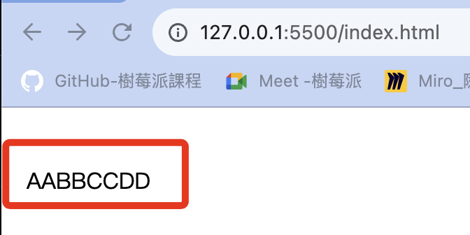

# 嵌入網頁

_將 Processing嵌入網頁 並與 Python 腳本進行通信_

<br>

## 說明

_以下採循序漸進方式進行，在這裡僅完成前面兩個步驟，其餘由同學自己實作。_

1. 先建立 Processing 與 `.txt` 格式文件的同步通信，並將 `文件內容` 同步顯示在Processing 的畫布與終端機上，當文件內容變更時，畫布與終端機會同步更新。
2. 將 Processing 腳本嵌入網頁，並再次讀取通道中文件的內容，確認彼此通信依舊順暢。
3. 在原有的通道基礎上，以 Python 腳本動態修改 `.txt` 文件的內容。
4. 若網頁中的 Processing 腳本能反應文件內容變動，即完成通信的目的。
5. 完成以上步驟，可進一步透過雲端通信與 Firebase 資料庫連動。

<br>

## Processing 讀取文件

1. 開啟一個 Processing 專案，先進行存檔，Processing 會建立一個同名資料夾，這裡示範命名為 `FirstProcessing`，並存放於樹莓派桌面。

    

<br>

2. 在桌面點擊專案資料夾，然後在資料夾內點擊右鍵添加新檔案 `New File`。

    

<br>

3. 命名為 `shared_file.txt` ，然後點擊確定。

    

<br>

4. 點擊文件會開啟樹莓派內建編輯器，內容任意打上一些文字如 `AABB` ，然後存檔退出。

   

<br>

5. 完整程式碼：將以下 Processing 腳本貼上。

    ```python
    last_command = ""

    def setup():
        # 設置畫布大小
        size(400, 400)
        # 設置背景色為白色
        background(255)
        # 設置更新率，可以設定適合腳本運行的更新頻率
        frameRate(1)
        # 設置文字顏色
        fill(0)
        # 設置文字大小
        textSize(16)

    def draw():
        global last_command
        # 持續讀取文件
        lines = loadStrings("shared_file.txt")
        if lines is not None and len(lines) > 0:
            command = lines[0]
            # 檢查是否有更新
            if command != last_command:
                last_command = command
                # 如果有更新就回重新繪製
                redrawCanvas()
                # 在畫布上顯示新的內容
                text(command, 10, 50)
                # 在終端機中顯示
                print("Command: " + command)
        else:
            print("為讀取到數據或文件不存在")

    def redrawCanvas():
    # 重置背景色，清除內容
        background(255)

    ```

<br>

6. 運行 Processing 腳本之後，在視窗與終端機中皆可 `動態地` 顯示文件中的內容以及其變動，至此確認 Processing 已經可以與文件進行通信。

   

<br>

## 嵌入網頁

1. 使用 VSCode 遠端連線樹莓派桌面的專案 `MyProcessing` 。

    

<br>

2. 可任意編輯文件檔案 `shared_file.txt` 來觀察變化，如 `AABBCCDD` 。

   

<br>

2. 將 Processing 腳本轉換為 P5.js，這個轉換難度不高，同學可自行琢磨，這裡僅展示一下嵌入的方式。

    ```javascript
    let lastCommand = "";

    function setup() {
        createCanvas(400, 400);
        background(255);
        frameRate(1);
        fill(0);
        textSize(16);
    }

    function draw() {
        loadStrings("shared_file.txt", function (lines) {
            if (lines.length > 0) {
                let command = lines[0];
                if (command !== lastCommand) {
                    lastCommand = command;
                    redrawCanvas();
                    text(command, 10, 50);
                }
            }
        }, function (error) {
            console.log("未讀取到內容或文件不存在。");
        });
    }

    function redrawCanvas() {
        background(255);
    }

    ```

<br>

3. 建立超文本 `index.html` ，依照 p5.js 腳本內容必須與 `shared_file.txt` 文件置於同層目錄，至於是否與 Processing 腳本放在一起皆可，因為此後進行通信的 Processing 程序會內嵌到超文本中，而不是原本的 Processing 腳本。

   ```bash
   touch index.html
   ```

<br>

4. 在超文本 `index.html` 中必須鏈接 p5.js 庫。

   ```html
   <head>
       <!--鏈接 p5.js 庫-->
       <script src="https://cdnjs.cloudflare.com/ajax/libs/p5.js/1.4.0/p5.js"></script>
   </head>
   ```

<br>

5. 先看一下文本  `index.html` 的架構，以下範例尚未寫入 p5.js 程式碼。

   ```html
   <!DOCTYPE html>
   <html>

   <head>
       <title>Processing Sketch</title>
       <script src="https://cdnjs.cloudflare.com/ajax/libs/p5.js/1.4.0/p5.js"></script>
   </head>

   <body>
       <script>
           // 這裡寫入 p5.js 程式碼
       </script>
   </body>

   </html>

   ```

<br>

6. 了解整個架構後，以下就是完整的 HTML 腳本。

   ```html
   <!DOCTYPE html>
   <html>

   <head>
       <title>Processing Sketch</title>
       <script src="https://cdnjs.cloudflare.com/ajax/libs/p5.js/1.4.0/p5.js"></script>
   </head>

   <body>
       <script>
           // 這裡寫入 p5.js 程式碼
           let lastCommand = "";

           function setup() {
               createCanvas(400, 400);
               background(255);
               frameRate(1);
               fill(0);
               textSize(16);
           }

           function draw() {
               loadStrings("shared_file.txt", function (lines) {
                   if (lines.length > 0) {
                       let command = lines[0];
                       if (command !== lastCommand) {
                           lastCommand = command;
                           redrawCanvas();
                           text(command, 10, 50);
                       }
                   }
               }, function (error) {
                   console.log("未讀取到資料或檔案不存在");
               });
           }

           function redrawCanvas() {
               background(255);
           }

       </script>
   </body>

   </html>
   ```

<br>

7. 在 VSCode 中可透過 `Live Server` 插件進行測試。

   

<br>

8. 會開啟本地網頁，網址是 `127.0.0.1:5500` 。

   

<br>

9. 區網訪問使用 `樹莓派網址:5500` ，我的樹莓派網址是 `192.168.1.134` 。

   

<br>

## 套用先前的範例

1. 使用的是繪製這個圖片的腳本 (第一個)。

   

<br>

2. 同樣需要將 Python 腳本轉換為 P5.js，轉換後腳本如下。

   ```javascript
   function setup() {
       // 初始化畫布設置，大小為 1000x1000 像素
       createCanvas(1000, 1000);

       // 設置背景顏色為白色，RGB 值為 (255, 255, 255)
       background(255, 255, 255);

       // 使用 for 迴圈重複繪製 1000 次
       for (let c = 0; c < 1000; c++) {
           // 隨機生成圓心的 x 軸坐標，範圍從 100 到 900
           let center_x = random(100, 900);
           // 隨機生成圓心的 y 軸坐標，範圍從 100 到 900
           let center_y = random(100, 900);
           // 設置圓的直徑為 50 像素
           let cs = 50;

           // 繪製陰影，不使用邊線
           noStroke();
           // 設置填充色為半透明的黑色，透明度為 2（範圍是 0 到 255）
           fill(15, 15, 15, 2);
           // 繪製一系列圓形來創造陰影效果，每個圓形的直徑逐漸減小
           for (let i = 0; i < 30; i++) {
               circle(center_x, center_y, cs - i * 5);
           }

           // 繪製主要的圓形
           // 設置邊線顏色為深灰色，RGB 值為 (30, 30, 30)
           stroke(30, 30, 30);
           // 隨機填充顏色，紅綠值隨機範圍是 50 到 255，藍色值隨機範圍是 200 到 255
           fill(random(50, 255), random(50, 255), random(200, 255));
           // 繪製圓形，圓心向左上角偏移 25 像素，直徑為 50 像素
           circle(center_x - 25, center_y - 25, cs);
       }
   }

   ```

<br>

3. 可直接將腳本插入 `<body></body>` 中的 `<script></script>`，因為畫面有點偏移，以下略作優化，添加了一個 `style` 以及一個 `div` 。

   ```html
   <!DOCTYPE html>
   <html>
   <head>
       <title>p5.js Sketch</title>
       <script src="https://cdnjs.cloudflare.com/ajax/libs/p5.js/1.4.0/p5.js"></script>
       <!--加入 style-->
       <style>
           #sketch-holder {
               display: flex;
               justify-content: center;
               align-items: center;
               height: 100vh;
           }
       </style>
   </head>
   <body>
       <!--加入一個 div，並使用自訂的樣式-->
       <div id="sketch-holder"></div>
       <script src="sketch.js">
           // 一樣插入轉換為 p5.js 的 Python 腳本
       </script>
   </body>
   </html>

   ```

<br>

4. 完整程式碼：已將畫面圖像置中。

   ```html
   <!DOCTYPE html>
   <html>

   <head>
       <title>Processing Sketch</title>
       <script src="https://cdnjs.cloudflare.com/ajax/libs/p5.js/1.4.0/p5.js"></script>
       <style>
           #sketch-holder {
               display: flex;
               justify-content: center;
               align-items: center;
               height: 100vh;
           }
       </style>
   </head>

   <body>
       <div id="sketch-holder"></div>
       <script>
           // 這裡寫入 p5.js 程式碼
           function setup() {
               let canvas = createCanvas(1000, 1000);
               // 初始化畫布設置，大小為 1000x1000 像素
               canvas.parent('sketch-holder');

               // 設置背景顏色為白色，RGB 值為 (255, 255, 255)
               background(255, 255, 255);

               // 使用 for 迴圈重複繪製 1000 次
               for (let c = 0; c < 1000; c++) {
                   // 隨機生成圓心的 x 軸坐標，範圍從 100 到 900
                   let center_x = random(100, 900);
                   // 隨機生成圓心的 y 軸坐標，範圍從 100 到 900
                   let center_y = random(100, 900);
                   // 設置圓的直徑為 50 像素
                   let cs = 50;

                   // 繪製陰影，不使用邊線
                   noStroke();
                   // 設置填充色為半透明的黑色，透明度為 2（範圍是 0 到 255）
                   fill(15, 15, 15, 2);
                   // 繪製一系列圓形來創造陰影效果，每個圓形的直徑逐漸減小
                   for (let i = 0; i < 30; i++) {
                       circle(center_x, center_y, cs - i * 5);
                   }

                   // 繪製主要的圓形
                   // 設置邊線顏色為深灰色，RGB 值為 (30, 30, 30)
                   stroke(30, 30, 30);
                   // 隨機填充顏色，紅綠值隨機範圍是 50 到 255，藍色值隨機範圍是 200 到 255
                   fill(random(50, 255), random(50, 255), random(200, 255));
                   // 繪製圓形，圓心向左上角偏移 25 像素，直徑為 50 像素
                   circle(center_x - 25, center_y - 25, cs);
               }
           }


       </script>
   </body>

   </html>
   ```

<br>

5. 成果圖。

   

<br>

---

_END_
