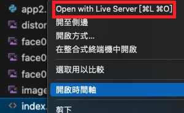
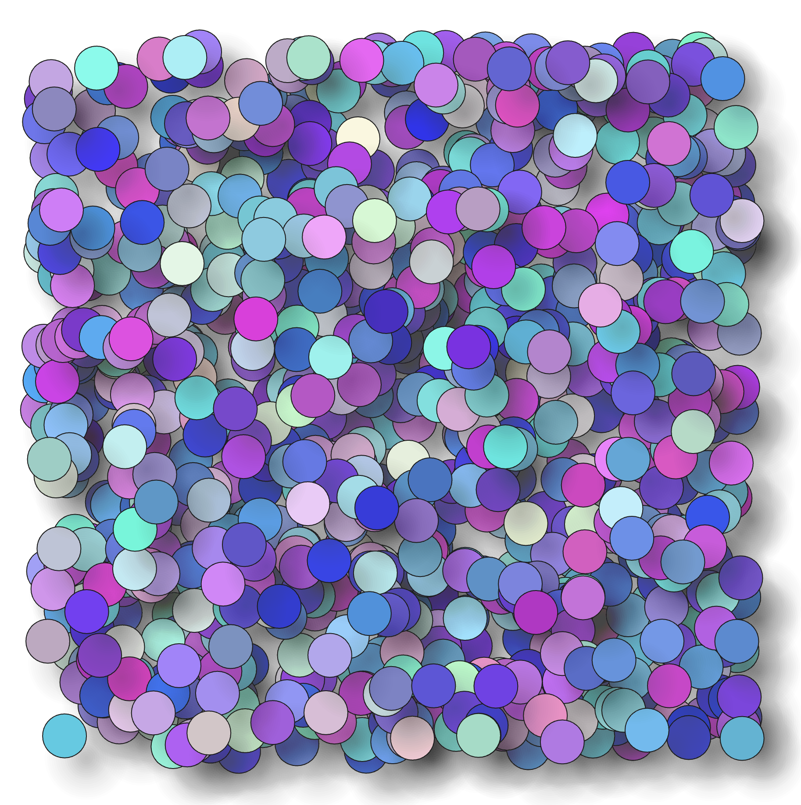
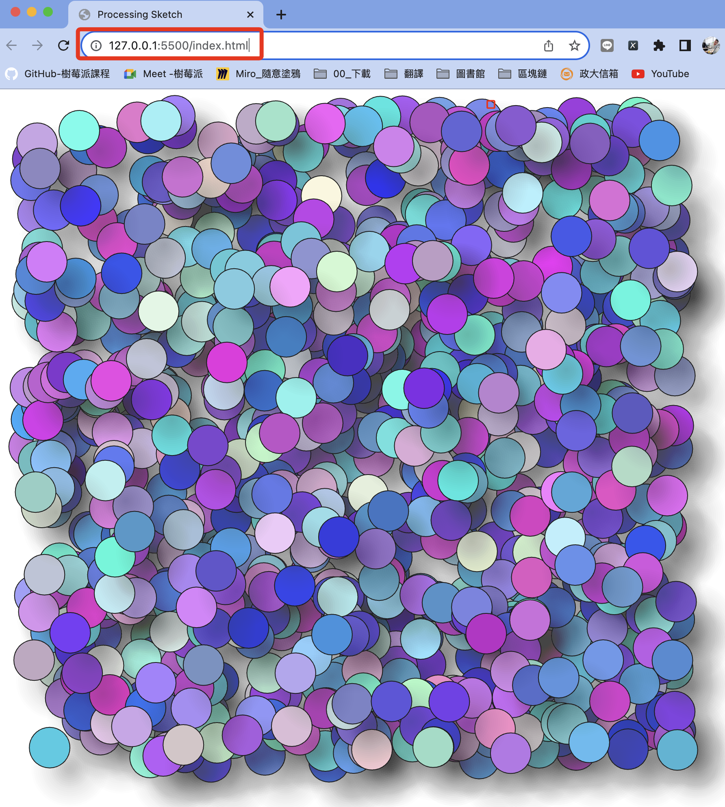

# 通信

_Processing 與 Python 腳本間進行通信_

<br>

## 說明

_以下採循序漸進方式進行_

1. 先建立 Processing 與 Python 腳本的通訊，並透過文件與其內容作為通信中介。
2. 將 Processing 腳本嵌入網頁，並讀取通道中文件的訊息。
3. 在原有的通道基礎上，完成 Python 腳本與網頁中的 Processing 腳本通信的目的。

<br>

## Processing 讀取文件

1. 完整程式碼：Processing 腳本。

    ```python
    last_command = ""

    def setup():
        # 設置畫布大小
        size(400, 400)
        # 設置背景色為白色
        background(255)
        # 設置更新率，可以設定適合腳本運行的更新頻率
        frameRate(1)
        # 設置文字顏色
        fill(0)
        # 設置文字大小
        textSize(16)

    def draw():
        global last_command
        # 持續讀取文件
        lines = loadStrings("shared_file.txt")
        if lines is not None and len(lines) > 0:
            command = lines[0]
            # 檢查是否有更新
            if command != last_command:
                last_command = command
                # 如果有更新就回重新繪製
                redrawCanvas()
                # 在畫布上顯示新的內容
                text(command, 10, 50)
                # 在終端機中顯示
                print("Command: " + command)
        else:
            print("為讀取到數據或文件不存在")

    def redrawCanvas():
    # 重置背景色，清除內容
        background(255)

    ```

<br>

## 嵌入網頁

1. 在專案資料夾內建立一個測試用的文件檔案 `shared_file.txt` ，預先寫入內容 `AABBCCDD` 。

    ```bash
    touch shared_file.txt
    ```

    

<br>

2. 建立 `index.html` ，與前一項的文件至於同層目錄。

    ```html
    <!DOCTYPE html>
    <html>

    <head>
        <title>Processing Sketch</title>
        <script src="https://cdnjs.cloudflare.com/ajax/libs/p5.js/1.4.0/p5.js"></script>
    </head>

    <body>
        <script>
            // 這裡寫入 p5.js 程式碼
            let lastCommand = "";

            function setup() {
                createCanvas(400, 400);
                background(255);
                frameRate(1);
                fill(0);
                textSize(16);
            }

            function draw() {
                loadStrings("shared_file.txt", function (lines) {
                    if (lines.length > 0) {
                        let command = lines[0];
                        if (command !== lastCommand) {
                            lastCommand = command;
                            redrawCanvas();
                            text(command, 10, 50);
                        }
                    }
                }, function (error) {
                    console.log("未讀取到資料或檔案不存在");
                });
            }

            function redrawCanvas() {
                background(255);
            }

        </script>
    </body>

    </html>
    ```

<br>

3. 在 VSCode 中透過 Live Server 插件進行測試。

    

<br>

4. 會開啟本地網頁，網址是 `127.0.0.1:5500` 。

    

<br>

5. 區網訪問使用 `樹莓派網址:5500` ，我的樹莓派網址是 `192.168.1.134` 。

    

<br>

## 套用先前的範例

1. 使用的是這個腳本。

    

<br>

2. 需要將 Python 腳本轉換為 P5.js，這部分難度不高，但語法不同，同學可以自行琢磨，也可使用線上工具或交由 GPT 進行轉換皆可。

    ```js
    function setup() {
    // 初始化畫布設置，大小為 1000x1000 像素
    createCanvas(1000, 1000);

    // 設置背景顏色為白色，RGB 值為 (255, 255, 255)
    background(255, 255, 255);

    // 使用 for 迴圈重複繪製 1000 次
    for (let c = 0; c < 1000; c++) {
        // 隨機生成圓心的 x 軸坐標，範圍從 100 到 900
        let center_x = random(100, 900);
        // 隨機生成圓心的 y 軸坐標，範圍從 100 到 900
        let center_y = random(100, 900);
        // 設置圓的直徑為 50 像素
        let cs = 50;

        // 繪製陰影，不使用邊線
        noStroke();
        // 設置填充色為半透明的黑色，透明度為 2（範圍是 0 到 255）
        fill(15, 15, 15, 2);
        // 繪製一系列圓形來創造陰影效果，每個圓形的直徑逐漸減小
        for (let i = 0; i < 30; i++) {
        circle(center_x, center_y, cs - i * 5);
        }

        // 繪製主要的圓形
        // 設置邊線顏色為深灰色，RGB 值為 (30, 30, 30)
        stroke(30, 30, 30);
        // 隨機填充顏色，紅綠值隨機範圍是 50 到 255，藍色值隨機範圍是 200 到 255
        fill(random(50, 255), random(50, 255), random(200, 255));
        // 繪製圓形，圓心向左上角偏移 25 像素，直徑為 50 像素
        circle(center_x - 25, center_y - 25, cs);
    }
    }

    ```

<br>

3. 可直接將腳本插入 `<body></body>` 中的 `<script></script>`，因為畫面有點偏移，以下略作優化。

    ```html
    <!DOCTYPE html>
    <html>
    <head>
        <title>p5.js Sketch</title>
        <script src="https://cdnjs.cloudflare.com/ajax/libs/p5.js/1.4.0/p5.js"></script>
        <!--加入 style-->
        <style>
            #sketch-holder {
                display: flex;
                justify-content: center;
                align-items: center;
                height: 100vh;
            }
        </style>
    </head>
    <body>
        <!--加入一個 div，並使用自訂的樣式-->
        <div id="sketch-holder"></div>
        <script src="sketch.js">
            // 一樣插入轉換為 p5.js 的 Python 腳本
        </script>
    </body>
    </html>

    ```

<br>

4. 完整程式碼。

    ```html
    <!DOCTYPE html>
    <html>

    <head>
        <title>Processing Sketch</title>
        <script src="https://cdnjs.cloudflare.com/ajax/libs/p5.js/1.4.0/p5.js"></script>
        <style>
            #sketch-holder {
                display: flex;
                justify-content: center;
                align-items: center;
                height: 100vh;
            }
        </style>
    </head>

    <body>
        <div id="sketch-holder"></div>
        <script>
            // 這裡寫入 p5.js 程式碼
            function setup() {
                let canvas = createCanvas(1000, 1000);
                // 初始化畫布設置，大小為 1000x1000 像素
                canvas.parent('sketch-holder');

                // 設置背景顏色為白色，RGB 值為 (255, 255, 255)
                background(255, 255, 255);

                // 使用 for 迴圈重複繪製 1000 次
                for (let c = 0; c < 1000; c++) {
                    // 隨機生成圓心的 x 軸坐標，範圍從 100 到 900
                    let center_x = random(100, 900);
                    // 隨機生成圓心的 y 軸坐標，範圍從 100 到 900
                    let center_y = random(100, 900);
                    // 設置圓的直徑為 50 像素
                    let cs = 50;

                    // 繪製陰影，不使用邊線
                    noStroke();
                    // 設置填充色為半透明的黑色，透明度為 2（範圍是 0 到 255）
                    fill(15, 15, 15, 2);
                    // 繪製一系列圓形來創造陰影效果，每個圓形的直徑逐漸減小
                    for (let i = 0; i < 30; i++) {
                        circle(center_x, center_y, cs - i * 5);
                    }

                    // 繪製主要的圓形
                    // 設置邊線顏色為深灰色，RGB 值為 (30, 30, 30)
                    stroke(30, 30, 30);
                    // 隨機填充顏色，紅綠值隨機範圍是 50 到 255，藍色值隨機範圍是 200 到 255
                    fill(random(50, 255), random(50, 255), random(200, 255));
                    // 繪製圓形，圓心向左上角偏移 25 像素，直徑為 50 像素
                    circle(center_x - 25, center_y - 25, cs);
                }
            }


        </script>
    </body>

    </html>
    ```

<br>

5. 成果圖。

    

<br>

---

_END_