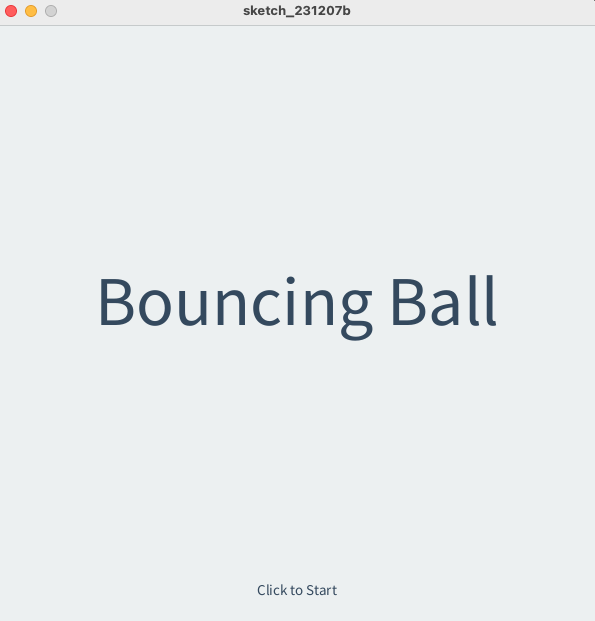
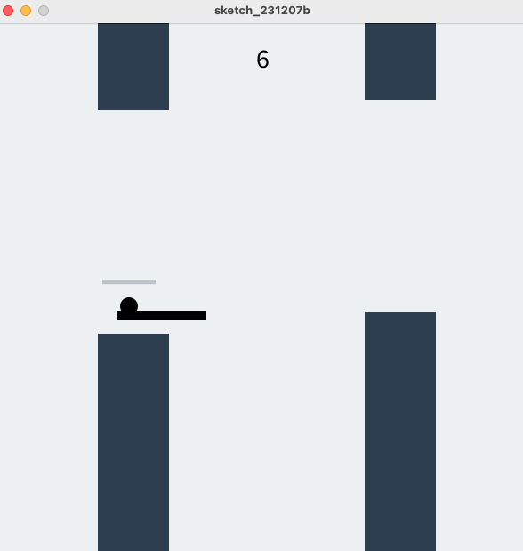

# 動態遊戲

_這是一個比較複雜的專案，同學可以慢慢琢磨，也可以將腳本與前一小節的嵌入網頁結合。_

<br>

## 示意圖

1. 點擊開始遊戲。

    

<br>

2. 支撐球的彈跳來維持血條。

    

<br>

## 範例

1. 完整程式碼。

    ```python
    '''全局變量'''
    # 遊戲畫面狀態：0-初始畫面，1-遊戲進行中，2-遊戲結束
    gameScreen = 0
    # 重力加速度
    gravity = 0.3
    # 空氣阻力
    airfriction = 0.00001
    # 摩擦力
    friction = 0.1
    # 玩家得分
    score = 0
    # 最大血條
    maxHealth = 100
    # 當前血條
    health = 100
    # 血條減少量
    healthDecrease = 1
    # 血條寬度
    healthBarWidth = 60
    # 球的初始位置
    ballX, ballY = 0, 0
    # 球的垂直速度
    ballSpeedVert = 0
    # 球的水平速度
    ballSpeedHorizon = 0
    # 球的大小
    ballSize = 20
    # 球的顏色
    ballColor = color(0)
    # 球拍顏色
    racketColor = color(0)
    # 球拍寬高
    racketWidth = 100
    racketHeight = 10
    # 牆體向前移動速度
    wallSpeed = 5
    # 牆體添加速度
    wallInterval = 1000
    # 上次添加牆體的時間
    lastAddTime = 0
    # 最小最大牆體間隙
    minGapHeight = 200
    maxGapHeight = 300
    # 牆寬
    wallWidth = 80
    # 牆顏色
    wallColors = color(44, 62, 80)
    # 牆列表
    walls = []

    # 初始化
    def setup():
        global ballX, ballY, ballColor, racketColor
        # 窗口 800x600
        ballX = width / 4
        size(600, 600)  
        ballY = height / 5
        ballColor = color(0)
        racketColor = color(0)

    # 開始繪圖
    def draw():
        global gameScreen
        if gameScreen == 0:
            initScreen()
        elif gameScreen == 1:
            gameScreenFunction()
        elif gameScreen == 2:
            gameOverScreen()

    # 遊戲起始畫面
    def initScreen():
        background(236, 240, 241)
        textAlign(CENTER)
        fill(52, 73, 94)
        textSize(70)
        text("Bouncing Ball", width / 2, height / 2)
        textSize(15)
        text("Click to Start", width / 2, height - 30)

    # 遊戲畫面
    def gameScreenFunction():
        background(236, 240, 241)
        drawRacket()
        watchRacketBounce()
        drawBall()
        applyGravity()
        applyHorizontalSpeed()
        keepInScreen()
        drawHealthBar()
        printScore()
        wallAdder()
        wallHandler()

    def gameOverScreen():
        # 設置遊戲結束螢幕的背景和文字樣式
        # 深藍色
        background(44, 62, 80)
        textAlign(CENTER, CENTER)
        # 淺灰色字
        fill(236, 240, 241)

        # 顯示 "Scores"
        textSize(12)
        text("Scores", width / 2, height / 2 - 120)

        # 顯示玩家的得分
        textSize(130)
        text(score, width / 2, height / 2)

        # 顯示 "Click to Restart" 提示，指導玩家如何重新開始遊戲
        textSize(15)
        text("Click to Restart", width / 2, height - 30)

    # 滑鼠
    def mousePressed():
        global gameScreen
        if gameScreen == 0:
            startGame()
        elif gameScreen == 2:
            restart()

    # 開始遊戲
    def startGame():
        global gameScreen
        gameScreen = 1

    # 遊戲結束
    def gameOver():
        global gameScreen
        gameScreen = 2

    # 重新開始
    def restart():
        global gameScreen, score, health, ballX, ballY, lastAddTime, walls
        score = 0
        health = maxHealth
        ballX = width / 4
        ballY = height / 5
        lastAddTime = 0
        walls = []
        gameScreen = 1

    # 球
    def drawBall():
        fill(ballColor)
        ellipse(ballX, ballY, ballSize, ballSize)

    # 球拍
    def drawRacket():
        fill(racketColor)
        rectMode(CENTER)
        rect(mouseX, mouseY, racketWidth, racketHeight)

    # 添加牆
    def wallAdder():
        global lastAddTime
        if millis() - lastAddTime > wallInterval:
            randHeight = int(random(minGapHeight, maxGapHeight))
            randY = int(random(0, height - randHeight))
            randWall = [width, randY, wallWidth, randHeight, 0]
            walls.append(randWall)
            lastAddTime = millis()

    # 處理牆
    def wallHandler():
        global walls
        i = 0
        while i < len(walls):
            wall = walls[i]
            wallMover(wall)
            wallDrawer(wall)
            watchWallCollision(wall)
            if wall[0] + wall[2] <= 0:
                walls.pop(i)
            else:
                i += 1

    # 繪製牆
    def wallDrawer(wall):
        gapWallX, gapWallY, gapWallWidth, gapWallHeight = wall[:4]
        rectMode(CORNER)
        noStroke()
        fill(wallColors)
        rect(gapWallX, 0, gapWallWidth, gapWallY)
        rect(gapWallX, gapWallY + gapWallHeight, gapWallWidth, height - (gapWallY + gapWallHeight))

    # 牆移動
    def wallMover(wall):
        wall[0] -= wallSpeed

    # 碰撞
    def watchWallCollision(wall):
        global score, health
        gapWallX, gapWallY, gapWallWidth, gapWallHeight, wallScored = wall
        wallTopX, wallTopY = gapWallX, 0
        wallTopWidth, wallTopHeight = gapWallWidth, gapWallY
        wallBottomX, wallBottomY = gapWallX, gapWallY + gapWallHeight
        wallBottomWidth, wallBottomHeight = gapWallWidth, height - (gapWallY + gapWallHeight)

        # 檢測球體與牆體的碰撞
        if (ballX + ballSize / 2 > wallTopX and
            ballX - ballSize / 2 < wallTopX + wallTopWidth and
            ballY + ballSize / 2 > wallTopY and
            ballY - ballSize / 2 < wallTopY + wallTopHeight) or \
        (ballX + ballSize / 2 > wallBottomX and
            ballX - ballSize / 2 < wallBottomX + wallBottomWidth and
            ballY + ballSize / 2 > wallBottomY and
            ballY - ballSize / 2 < wallBottomY + wallBottomHeight):
            decreaseHealth()

        # 更新分數
        if ballX > gapWallX + gapWallWidth / 2 and wallScored == 0:
            wall[4] = 1
            score += 1

    # 減少血條
    def decreaseHealth():
        global health
        health -= healthDecrease
        if health <= 0:
            health = 0
            gameOver()

    # 球拍彈跳
    def watchRacketBounce():
        global ballY, ballSpeedVert
        overhead = mouseY - pmouseY
        if (ballX + ballSize / 2 > mouseX - racketWidth / 2 and
            ballX - ballSize / 2 < mouseX + racketWidth / 2):
            if dist(ballX, ballY, ballX, mouseY) <= ballSize / 2 + abs(overhead):
                makeBounceBottom(mouseY)
                ballSpeedHorizon = (ballX - mouseX) / 10
                # 球拍向上移動
                if overhead < 0:
                    ballY += overhead / 2
                    ballSpeedVert += overhead / 2

    # 重力
    def applyGravity():
        global ballY, ballSpeedVert
        ballSpeedVert += gravity
        ballY += ballSpeedVert
        ballSpeedVert -= ballSpeedVert * airfriction

    # 垂直速度
    def applyHorizontalSpeed():
        global ballX, ballSpeedHorizon
        ballX += ballSpeedHorizon
        ballSpeedHorizon -= ballSpeedHorizon * airfriction

    # 彈跳底部
    def makeBounceBottom(surface):
        global ballY, ballSpeedVert
        ballY = surface - ballSize / 2
        ballSpeedVert *= -1
        ballSpeedVert -= ballSpeedVert * friction

    # 彈跳頂部
    def makeBounceTop(surface):
        global ballY, ballSpeedVert
        ballY = surface + ballSize / 2
        ballSpeedVert *= -1
        ballSpeedVert -= ballSpeedVert * friction

    # 左彈跳
    def makeBounceLeft(surface):
        global ballX, ballSpeedHorizon
        ballX = surface + ballSize / 2
        ballSpeedHorizon *= -1
        ballSpeedHorizon -= ballSpeedHorizon * friction

    # 右彈跳
    def makeBounceRight(surface):
        global ballX, ballSpeedHorizon
        ballX = surface - ballSize / 2
        ballSpeedHorizon *= -1
        ballSpeedHorizon -= ballSpeedHorizon * friction

    # 保持
    def keepInScreen():
        if ballY + ballSize / 2 > height:
            makeBounceBottom(height)
        if ballY - ballSize / 2 < 0:
            makeBounceTop(0)
        if ballX - ballSize / 2 < 0:
            makeBounceLeft(0)
        if ballX + ballSize / 2 > width:
            makeBounceRight(width)

    # 繪製剩餘的血條
    def drawHealthBar():
        noStroke()
        fill(189, 195, 199)
        rectMode(CORNER)
        rect(ballX - healthBarWidth / 2, ballY - 30, healthBarWidth, 5)
        healthColor = color(46, 204, 113) if health > 60 else color(230, 126, 34) if health > 30 else color(231, 76, 60)
        fill(healthColor)
        rect(ballX - healthBarWidth / 2, ballY - 30, healthBarWidth * (health / maxHealth), 5)

    # 輸出分數
    def printScore():
        textAlign(CENTER)
        fill(0)
        textSize(30)
        text(score, width / 2, 50)

    ```

<br>

---

_END_