# YOLO

_You Only Look Once，以下將使用 YOLOv5 示範，可參考 [官網](https://github.com/ultralytics/yolov5) 。_

<br>

## 準備工作

1. 建立虛擬環境，進入 `bin` 資料夾，透過 `pwd` 指令查詢絕對路徑。

    ```bash
    python -m venv envYOLO 
    ```

<br>

2. 編輯環境參數。

    ```bash
    sudo nano ~/.bashrc
    ```

<br>

3. 在最下方貼上指令，指定預設的虛擬環境。

    ```ini
    source /home/sam6238/Documents/envYOLO/bin/activate
    ```
    
    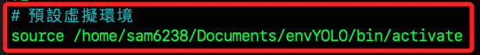

<br>

4. 載入環境參數設定。

    ```bash
    source ~/.bashrc
    ```

<br>

5. 建立並進入專案資料夾。

    ```bash
    mkdir MyYolo && cd MyYolo
    ```

<br>

## 下載安裝

1. 在專案資料夾內執行下載指令。

    ```bash
    git clone https://github.com/ultralytics/yolov5.git
    ```

    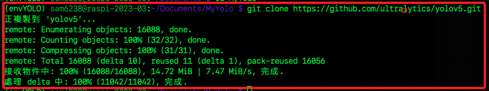

<br>

2. 進入下載的資料夾。

    ```bash
    cd yolov5
    ```   

<br>

3. 資料夾內有指定套件的管理文件，執行指令進行安裝，需要一點時間。

    ```bash
    pip install -U -r requirements.txt
    ```

    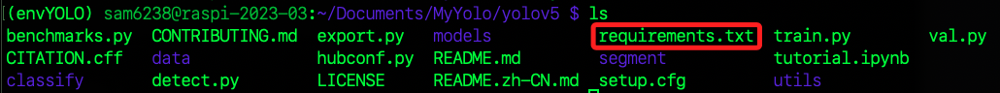

<br>

6. 建立並進入存放相片的資料夾，因為 `inference` 也是新建的，所以使用參數 `-p` 表示 `允許建立多層資料夾` 。 

    ```bash
    mkdir -p inference/images && cd inference/images
    ```

<br>

7. 取得並複製絕對路徑。

    ```bash
    pwd
    ```

    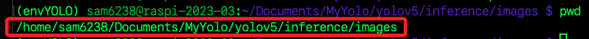

<br>

8. 使用 `chmod` 進行授權，`777` 表示所有用戶（所有者、所屬組和其他用戶）都有讀、寫和執行的權限。

    ```bash
    sudo chmod -R 777 <貼上前一個步驟複製的路徑>
    ```

<br>

9. 加入一張相片到 `images` 資料夾內。

    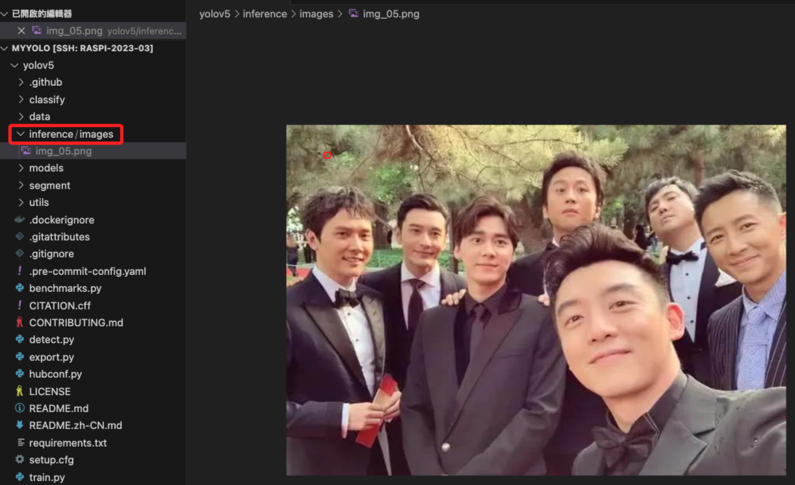

<br>

10. 回到專案的根目錄 `yolov5` ，會看到腳本 `detect.py` 。

    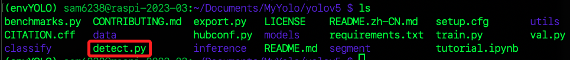

<br>

11. 透過以下參數運行腳本。
    ```bash
    python detect.py --weights yolov5s.pt --source inference/images/ --img 416 --conf 0.85
    ```

    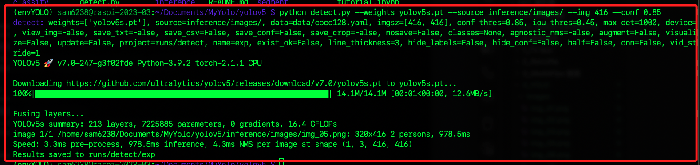

<br>

12. 結果顯示於預設的資料夾內。

    ```ini
    runs/detect/exp
    ```

    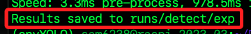

<br>

## 辨識結果

1. 閥值 0.85

    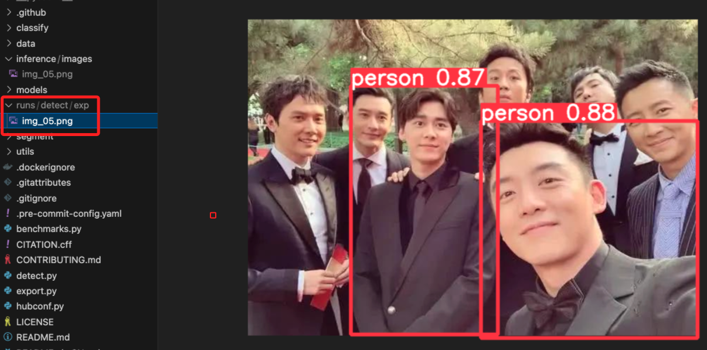

    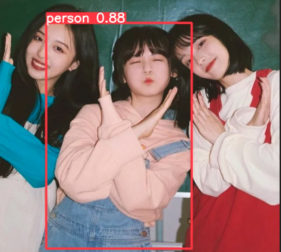

    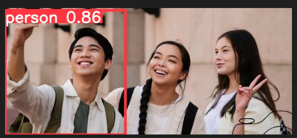

    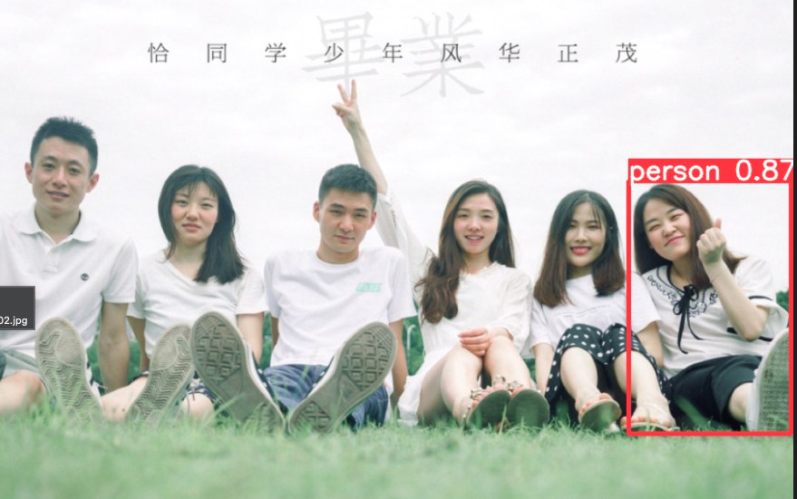

<br>

2. 閥值 0.5

    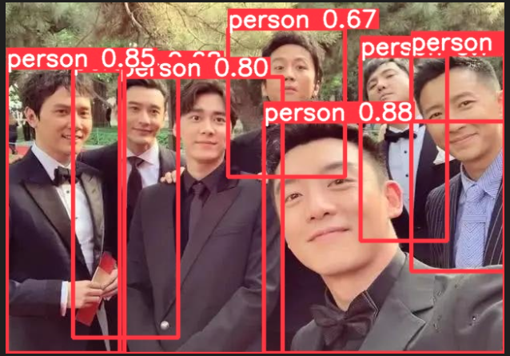

    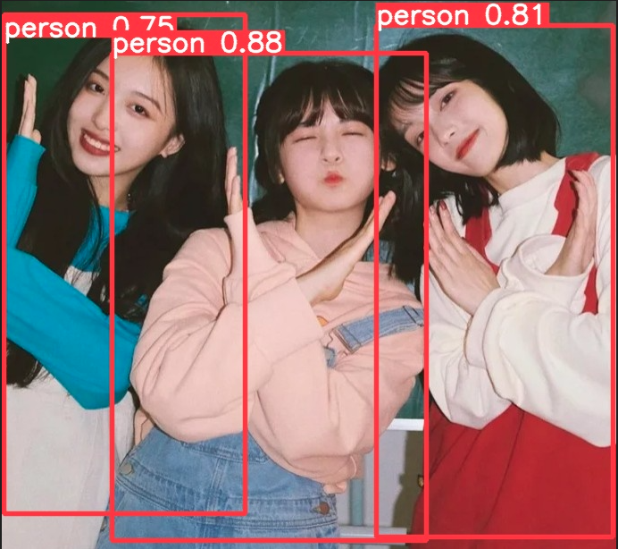

    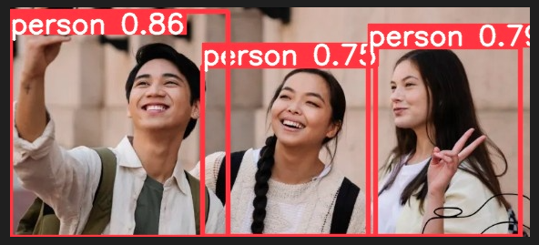

    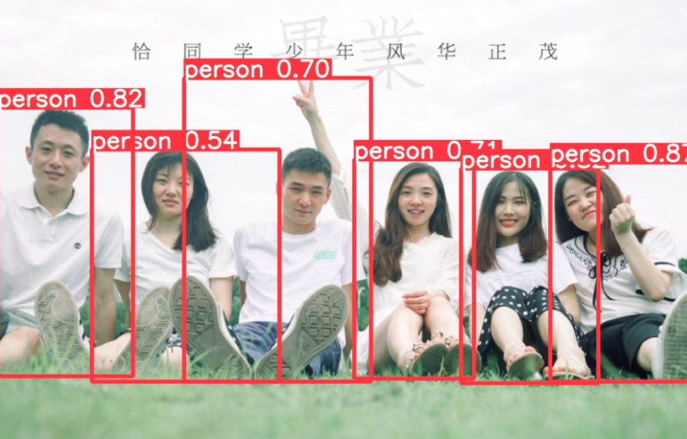

<br>

## 指令說明

1. 指令：辨識相片。

    ```bash
    python detect.py --weights yolov5s.pt --source inference/images/ --img 416 --conf 0.85
    ```

<br>

2. 透過 USB 攝像頭辨識實時影像。

    ```bash
    python detect.py --weights yolov5s.pt --source 0
    ```

<br>

3. `--weights`：指定模型的權重文件。

<br>

4. `yolov5s.pt`：權重文件名稱，是 YOLOv5 的 `s` 版本。

<br>

5. `--img`：指定輸入圖像的大小，這裡是 416x416 像素，YOLO 是一種對圖像只做一次前向過程的物件檢測方法，所有輸入圖像會被調整到一個固定的大小。

<br>

6. `--conf`：設定物件檢測的信心閾值，這裡使用 0.85，範圍是 0 到 1，只有當物件檢測的信心分數高於這個值才會被認為是有效的檢測結果。

<br>

7. `--source`：指定要檢測的圖像或視頻路徑。

<br>

8. 關於 `--source` 參數官網有說明。

    | Type                    | Description              |
    |-------------------------|--------------------------|
    | `0`                     | webcam                   |
    | `img.jpg`               | image                    |
    | `vid.mp4`               | video                    |
    | `screen`                | screenshot               |
    | `path/`                 | directory                |
    | `list.txt`              | list of images           |
    | `list.streams`          | list of streams          |
    | `'path*.jpg'`           | glob                     |
    | `'https://youtu.be/LNwODJXcvt4'` | YouTube           |
    | `'rtsp://example.com/media.mp4'` | RTSP, RTMP, HTTP stream |

<br>

---

_END_