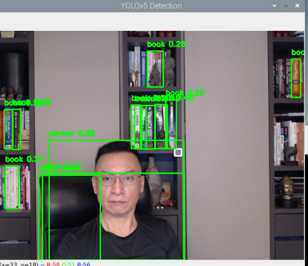

# 自訂腳本

_進階應用_


<br>

## 範例

1. 示意圖。

    

<br>

2. 完整程式碼。

    ```python
    # OpenCV
    import cv2
    # 導入 yolov5 專案內的模組
    from models.common import DetectMultiBackend
    from utils.general import non_max_suppression, scale_boxes
    from utils.torch_utils import select_device, smart_inference_mode
    # 使用 PyTorch 檢測物件
    import torch
    import numpy as np


    @smart_inference_mode()
    def detect(image, model):
        # 對圖像進行處理和模型推理
        # 轉換 BGR 至 RGB，調整數據類型並添加批次維度
        image = image[..., ::-1].transpose((2, 0, 1))
        image = np.ascontiguousarray(image)
        # 將圖像的數據類型從 NumPy 陣列轉換為 PyTorch 張量
        image = torch.from_numpy(image).to(model.device)
        # 調整圖像數據範圍並加入批次維度，uint8 to fp32
        image = image.float()
        # 圖像數據從 0 到 255 的整數範圍被轉換成 0.0 到 1.0 的浮點數範圍
        image /= 255
        # 為了符合模型的輸入要求，增加了一個批次維度（batch dimension）
        image = image.unsqueeze(0)
        # 使用轉換後的圖像進行模型推理，即前向傳播過程
        pred = model(image)
        # 應用非極大抑制 NMS
        # 這是一個通過選擇特定閾值來過濾重疊檢測框的後處理步驟，用於保留最佳的檢測框
        pred = non_max_suppression(pred, 0.25, 0.45)
        # 返回檢測結果
        return pred


    def main():
        # 選擇設備（CPU 或 CUDA）
        device = select_device("")
        # 加載模型
        model = DetectMultiBackend("yolov5s.pt", device=device)
        names = model.names
        # 打開 USB 攝像頭
        cap = cv2.VideoCapture(0)
        # 假如攝像頭維持開啟
        while cap.isOpened():
            # 讀取影像
            ret, frame = cap.read()
            # 是否取得影像
            if not ret:
                break

            # 轉換 BGR 至 RGB
            img = frame[..., ::-1]

            # 檢測每一幀畫面
            pred = detect(img, model)
            # 從原始畫面獲取影像尺寸，傳回其中的 height 及 width
            img_shape = frame.shape[:2]
            # 遍歷並處理檢測結果
            for i, det in enumerate(pred):
                if len(det):
                    # 建立檢測框的副本以避免原地更新
                    det_copy = det.clone()
                    # 將檢測到的目標的邊框縮放到原始圖像的尺寸，並且四捨五入
                    det_copy[:, :4] = scale_boxes(
                        img_shape, det_copy[:, :4], img_shape
                    ).round()
                    # 繪製檢測框以及標籤
                    for *xyxy, conf, cls in reversed(det_copy):
                        label = f"{names[int(cls)]} {conf:.2f}"
                        cv2.rectangle(
                            frame,
                            (int(xyxy[0]), int(xyxy[1])),
                            (int(xyxy[2]), int(xyxy[3])),
                            (0, 255, 0),
                            2,
                        )
                        cv2.putText(
                            frame,
                            label,
                            (int(xyxy[0]), int(xyxy[1]) - 10),
                            cv2.FONT_HERSHEY_SIMPLEX,
                            0.5,
                            (0, 255, 0),
                            2,
                        )

            # 顯示結果
            cv2.imshow("YOLOv5 Detection", frame)

            # 退出 'ESC'
            if cv2.waitKey(1) == 27:
                break
        # 釋放資源並關閉視窗
        cap.release()
        cv2.destroyAllWindows()


    if __name__ == "__main__":
        main()

    ```

<br>

---

_END_