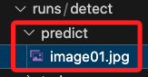

# YOLOv8

_最新推出的版本，以下簡單介紹官網的指引與說明。_

<br>

## 說明

1. 可參考 [Ultralytics YOLOv8 Docs 官方說明文件](https://docs.ultralytics.com/) 或 [Github](https://github.com/ultralytics/ultralytics)。

<br>

2. 安裝套件。

    ```bash
    pip install ultralytics
    ```

<br>

3. YOLOv8 可以透過 `yolo` 指令直接在 CLI 中使用。

    ```bash
    yolo predict model=yolov8n.pt source='image01.jpg'
    ```

    

<br>

4. 原始相片：準備一張相片。

    

<br>

5. 辨識後會儲存在指定的資料夾內。

    

<br>

6. 辨識結果。

    


<br>

7. YOLOv8 可以直接在 Python 環境中使用，並使用與 CLI 範例相同的參數。

    ```python
    # 從 ultralytics 模組導入 YOLO
    from ultralytics import YOLO

    '''載入模型'''
    # 使用官方提供的參數文件「yolov8n.yaml」建立新的 YOLOv8n 模型
    model = YOLO("yolov8n.yaml")
    # 加載一個預訓練的 YOLOv8n 模型，官方推薦用於進行進一步訓練
    model = YOLO("yolov8n.pt")

    '''訓練模型'''
    # 指定訓練數據集配置文件 coco128.yaml，訓練週期數 epochs=3
    model.train(data="coco128.yaml", epochs=3)

    '''評估'''
    metrics = model.val()
    '''預測、推理'''
    # 提供一張相片
    results = model("bus.jpg")

    '''導出'''
    # 將模型導出為 ONNX 格式，方便在不同的機器學習平台上進行部署
    path = model.export(format="onnx")
    ```

<br>

8. 相較於之前的版本，v8 提供了更多的模型參數文件，相關文件在 `cfg` 資料夾內。

    


<br>

## 其他

1. 在這個版本中，[官方說明書](https://docs.ultralytics.com/usage/python/) 寫得非常清楚，此處不再贅述。

    

<br>

---

_END_