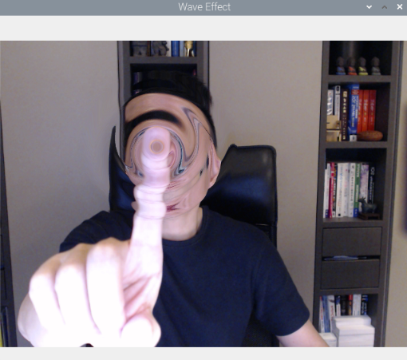

# 進階應用

## 標註指尖

1. 標註四指指尖，程式碼中的特徵索引 `8, 12, 16, 20` 就是手指指尖的標記。

    

<br>

2. 在這個部分最重要的是取得影像中四個關鍵索引的動態座標，範例中透過動態座標繪製一個圓形來標註指尖位置。

    ```python
    cx, cy = int(lm.x * w), int(lm.y * h)
    ```

<br>

3. 完整程式碼。

    ```python
    import cv2
    import mediapipe as mp

    # 初始化 MediaPipe 解決方案中手部追踪的模組
    mp_hands = mp.solutions.hands
    # 初始化繪圖工具，負責繪圖的模組
    mp_drawing = mp.solutions.drawing_utils
    # 創建了一個 Hands 類的實例，負責處理手部追踪的功能。
    hands = mp_hands.Hands()

    # 開啟鏡頭
    cap = cv2.VideoCapture(0)

    while cap.isOpened():
        success, image = cap.read()
        if not success:
            continue

        # 處理影像並進行手部偵測
        image = cv2.cvtColor(cv2.flip(image, 1), cv2.COLOR_BGR2RGB)
        results = hands.process(image)

        # 將影像顏色空間轉回 BGR 以顯示
        image = cv2.cvtColor(image, cv2.COLOR_RGB2BGR)

        # 繪製手部標記
        if results.multi_hand_landmarks:
            for hand_landmarks in results.multi_hand_landmarks:
                mp_drawing.draw_landmarks(
                    image, hand_landmarks, mp_hands.HAND_CONNECTIONS
                )

                # 獲取指尖位置並模擬按壓效果
                for id, lm in enumerate(hand_landmarks.landmark):
                    # 8, 12, 16, 20 是手指指尖的標記
                    if id in [8, 12, 16, 20]:
                        # 取得影像的高 height、寬width、通道 channel
                        h, w, c = image.shape
                        # lm.x 及 lm.y 會取得 landmark 相對於圖像的水平與垂直位置
                        # 然後乘上寬高就等同於取得像素座標
                        cx, cy = int(lm.x * w), int(lm.y * h)
                        # 透過像素座標作為原心畫出圓形
                        cv2.circle(image, (cx, cy), 15, (255, 0, 255), cv2.FILLED)

        # 顯示影像
        cv2.imshow('MediaPipe Hands with OpenCV', image)

        # 按下 q 或 ESC 鍵退出
        if cv2.waitKey(5) & 0xFF == ord('q') or cv2.waitKey(5) == 27:
            break

    cap.release()
    cv2.destroyAllWindows()

    ```

<br>

## 遮蔽影像

1. 透過 `np.zeros()` 製作全黑背景，取代人物影像，觀察手指特徵。

    ```python
    np.zeros((h, w, c), dtype=np.uint8)
    ```

<br>

2. 完整程式碼。

    ```python
    import cv2
    import mediapipe as mp
    import numpy as np

    # 初始化 MediaPipe 手部模型
    mp_hands = mp.solutions.hands
    mp_drawing = mp.solutions.drawing_utils
    hands = mp_hands.Hands()

    # 開啟攝像頭
    cap = cv2.VideoCapture(0)
    # 假如處在開啟狀態
    while cap.isOpened():
        # 讀取影像，回傳兩個值
        success, image = cap.read()
        # 用第一個回傳值判讀是否成功取得影像
        if not success:
            # 假如失敗，結束這一輪迴圈，重新開始
            continue

        # 成功取得影像，透過 .shape 取得高、寬、通道
        h, w, c = image.shape

        # 透過 np.zeros 創建一個與影像相同大小且初始值為 0 的數據資料
        # np.uint8 取值範圍為 0~255
        # 這個程式碼會建立一個全黑背景需要的數據
        background = np.zeros((h, w, c), dtype=np.uint8)

        # 轉會圖像格式並進行水平翻轉
        image = cv2.cvtColor(cv2.flip(image, 1), cv2.COLOR_BGR2RGB)
        # 進行手部偵測
        results = hands.process(image)

        # 假如有取得特徵資料
        if results.multi_hand_landmarks:
            # 遍歷特徵
            for hand_landmarks in results.multi_hand_landmarks:
                # 繪圖：黑色背景、特徵索引、使用預設的連結樣式
                mp_drawing.draw_landmarks(
                    background, hand_landmarks, mp_hands.HAND_CONNECTIONS
                )

        # 顯示影像，背景是全黑的
        cv2.imshow('MediaPipe Hands Grid', background)

        # 按下 q 或 ESC 键退出
        if cv2.waitKey(5) & 0xFF == ord('q') or cv2.waitKey(5) == 27:
            break

    # 釋放資源
    cap.release()
    # 關閉視窗
    cv2.destroyAllWindows()

    ```
   

## 相片按壓效果

1. 透過遍歷相片每個像素進行位置重設達到扭曲效果。

    

<br>

2. 完整程式碼。

    ```python
    import cv2
    import numpy as np


    # 設定期望的影像大小
    DESIRED_WIDTH = 800
    DESIRED_HEIGHT = 600


    # 定義一個函數來調整影像尺寸
    def resize_image(image, width=DESIRED_WIDTH, height=DESIRED_HEIGHT):
        # 獲取影像當前的高度和寬度
        h, w = image.shape[:2]
        # 計算縮放比例
        scale = min(width / w, height / h)
        # 獲得新的影像尺寸
        new_size = (int(w * scale), int(h * scale))
        # 調整影像大小
        resized_image = cv2.resize(image, new_size, interpolation=cv2.INTER_AREA)
        return resized_image


    # 定義一個函數來應用波浪效果
    def apply_wave_effect(
        image, center=None, intensity=40, radius=100, frequency=5, transition_width=40
    ):
        # 獲取影像的高度和寬度
        h, w = image.shape[:2]
        # 如果未指定中心，則使用影像的中心點
        if center is None:
            center = (w // 2, h // 2)

        # 產生一組座標網格
        xx, yy = np.meshgrid(np.arange(w), np.arange(h))

        # 計算每個點距離中心的距離
        distances = np.sqrt((xx - center[0]) ** 2 + (yy - center[1]) ** 2)

        # 在指定半徑內應用波浪效果，並在邊緣處進行平滑過渡
        transition = np.clip((radius - distances) / transition_width, 0, 1)
        wave_effect = (
            np.cos(distances / radius * frequency * np.pi) * intensity * transition
        )

        # 通過改變 yy 座標來應用波浪效果
        yy_shifted = np.clip(yy - wave_effect.astype(np.int32), 0, h - 1)

        # 通過重新映射像素來創建扭曲的影像
        distorted_image = cv2.remap(
            image,
            xx.astype(np.float32),
            yy_shifted.astype(np.float32),
            interpolation=cv2.INTER_LINEAR,
        )
        # 返回扭曲後的影像
        return distorted_image


    # 加載影像
    image_path = "image01.jpeg"
    image = cv2.imread(image_path)

    # 檢查並調整影像尺寸
    if image.shape[0] > DESIRED_HEIGHT or image.shape[1] > DESIRED_WIDTH:
        image = resize_image(image)

    # 應用波浪效果
    distorted_image = apply_wave_effect(image)

    # 儲存扭曲後的影像
    output_path = "distorted_image.png"
    cv2.imwrite(output_path, distorted_image)

    # 顯示影像
    cv2.imshow("Original", image)
    cv2.imshow("Wave Effect", distorted_image)
    # 等待按鍵後關閉視窗
    cv2.waitKey(0)
    # 銷毀所有視窗
    cv2.destroyAllWindows()

    ```

<br>


## 結合按壓與實時影像

1. 這個腳本結合了實時影像以及手指特徵偵測，透過食指指尖特徵索引來決定按壓效果的圓心位置，並以手指特徵索引間的距離來推理按壓點與鏡頭的距離，藉此產生不同強度的按壓效果。不過，這樣的推理是有瑕疵的，因為手指特徵索引間的距離並不代表手指與鏡頭之間絕對距離的變化，只能說這是在其他條件不變下的一種合理推理，特此說明。

<br>

2. 近距離按壓效果。 

    

<br>

3. 遠距離按壓效果。

    

<br>

4. 完整程式碼。

    ```python
    import cv2
    import mediapipe as mp
    import numpy as np

    # 初始化 MediaPipe 手指模型
    mp_hands = mp.solutions.hands
    hands = mp_hands.Hands()


    # 定義按壓效果函數
    def apply_wave_effect(
        image,
        center=None,
        intensity=40,
        base_radius=100,
        frequency=5,
        transition_width=40,
        distance_ratio=1.0,
    ):
        h, w = image.shape[:2]
        # 根據距離調整半徑
        radius = base_radius * distance_ratio
        if center is None:
            center = (w // 2, h // 2)
        xx, yy = np.meshgrid(np.arange(w), np.arange(h))
        distances = np.sqrt((xx - center[0]) ** 2 + (yy - center[1]) ** 2)
        transition = np.clip((radius - distances) / transition_width, 0, 1)
        wave_effect = (
            np.cos(distances / radius * frequency * np.pi) * intensity * transition
        )
        yy_shifted = np.clip(yy - wave_effect.astype(np.int32), 0, h - 1)
        distorted_image = cv2.remap(
            image,
            xx.astype(np.float32),
            yy_shifted.astype(np.float32),
            interpolation=cv2.INTER_LINEAR,
        )
        return distorted_image


    # 開啟攝像頭
    cap = cv2.VideoCapture(0)

    while cap.isOpened():
        success, frame = cap.read()
        if not success:
            continue

        # 水平翻轉
        frame_flipped = cv2.flip(frame, 1)
        # 以翻轉後的影像作為原始畫面
        frame_with_wave = frame_flipped

        # 轉換為 RGB
        frame_rgb = cv2.cvtColor(frame_flipped, cv2.COLOR_BGR2RGB)
        results = hands.process(frame_rgb)

        # 如果檢測到手勢
        if results.multi_hand_landmarks:
            # 取得手指指尖的位置並計算按壓半徑的縮放比例
            for hand_landmarks in results.multi_hand_landmarks:
                # 使用食指和腕部標記來估算手部距離相機的距離
                index_fingertip = hand_landmarks.landmark[
                    mp_hands.HandLandmark.INDEX_FINGER_TIP
                ]
                wrist = hand_landmarks.landmark[mp_hands.HandLandmark.WRIST]
                # 放大距離比例因子以增強效果
                # 可以調整這個值來放大效果
                distance_multiplier = 2.0
                # 計算食指指尖和腕部之間的距離，用於調整按壓效果的半徑
                distance_ratio = (
                    np.sqrt(
                        (index_fingertip.x - wrist.x) ** 2
                        + (index_fingertip.y - wrist.y) ** 2
                    )
                    * distance_multiplier
                )
                h, w, c = frame.shape
                cx, cy = int(index_fingertip.x * w), int(index_fingertip.y * h)
                frame_with_wave = apply_wave_effect(
                    frame_flipped, center=(cx, cy), distance_ratio=distance_ratio
                )

        # 顯示帶有波浪效果的相機畫面
        cv2.imshow("Wave Effect", frame_with_wave)

        # 按下 'q' 鍵或 Esc，則退出循環
        key = cv2.waitKey(5) & 0xFF
        if key == ord("q") or key == 27:
            break

    # 釋放攝影機資源並關閉所有視窗
    cap.release()
    cv2.destroyAllWindows()

    ```


<br>

---

_END_