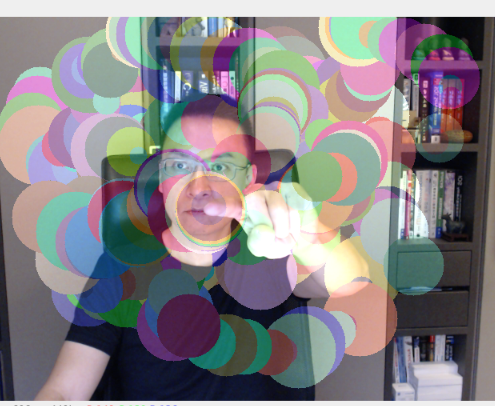

# 模擬 Processing 的效果

<br>

## 範例

1. 成果圖。

    

<br>

2. 完整程式碼。

    ```python
    import cv2
    import mediapipe as mp
    import numpy as np
    import random

    mp_hands = mp.solutions.hands
    hands = mp_hands.Hands(
        static_image_mode=False, max_num_hands=1, min_detection_confidence=0.7
    )
    mp_drawing = mp.solutions.drawing_utils

    cap = cv2.VideoCapture(0)
    success, image = cap.read()

    h, w, c = image.shape
    canvas = np.zeros((h, w, c), dtype=np.uint8)

    while cap.isOpened():
        success, image = cap.read()
        if not success:
            continue

        image = cv2.flip(image, 1)
        image_rgb = cv2.cvtColor(image, cv2.COLOR_BGR2RGB)
        results = hands.process(image_rgb)

        if results.multi_hand_landmarks:
            for hand_landmarks in results.multi_hand_landmarks:
                finger_tip = hand_landmarks.landmark[
                    mp_hands.HandLandmark.INDEX_FINGER_TIP
                ]
                cx, cy = int(finger_tip.x * w), int(finger_tip.y * h)

                cv2.circle(
                    canvas,
                    (cx, cy),
                    random.randint(10, 50),
                    (
                        random.randint(0, 255),
                        random.randint(0, 255),
                        random.randint(0, 255),
                    ),
                    -1,
                )

        image = cv2.addWeighted(image, 0.9, canvas, 0.4, 0)
        cv2.imshow("MediaPipe Hands Drawing", image)

        key = cv2.waitKey(5) & 0xFF
        if key == ord("q") or key == 27:
            break

    cap.release()
    cv2.destroyAllWindows()

    ```

<br>

## 去背景人像

1. 成果圖。

    

<br>

2. 完整程式碼。

    ```python
    import cv2
    import mediapipe as mp
    import numpy as np
    import random

    # 初始化 MediaPipe 手部模型
    mp_hands = mp.solutions.hands
    hands = mp_hands.Hands(
        static_image_mode=False, max_num_hands=1, min_detection_confidence=0.7
    )
    mp_drawing = mp.solutions.drawing_utils

    # 開啟攝像頭
    cap = cv2.VideoCapture(0)
    success, image = cap.read()

    # 建立一個與攝像頭圖像大小相同的全黑畫布
    h, w, c = image.shape
    canvas = np.zeros((h, w, c), dtype=np.uint8)

    while cap.isOpened():
        success, image = cap.read()
        if not success:
            continue

        # 翻轉圖像以方便操作
        image = cv2.flip(image, 1)

        # 轉換圖像顏色空間從 BGR 到 RGB
        image_rgb = cv2.cvtColor(image, cv2.COLOR_BGR2RGB)

        # 處理圖像並取得手部標記
        results = hands.process(image_rgb)

        # 如果檢測到手部
        if results.multi_hand_landmarks:
            for hand_landmarks in results.multi_hand_landmarks:
                # 取得食指指尖的坐標
                finger_tip = hand_landmarks.landmark[
                    mp_hands.HandLandmark.INDEX_FINGER_TIP
                ]
                cx, cy = int(finger_tip.x * w), int(finger_tip.y * h)

                # 在畫布上繪製圓形
                cv2.circle(
                    canvas,
                    (cx, cy),
                    random.randint(10, 50),
                    (
                        random.randint(0, 255),
                        random.randint(0, 255),
                        random.randint(0, 255),
                    ),
                    -1,
                )

        # 顯示畫布上的圖像
        cv2.imshow("MediaPipe Hands Drawing", canvas)

        # 按 'q' 退出
        key = cv2.waitKey(5) & 0xFF
        if key == ord("q") or key == 27:
            break

    # 釋放資源
    cap.release()
    cv2.destroyAllWindows()

    ```

<br>

---

_END_