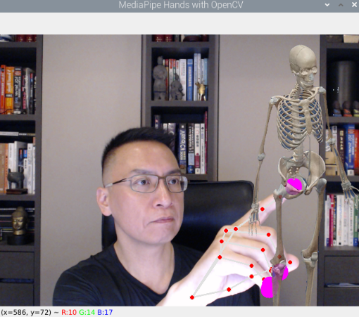
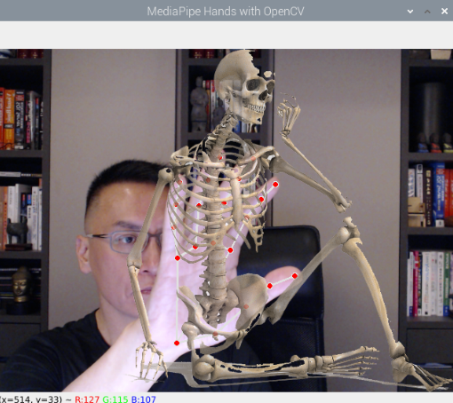

# 前景影像

_以下分別採用直接疊加、動態疊加方式處理前景影像_

<br>

## 直接疊加

1. 透過調整前景與背景的透明度，對每個像素位置進行影像加權疊加。

<br>

2. 成果示意。

    

<br>

3. 完整程式碼。

    ```python
    import cv2
    import mediapipe as mp
    import numpy as np

    # 前景透明度
    _ALPHA = 0.8
    # 初始化 MediaPipe 解決方案中手部追踪的模組
    mp_hands = mp.solutions.hands
    # 初始化繪圖工具，負責繪圖的模組
    mp_drawing = mp.solutions.drawing_utils
    # 創建了一個 Hands 類的實例，負責處理手部追踪的功能。
    hands = mp_hands.Hands()

    # 開啟鏡頭
    cap = cv2.VideoCapture(0)

    # 讀取半透明圖片，假設它和視頻流的大小相同
    overlay_image = cv2.imread('bone-1.png', cv2.IMREAD_UNCHANGED)

    # 檢查圖像是否有 alpha 通道
    if overlay_image.shape[2] == 4:
        # 有 alpha 通道，調整透明度為 60%
        overlay_alpha = overlay_image[:, :, 3] / 255.0 * _ALPHA  
        overlay = overlay_image[:, :, :3]
    else:
        # 沒有 alpha 通道，創建一個假設所有像素 60% 不透明的 alpha 通道
        overlay_alpha = np.ones((overlay_image.shape[0], overlay_image.shape[1]), dtype=overlay_image.dtype) * _ALPHA / 255.0
        overlay = overlay_image

    # 調整圖片與視頻流的大小相匹配，假設視頻流是 640x480 大小
    overlay = cv2.resize(overlay, (640, 480))
    overlay_alpha = cv2.resize(overlay_alpha, (640, 480))


    while cap.isOpened():
        success, image = cap.read()
        if not success:
            continue

        # 處理影像並進行手部偵測
        image = cv2.cvtColor(cv2.flip(image, 1), cv2.COLOR_BGR2RGB)
        results = hands.process(image)

        # 將影像顏色空間轉回 BGR 以顯示
        image = cv2.cvtColor(image, cv2.COLOR_RGB2BGR)

        # 繪製手部標記
        if results.multi_hand_landmarks:
            for hand_landmarks in results.multi_hand_landmarks:
                mp_drawing.draw_landmarks(
                    image, hand_landmarks, mp_hands.HAND_CONNECTIONS
                )

                # 獲取指尖位置並模擬按壓效果
                for id, lm in enumerate(hand_landmarks.landmark):
                    # 8, 12, 16, 20 是手指指尖的標記
                    if id in [8, 12, 16, 20]:
                        # 取得影像的高 height、寬width、通道 channel
                        h, w, c = image.shape
                        # lm.x 及 lm.y 會取得 landmark 相對於圖像的水平與垂直位置
                        # 然後乘上寬高就等同於取得像素座標
                        cx, cy = int(lm.x * w), int(lm.y * h)
                        # 透過像素座標作為原心畫出圓形
                        cv2.circle(image, (cx, cy), 15, (255, 0, 255), cv2.FILLED)

        # 將半透明圖片與攝像頭影像合成
        for i in range(3):
            image[:, :, i] = image[:, :, i] * (1 - overlay_alpha) + overlay[:, :, i] * overlay_alpha

        # 顯示影像
        cv2.imshow('MediaPipe Hands with OpenCV', image)

        # 按下 q 或 ESC 鍵退出
        if cv2.waitKey(5) & 0xFF == ord('q') or cv2.waitKey(5) == 27:
            break

    cap.release()
    cv2.destroyAllWindows()
    ```

<br>

## 動態疊加

1. 自定義一個函數 `overlay_transparent_image` 處理前景圖片，包含了圖片的尺寸與位置，隔離了兩個影像，使得可以更好控制影響的處理。

<br>

2. 示意圖。

    

<br>

2. 完整程式碼。

    ```python
    import cv2
    import mediapipe as mp
    import numpy as np

    def overlay_transparent_image(background_img, overlay_img, overlay_alpha=1.0):
        # 調整 overlay_img 的大小並保持高度與背景相同
        h, w = background_img.shape[:2]
        overlay_img_resized = cv2.resize(overlay_img, (int(overlay_img.shape[1] * h / overlay_img.shape[0]), h))
        
        # 檢查是否有 alpha 通道
        if overlay_img.shape[2] == 4:
            alpha_overlay = cv2.resize(overlay_img[:, :, 3], (int(overlay_img.shape[1] * h / overlay_img.shape[0]), h)) / 255.0 * overlay_alpha
        else:
            alpha_overlay = np.ones((overlay_img_resized.shape[0], overlay_img_resized.shape[1])) * overlay_alpha

        alpha_background = 1.0 - alpha_overlay

        # 計算開始位置
        x, y = w - overlay_img_resized.shape[1], 0

        for c in range(0, 3):
            background_img[y:y+h, x:x+overlay_img_resized.shape[1], c] = (
                alpha_overlay * overlay_img_resized[:, :, c] +
                alpha_background * background_img[y:y+h, x:x+overlay_img_resized.shape[1], c]
            )
        return background_img

    # 初始化 MediaPipe 解決方案中手部追踪的模組
    mp_hands = mp.solutions.hands
    mp_drawing = mp.solutions.drawing_utils
    hands = mp_hands.Hands()

    cap = cv2.VideoCapture(0)

    # 讀取半透明圖片
    overlay_image = cv2.imread('bone-3.png', cv2.IMREAD_UNCHANGED)

    while cap.isOpened():
        success, image = cap.read()
        if not success:
            continue

        # 處理影像並進行手部偵測
        image = cv2.cvtColor(cv2.flip(image, 1), cv2.COLOR_BGR2RGB)
        results = hands.process(image)

        image = cv2.cvtColor(image, cv2.COLOR_RGB2BGR)

        # 繪製手部標記
        if results.multi_hand_landmarks:
            for hand_landmarks in results.multi_hand_landmarks:
                mp_drawing.draw_landmarks(
                    image, hand_landmarks, mp_hands.HAND_CONNECTIONS
                )

        # 將前景圖片放大到與畫面同高並靠右上角
        image = overlay_transparent_image(image, overlay_image, overlay_alpha=0.8)

        # 顯示影像
        cv2.imshow('MediaPipe Hands with OpenCV', image)

        if cv2.waitKey(5) & 0xFF == ord('q') or cv2.waitKey(5) == 27:
            break

    cap.release()
    cv2.destroyAllWindows()

    ```

<br>

---

_END_