# RetroPie

<br>

## 下載遊戲

 提供一個 [網站](https://www.emugames.net/) 作為參考。

<br>

# 硬體
1. 樹莓派＋記憶卡
2. 視訊訊號線
3. 搖桿
4. 鍵盤
5. 喇叭

<br>

# 燒錄

1. 使用官方燒錄器。

    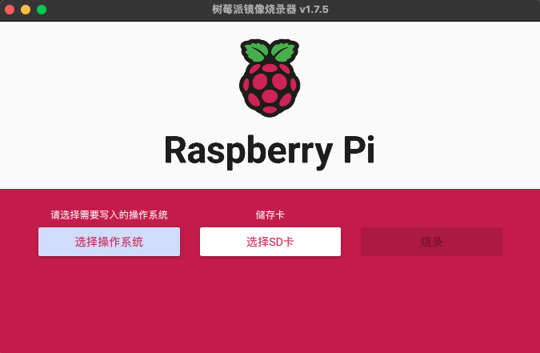

<br>

2. 選擇作業系統。

    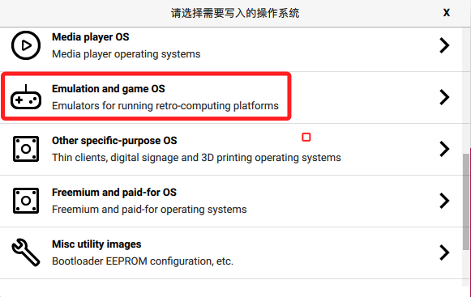

<br>

3. 選擇。

    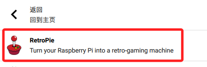

<br>

4. 依照硬體版本選擇合適的版本。

    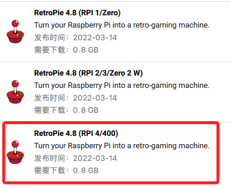

<br>

5. 然後進行燒錄。

    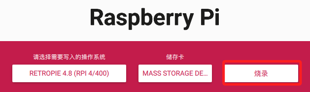

<br>

6. 注意，預設的帳號密碼是 `pi / raspberry` 。

    ```bash
    使用者 pi 
    密碼 raspberry
    ```

<br>

## 安裝

1. 插入卡片，看到以下畫面，按下鍵盤的 F4。

    

<br>

2. 進入RetroPie系統的終端機。

    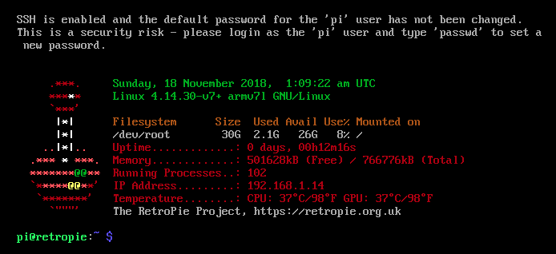

<br>

3. 設定靜態 IP。

    ```bash
    sudo nano /etc/network/interfaces
    ```

<br>

4. 以下是我的設定值，同學要按照自己的網路進行設置。

    ```ini
    # 有線網路設定
    auto eth0
    iface eth0 inet static
    address 192.168.1.218
    netmask 255.255.255.0
    gateway 192.168.1.1 
    ```

<br>

5. 設定 DNS。

    ```bash
    sudo nano /etc/resolv.conf
    ```

<br>

6. 預設應該會有一組 `192.168.1.1`，再添加一組。

    ```ini
    nameserver 192.168.1.1
    nameserver 8.8.8.8
    ```

<br>

7. 透過設定打開 SSH。

    ```bash
    sudo raspi-config
    ```

<br>

8. 進入後將 SSH 打開。

    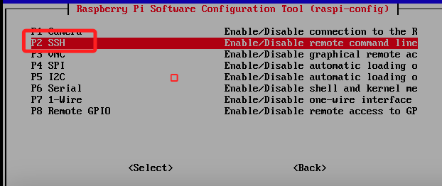

<br>

9. 重新啟動。

    ```bash
    sudo reboot
    ```

<br>

10. 回到一開始的畫面，依舊按下 F4 推出到終端機中。

    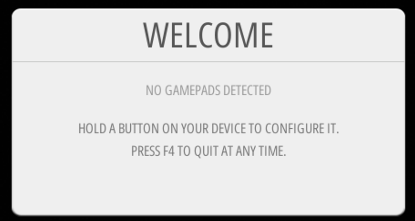

<br>

11. 更新：注意，sudo apt-get dist-upgrade 與 sudo apt-get upgrade 的差異在於 upgrade 只會更新現有軟件包，而 dist-upgrade 則是會一併安裝軟件與依賴，並移除不需要的包。

    ```bash
    sudo apt-get update
    sudo apt-get dist-upgrade
    ```

<br>

12. 更新後再次重新啟動。

    ```bash
    sudo reboot
    ```

<br>

13. 再次進入這個畫面。

    

<br>

14. 長按搖桿任一鍵，會進入設定畫面。

    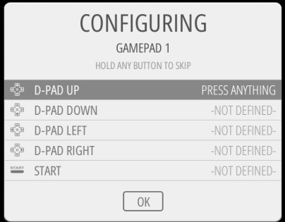

<br>

15. 使用 PS 搖桿進行設置，對應的名稱如下。

    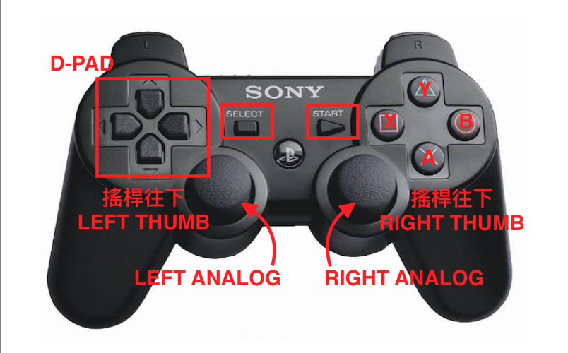

<br>

16. 前方按鈕。

    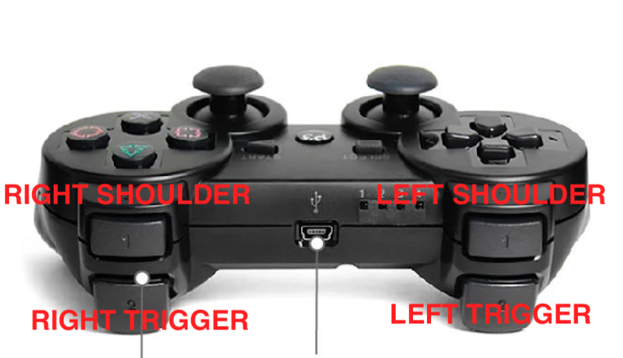

<br>

17. 最後一個使用 HOYKEY 使用 SELECT 代替。

    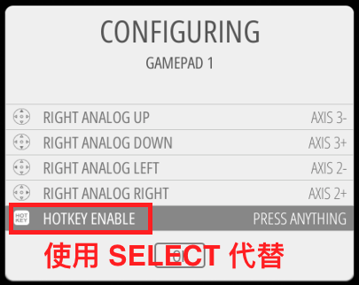

<br>

18. 完成以上操作，按下 A。

    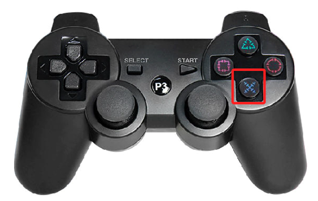

<br>

19. 再按下 A 可以進行設置。

    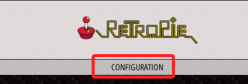

<br>

20. 使用 D-PAD 選擇，然後 A 確認。

    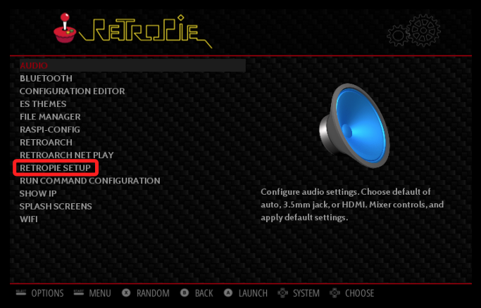

<br>

21. 跑了一陣子會出現這個畫面，按下 A。

    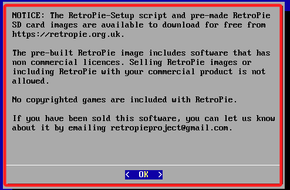

<br>

22. 按下 A 進行基本安裝 Basic install。

    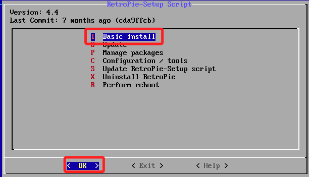

<br>

23. 使用 D-PAD 加上 A 選擇 YES。

    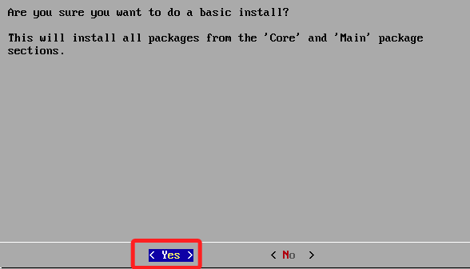

<br>

24. 跑上一陣子，然後更新，控制方式都相同，不再贅述。

    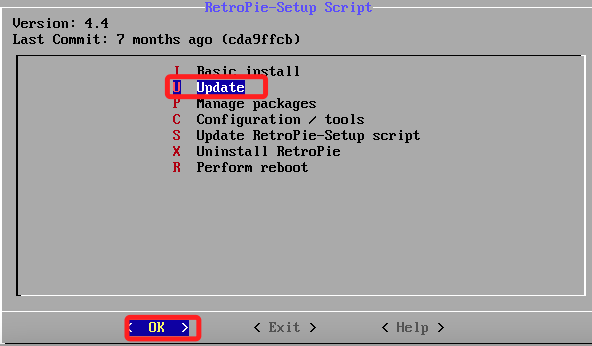

<br>

25. 會再問一次。

    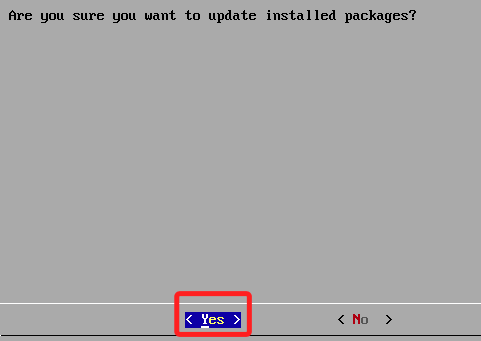

<br>

26. 按下 OK，然後跑一下就完成。

    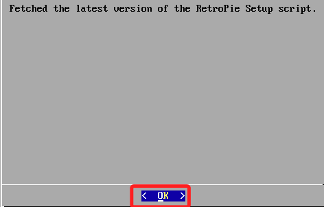

<br>

27. 與授權相關的說明，直接 OK。

    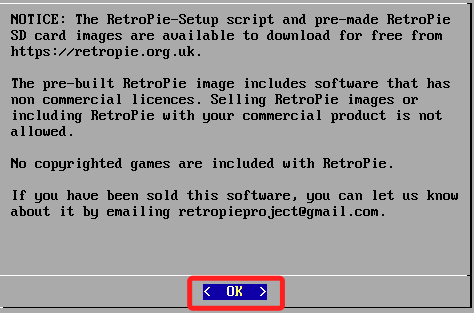

<br>

28. 又要再更新一次，這要跑上一陣子。

    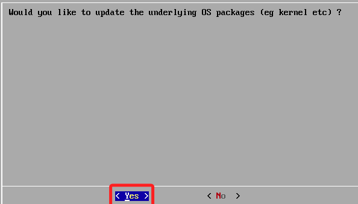

<br>

29. 按下 A。

    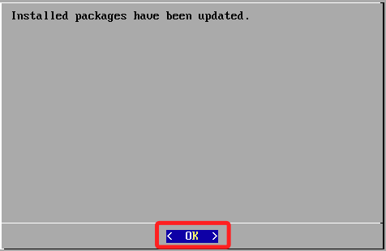

<br>

30. 接著選擇管理套件。

    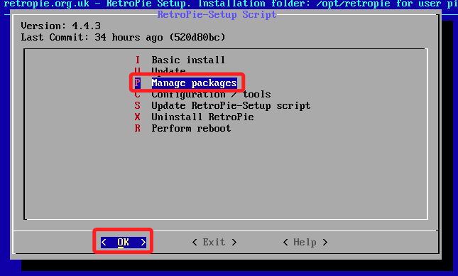

<br>

31. 選 Manage optional packages。

    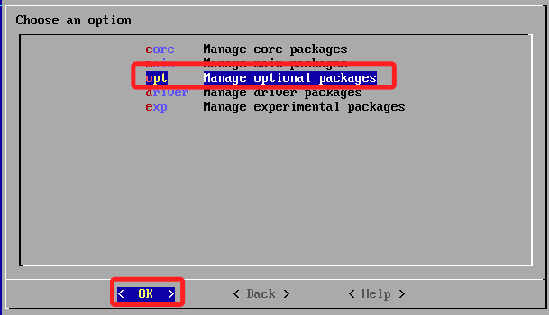

<br>

32. 分別，安裝的部分大概要15分鐘甚至更長一點。

    

<br>

33. 完成時，選擇 Back。

    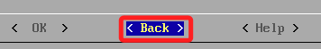

<br>

34. 再 Back。

    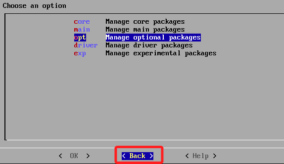

<br>

35. 設置。

    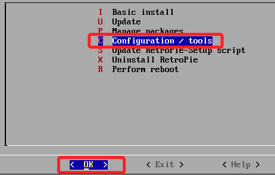

<br>

36. 選擇 autostart，注意，不同版的的代碼可能不同，不用在意。

    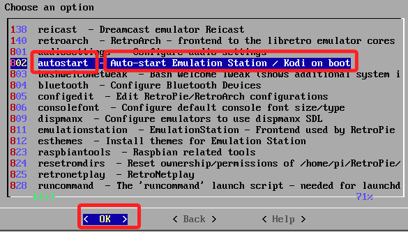

<br>

37. 設定開機啟動。

    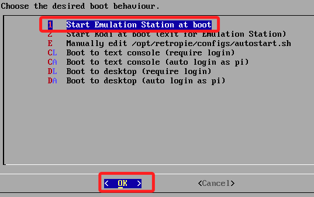

<br>

38. 已經設置為開機啟動。

    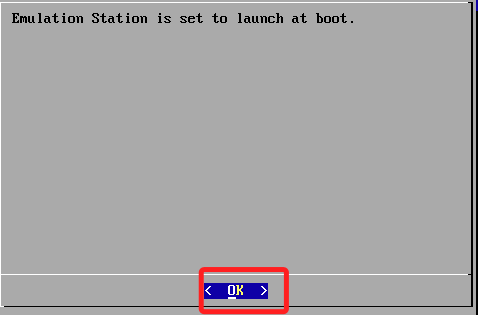

<br>

39. 選擇 Cancel。

    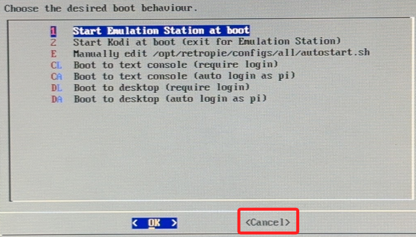

<br>

40. 然後先 Back 再 Exit。

    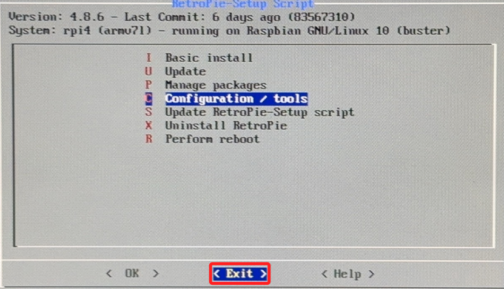

<br>

41. 出現這個畫面時，按下搖桿的 Start 按鈕。

    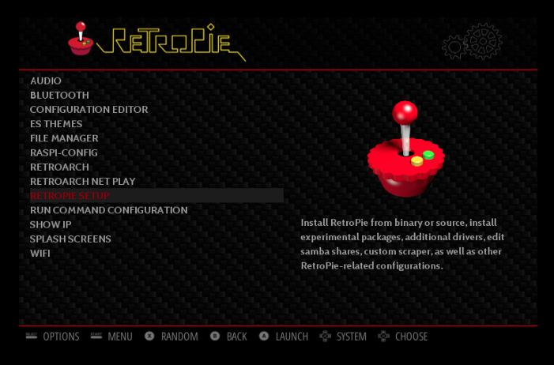

<br>

42. 然後選擇 Quit。

    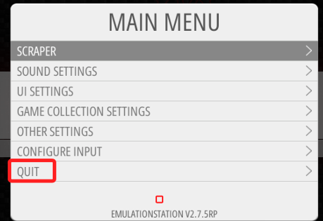

<br>

43. 退出。

    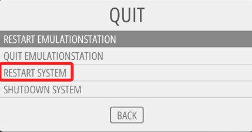

<br>

44. YES，然後又會重新開機。

    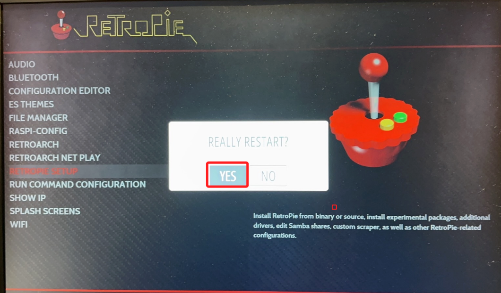

<br>

45. 重新啟動後，顯示兩個 Game，但這個模擬器不是我們要的。

    

<br>

## 下載遊戲

1. 先登入 [網站](https://www.emugames.net/) 。

<br>

2. 選擇 Nintendo 。
    
    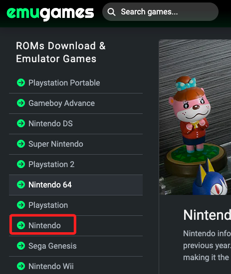

<br>

3. 任意下載後，解壓縮。
    
    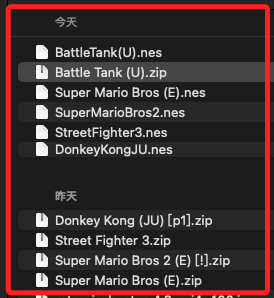

<br>

4. Windows 可以直接使用網路芳鄰將 .nes 檔案拖曳到樹莓派的 `/home/pi/RetroPie/roms/nes/` 資料夾。

<br>

5. Mac 可在本機電腦透過終端機 scp 指令將 .nes 檔案上傳到樹莓派，注意，若檔案有空格要用引號包覆。

    ```bash
    scp "Super Mario Bros (E).nes" pi@192.168.1.218:/home/pi/RetroPie/roms/nes/
    ```

<br>

6. 完成後可透過 SSH 連線到樹莓派的 `/home/pi/RetroPie/roms/nes/` 資料夾中查看。

    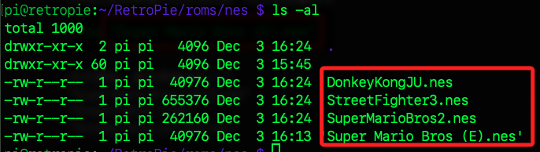

<br>

7. 完成後再來一次搖桿 Start -> 畫面 Quite -> 畫面 Restart System -> YES
記得確認都是 A，每次添加新的檔案都要重啟才會生效。

    

<br>

8. 再次重啟之後就會有 Nintendo，剛剛因為沒.nes 所以不會顯示，按下 A。

    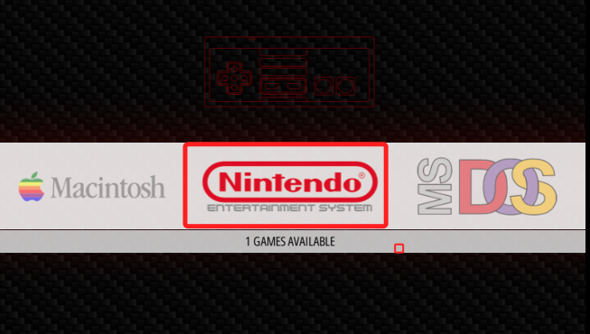

<br>

9. 在遊戲中同時按下 Select + Start 可以退出遊戲，其餘自行測試。


<br>

---

_END_