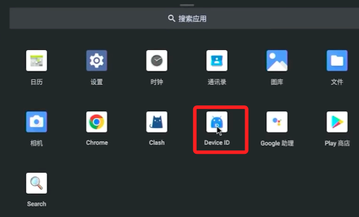
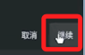
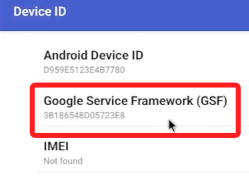
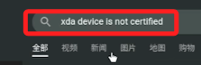
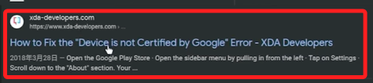
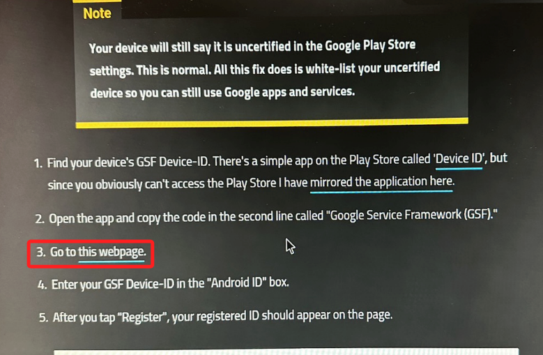
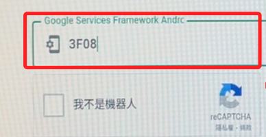
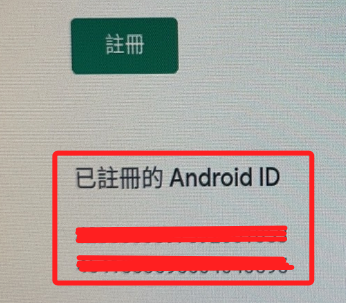
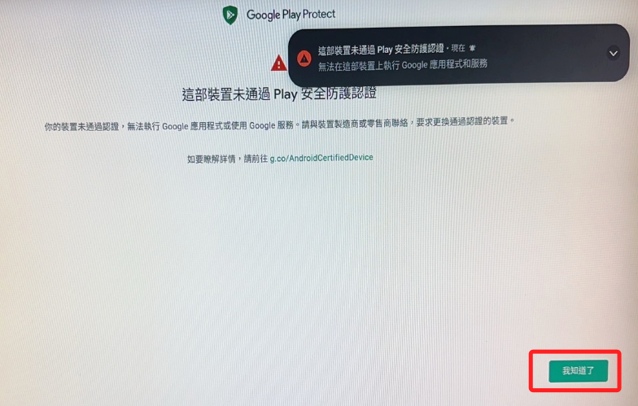

# 遠端設定

_從電腦上連線_

<br>

## 安裝 adb

1. MacOS 安裝 adb。

    ```bash
    brew install android-platform-tools
    ```

    

<br>

2. Windows 安裝 adb。

    ```bash
    https://developer.android.com/studio/releases/platform-tools?hl=zh-tw
    ```

    

<br>

## 連線

1. 透過 adb 進行連線，成功會顯示 successfully。

    ```bash
    adb connect <樹莓派 IP>
    ```
    

<br>

2. 查詢連接到電腦的 Android 裝置上設定的網絡時間協議（NTP）服務器的地址。

    ```bash
    adb shell settings get global ntp_server
    ```

<br>

3. 因為還未設置，所以會回傳 null。

    

<br>

4. 設置為阿里服務器 ntp.aliyun.com。

    ```bash
    adb shell settings put global ntp_server ntp.aliyun.com
    ```

<br>

5. 再查詢一次。

    ```bash
    adb shell settings get global ntp_server
    ```
    
    

<br>

6. 設置完成可以進行時區設置。

    ```bash
    adb shell settings put global time_zone Asia/Taipei
    ```
    
    

<br>

7. 查詢時區。

    ```bash
    adb shell settings get global time_zone
    ```
    
    

<br>

8. 刪除Android設備全局設定中預設關俘虜門戶（captive portal）檢測的 URL。

    ```bash
    adb shell settings delete global captive_portal_https_url
    adb shell settings delete global captive_portal_http_url
    ```

    

<br>

9. 設定新地址。

    ```bash
    adb shell settings put global captive_portal_https_url https://connect.rom.miui.com/generate_204
    adb shell settings put global captive_portal_http_url http://connect.rom.miui.com/generate_204
    ```

    

<br>

10. 重啟樹莓派，透過 adb 在本機運行就會重啟安卓電視。

    ```bash
    adb reboot
    ```

<br>

## 重啟後進行認證

_開啟瀏覽器連接 Google ，並完成認證登入_

<br>

1. 使用 adb 連接樹莓派。

    ```bash
    adb connect <樹莓派 IP>
    ```

    

<br>

2. 接下來要給電視盒處理認證問題。

    

<br>

3. 可透過 adb 給樹莓派安裝 APK，也就是不需要將 APK 存到樹莓派。

    ```bash
    adb install /Users/samhsiao/下載_百度網盤/Android13平板/Device+ID.apk
    ```

    

<br>

4. 安裝成功。

    

<br>

5. 從桌面進行開啟。

    

<br>

6. 點擊右下角的 `繼續` 。

    

<br>

7. 不用更新，直接 `確定` 開啟即可。

    

<br>

8. 找到 Google Service Framework 的這個資訊，點擊會跳出複製視窗。

    

<br>

9. 點擊 `Copy`。

    

<br>

10. 從下方點擊 Google 圖標開啟瀏覽器，搜尋 `xda device is not certified` 。

    

<br>

11. 點擊第一個進入。

    

<br>

12. 往下滾動滑到這段描述，點擊 `Go to this webpage`。

    

<br>

13. 假如一開始沒登入認證，這裡就先完成這個程序。 

<br>

14. 接著要貼上剛剛取得的 ID，請注意，這裡滑鼠沒有右鍵選單，可以手打輸入，或是用鍵盤的 `ctrl + V`。

    

<br>

15. 下方就會顯示已註冊的 ID。

    

<br>

16. 到這裡要重啟樹莓派。

    ```bash
    adb reboot
    ```

<br>

<br>
 
## 認證完成再度重啟後

1. 開啟商店，失敗的話多嘗試登入幾次。

    

<br>

2.  假如不使用商店功能，直接關閉通知也是可以的，這並非必要程序。


<br>

## 遠端安裝應用

3.  使用指令遠端開啟一個 shell。

    ```bash
    adb shell
    ```

    

<br>

1. 然後透過指令列出資料。

    ```bash
    ls
    ```

    

<br>
 
2. 同樣使用指令切換。

    

<br>

3. 其中的 sdcard 就是在樹莓派應用中看到的 Files 內的檔案。

    

<br>


4. 所以透過以下 push 指令將檔案推到遠端樹莓派上後，可在樹莓派應用上點擊 Raspberry Pi4 進行查看。

    ```bash
    adb push /Users/samhsiao/Downloads/明日影視.apk /sdcard/Download/
    ```

<br>

5. 查看。

    

<br>

---

_END_