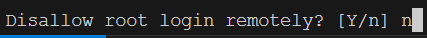
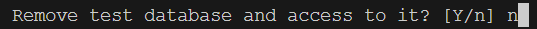
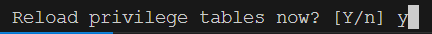
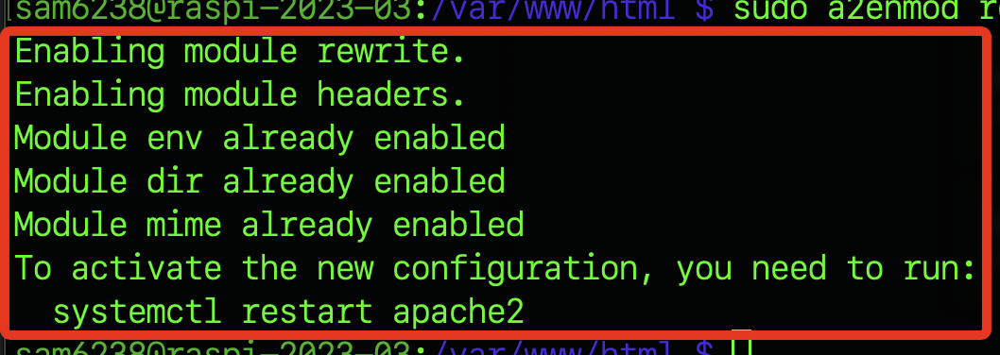
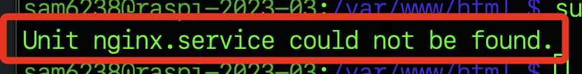
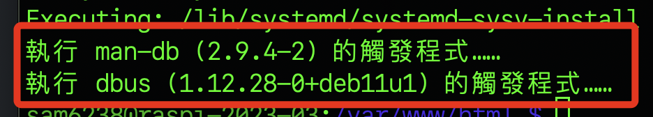
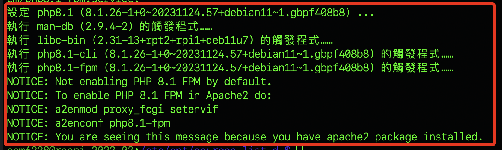
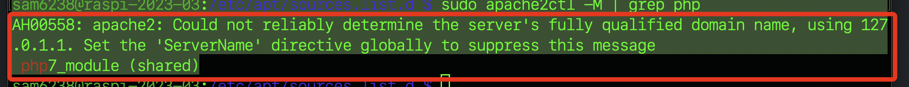

# 安裝

<br>

## 安裝基本環境

1. 更新

```bash
sudo apt update && sudo apt upgrade -y
```

<br>

2. 遇到提示移除不必要套件就跟著做。

```bash
sudo apt autoremove
```

<br>

3. 安裝多個依賴套件，主要用來搭建 LAMP(Linux, Apache, MySQL/MariaDB, PHP) 環境。
```bash
sudo apt install apache2 mariadb-server php php-mysql php-gd php-curl php-xml php-zip php-intl php-mbstring php-json php-imagick libapache2-mod-php
```

## 將相關套件設置為開啟啟動

1. 開機啟動服務：`apache2` 。
```bash
sudo systemctl enable apache2
```

2. 開機啟動服務：`mariadb` 。
```bash
sudo systemctl enable mariadb
```

3. 立即啟動服務
```bash
sudo systemctl start apache2 && sudo systemctl start mariadb
```

4. 設定資料庫：這個步驟跟 `MySQL` 的章節是一樣的，這裡簡單帶過，以下五次 `NO` + 一次 `YES` 。
```bash
sudo mysql_secure_installation
```

5. 預設沒有密碼，直接 `ENTER` 即可。


6. NO


7. NO


8. NO


9. NO


10. NO


11. YES


12. 然後會啟動資料庫。


13. 登入資料庫(預設沒密碼)。
```bash
sudo mysql -u root -p
```


14. 建立資料庫以及資料庫使用者。
```bash
CREATE DATABASE nextcloud;
```

15. 賦予權限。
```bash
GRANT ALL PRIVILEGES ON nextcloud.* TO 'sam6238'@'%' IDENTIFIED BY 'sam112233';
```

16. 刷新權限。
```bash
FLUSH PRIVILEGES;
```

17. 退出資料庫系統。

```bash
EXIT;
```


## 安裝 Nextcloud

1. 切換到要安裝 Nextcloud 的資料夾。
```bash
cd /var/www/html
```

2. 下載 Nextcloud。
```bash
sudo wget https://download.nextcloud.com/server/releases/latest.tar.bz2
```


3. 解壓縮，需要一點時間，畫面沒有變化，耐心等待。
```bash
sudo tar -xjf latest.tar.bz2
```

3. 設定權限，需要一點時間。
```bash
sudo chown -R www-data:www-data /var/www/html/nextcloud && sudo find /var/www/html/nextcloud/ -type d -exec chmod 750 {} \; && sudo find /var/www/html/nextcloud/ -type f -exec chmod 640 {} \;
```

4. 建立 Nextcloud 設定檔。
```bash
sudo nano /etc/apache2/sites-available/nextcloud.conf
```

5. 貼上以下內容，儲存退出。
```ini
Alias /nextcloud "/var/www/html/nextcloud"

<Directory /var/www/html/nextcloud>
   Require all granted
   AllowOverride All
   Options FollowSymLinks MultiViews

   <IfModule mod_dav.c>
      Dav off
   </IfModule>

</Directory>
```

6. 啟用站點。
```bash
sudo a2ensite nextcloud.conf
```

7. 現在還不需要執行 `systemctl reload apache2` 。


8. 啟動必要模組。

```bash
sudo a2enmod rewrite headers env dir mime
```


9. 查詢 `nginx` 服務狀態。
```bash
sudo systemctl status nginx
```


10. 假如 `nginx` 是啟用狀態，要先停用。
```bash
sudo systemctl stop nginx
```

11. 查詢 `apache2` 服務狀態。
```bash
sudo systemctl status apache2
```


12. 如需啟用 `apache2` ，立即啟用並設定為開機啟動。
```bash
sudo systemctl start apache2 && sudo systemctl enable apache2
```

13. 確保模組已經啟用
```bash
sudo a2enmod rewrite
```


14. 重啟 Apache
```bash
sudo systemctl restart apache2
```

15. 安裝套件 `software-properties-common`。
```bash
sudo apt install -y software-properties-common
```


16. 在系統中添加一個 `ondrej/php` 的個人軟體包存檔（Personal Package Archive，簡稱PPA），主要目的是獲得更新的PHP版本，添加這個PPA後就可安裝或更新到這個 PPA 提供的 PHP 版本。。
```bash
sudo add-apt-repository ppa:ondrej/php
```

17. 會顯示提醒按下 `ENTER` 繼續。


18. 出現關於棄用的警告，這在後續繼續安裝可能會出錯。


## 排除問題

1. 執行更新指令，確實出現一些錯誤。
```bsh
sudo apt update
```


2. 切換到套件列表管理目錄。
```bash
cd /etc/apt/sources.list.d/
```

3. 查看有哪些列表，假如有切換目錄，僅需 `ls` 。
```bash
ls
```


4. 編輯兩個列表，將導致錯誤的來源註解。
```bash
sudo nano ondrej-ubuntu-php-noble.list
sudo nano ondrej-ubuntu-php-noble.list.save
```


5. 安裝兩個套件
```bash
sudo apt install ca-certificates apt-transport-https
```


6. 下載公鑰。
```bash
wget -q https://packages.sury.org/php/apt.gpg -O- | sudo tee /etc/apt/trusted.gpg.d/php.gpg
```

7. 出現可怕的一堆亂碼。


8. 先用 gpg 命令來列出密鑰並驗證密鑰是否正確下載。
```bash
sudo gpg --show-keys /etc/apt/trusted.gpg.d/php.gpg
```
9. 既然正確下載了，就不予理會了。


10. 添加資源列表。
```bash
echo "deb https://packages.sury.org/php/ bullseye main" | sudo tee /etc/apt/sources.list.d/php.list
```

11. 進行更新。
```bash
sudo apt update && sudo apt upgrade -y
```
12. 完成上面步驟，可以安裝 PHP8.1等套件了。
```bash
sudo apt install php8.1 php8.1-common php8.1-cli php8.1-bcmath php8.1-fpm php8.1-mbstring php8.1-xml php8.1-curl php8.1-gd php8.1-mysql php8.1-pgsql php8.1-sqlite3 php8.1-zip php8.1-readline php8.1-opcache
```

13. 好一會才安裝好。



14. 可設定預設版本。
```bash
sudo update-alternatives --config php
```


15. 假如不想切換，也可以在下指令時指定。
```bash
sudo update-alternatives --set php /usr/bin/php8.1
```

16. 查看目前連結的版本。
```bash
sudo update-alternatives --display php
```


17. 確認已經啟用版本。
```bash
sudo apache2ctl -M | grep php
```


18. 關於 `AH00558`：表示 Apache 伺服器無法可靠地確定伺服器的完全合格域名（FQDN），Apache 嘗試自動檢測域名，但未能確定，因此它回退到使用本地回路地址 `127.0.1.1`，接下來依照訊息的建議進行設置。


19. 安裝。
```bash
sudo apt install libapache2-mod-php8.1
```

20. 停用舊版、啟用新版。
```bash
sudo a2dismod php7.4 && sudo a2enmod php8.1 && sudo systemctl restart apache2
```

21. 再查看一次啟用的版本，確實已經切換。
```bash
sudo apache2ctl -M | grep php
```


22. 重新啟動。
```bash
sudo reboot
```

23. 切換目錄。
```bash
cd  /var/www/html
```

24. 授權。
```bash
sudo chown -R sam6238:sam6238 /var/www/html/nextcloud
```

25. 訪問，沒權限。


26. 確保 .htaccess 文件存在
```bash
ls -la /var/www/html/nextcloud | grep .htaccess
```


27. 確保「.htaccess」文件的權限為 644
```bash
sudo chmod 644 /var/www/html/nextcloud/.htaccess
```

28. 確保目錄「/var/www/html/nextcloud」和其子目錄的權限至少為 755
```bash
sudo chmod -R 755 /var/www/html/nextcloud
```

29. 確保「www-data」（或Web伺服器的用戶）是「/var/www/html/nextcloud」和其子目錄的擁有者
```bash
sudo chown -R www-data:www-data /var/www/html/nextcloud
```

30. 再次訪問 `<樹莓派 IP>/nextcloud`，終於成功。


## 連線以後

1. 安裝


## 其他指令

1. 檢查端口。
```bash
sudo netstat -tuln | grep ':80'
```


2. 假如有安裝 `ufw` 可查看防火牆。
```bash
sudo ufw status
```
3. 查看 Apache 日誌。

```bash
sudo cat /var/log/apache2/error.log
```

4. 確認 Apache 的設定語法是否正確。

```bash
sudo apache2ctl configtest
```


