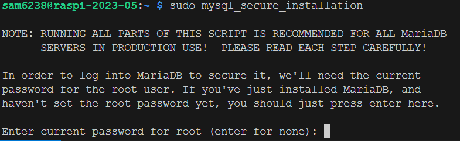
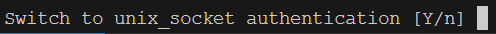
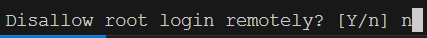
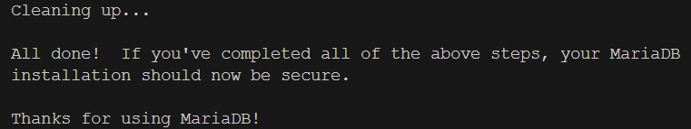
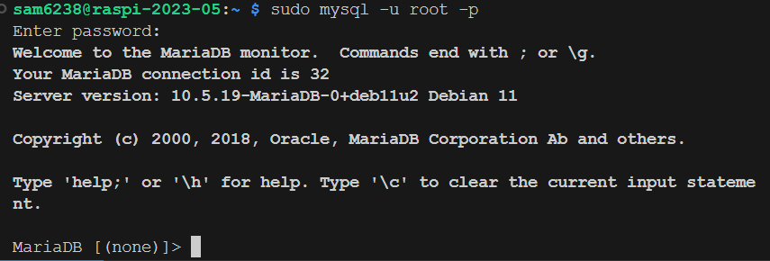
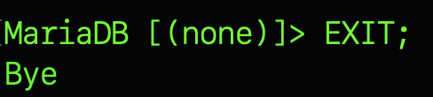

# 環境設置

_更新、安裝依賴與設定資料庫_

<br>

## 更新與安裝依賴庫

1. 更新。

    ```bash
    sudo apt update && sudo apt upgrade -y
    ```

<br>

2. 遇到提示移除不必要套件就跟著做。

    ```bash
    sudo apt autoremove
    ```

<br>

3. 安裝多個依賴套件：主要用來搭建 LAMP(Linux, Apache, MySQL/MariaDB, PHP) 環境。

    ```bash
    sudo apt install apache2 mariadb-server php php-mysql php-gd php-curl php-xml php-zip php-intl php-mbstring php-json php-imagick libapache2-mod-php
    ```

<br>

## 相關服務設置

1. 開機啟動服務：`apache2` 。

    ```bash
    sudo systemctl enable apache2
    ```

<br>

2. 開機啟動服務：`mariadb` 。

    ```bash
    sudo systemctl enable mariadb
    ```

<br>

3. 立即啟動服務：`apache2`、`mariadb` 。

    ```bash
    sudo systemctl start apache2 && sudo systemctl start mariadb
    ```

<br>

1. 設定資料庫：這個步驟跟 `MySQL` 的章節是一樣的。以下簡單帶過，共五次 `NO` + 一次 `YES` 。

    ```bash
    sudo mysql_secure_installation
    ```

<br>

5. 預設沒有密碼：直接 `ENTER` 即可。

    

<br>

6. NO。

    

<br>

7. NO。

    

<br>

8. NO。

    

<br>

9. NO。

    

<br>

10. NO。

    

<br>

11. YES。

    

<br>

12. 設置完成：會啟動資料庫。

    

<br>

13. 使用以下指令在樹莓派登入資料庫：預設沒密碼。

    ```bash
    sudo mysql -u root -p
    ```

    

<br>

14. 使用資料庫語法建立資料庫：資料庫名稱為 `nextcloud` 。

    ```bash
    CREATE DATABASE nextcloud;
    ```

<br>

15. 建立資料庫使用者帳號並賦予權限：語法裡的是我自訂的帳號 `sam6238` 與 密碼 `sam112233`，同學要更改為自己的設定值。

    ```bash
    GRANT ALL PRIVILEGES ON nextcloud.* TO 'sam6238'@'%' IDENTIFIED BY 'sam112233';
    ```

<br>

16. 刷新權限：很重要的步驟。

    ```bash
    FLUSH PRIVILEGES;
    ```

<br>

17. 退出資料庫系統。

    ```bash
    EXIT;
    ```

    

<br>

---

_END_
