# 安裝 Nextcloud

<br>

## 步驟說明

1. 切換到要安裝 Nextcloud 的資料夾：這是樹莓派系統預設的 Web 服務器資料夾。

    ```bash
    cd /var/www/html
    ```

<br>

2. 透過 `wget` 指令下載 Nextcloud 安裝檔案。

    ```bash
    sudo wget https://download.nextcloud.com/server/releases/latest.tar.bz2
    ```

    

<br>

3. 透過 `tar` 指令進行解壓縮：ˋ這需要一點時間，過程中畫面沒有變化，請耐心等待。
    
    ```bash
    sudo tar -xjf latest.tar.bz2
    ```

    

<br>

4. 設定權限：需要一點時間，這將設定 Nextcloud 目錄 `/var/www/html/nextcloud` 的所有權限，包含 `chown` 更改所有權、`chmod` 設置目錄與文件權限。

    ```bash
    sudo chown -R www-data:www-data /var/www/html/nextcloud && sudo find /var/www/html/nextcloud/ -type d -exec chmod 750 {} \; && sudo find /var/www/html/nextcloud/ -type f -exec chmod 640 {} \;
    ```

<br>

5. 建立 Nextcloud 設定檔 `nextcloud.conf`：。

    ```bash
    sudo nano /etc/apache2/sites-available/nextcloud.conf
    ```

<br>

6. 貼上以下內容：儲存退出。

    ```ini
    Alias /nextcloud "/var/www/html/nextcloud"

    <Directory /var/www/html/nextcloud>
    Require all granted
    AllowOverride All
    Options FollowSymLinks MultiViews

    <IfModule mod_dav.c>
        Dav off
    </IfModule>

    </Directory>
    ```

<br>

7. 啟用站點配置文件：告知 Apache 按照配置文件服務網站。

    ```bash
    sudo a2ensite nextcloud.conf
    ```

<br>

8. 出現提示訊息說要載入 `apache2` ：設置還未完成，暫且不需要執行 `systemctl reload apache2` 。

    

<br>

9. 啟動必要模組：Nextcloud 運行所必要的模組。

    ```bash
    sudo a2enmod rewrite headers env dir mime
    ```
    
    

<br>

10. 查詢 `nginx` 服務狀態：因為我們要使用的是 Apache。

    ```bash
    sudo systemctl status nginx
    ```

    

<br>

11. 假如 `nginx` 服務的狀態是啟用中：透過以下指令進行停用。

    ```bash
    sudo systemctl stop nginx
    ```

<br>

12. 查詢 `apache2` 服務狀態：需要的狀態是 `active` 。

    ```bash
    sudo systemctl status apache2
    ```

    

<br>

13. 如需前一個步驟顯示尚未啟用 `apache2` ：立即啟用 Apache 服務並設定為開機啟動。

    ```bash
    sudo systemctl start apache2 && sudo systemctl enable apache2
    ```

<br>

14. 假如有修改設定文件：必須透過 `restart` 指令重啟 Apache 服務。

    ```bash
    sudo systemctl restart apache2
    ```

<br>

15. 安裝套件 `software-properties-common` ：這是管理軟件來源和 PPA 的工具，以下程序所需。

    ```bash
    sudo apt install -y software-properties-common
    ```

    

<br>

16. 安裝兩個套件： `certificates` 包含了一系列被信任的證書， `apt-transport-https` 讓 APT 可通過 HTTPS 協議訪問軟件倉庫。

    ```bash
    sudo apt install ca-certificates apt-transport-https
    ```

    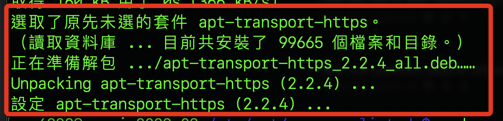

<br>

17. 下載公鑰：從指定的 URL 下載 GPG，並且儲存到系統中。

    ```bash
    wget -q https://packages.sury.org/php/apt.gpg -O- | sudo tee /etc/apt/trusted.gpg.d/php.gpg
    ```

<br>

18. 出現可怕的一堆亂碼：會先嘗試檢驗這亂碼是否影響運行。

    

<br>

19. 用 gpg 命令來列出密鑰：可查看密鑰是否正確下載達到驗證目的。

    ```bash
    sudo gpg --show-keys /etc/apt/trusted.gpg.d/php.gpg
    ```

<br>

20. 繼續進行安裝：既然檢查程序都正確，對前面顯示的亂碼不予理會。

    

<br>

21. 手動添加資源列表。

    ```bash
    echo "deb https://packages.sury.org/php/ bullseye main" | sudo tee /etc/apt/sources.list.d/php.list
    ```

<br>

22. 進行更新。

    ```bash
    sudo apt update && sudo apt upgrade -y
    ```

<br>

12. 完成上面步驟，可以安裝 PHP8.1 等套件。

    ```bash
    sudo apt install php8.1 php8.1-common php8.1-cli php8.1-bcmath php8.1-fpm php8.1-mbstring php8.1-xml php8.1-curl php8.1-gd php8.1-mysql php8.1-pgsql php8.1-sqlite3 php8.1-zip php8.1-readline php8.1-opcache
    ```

<br>

13. 安裝好會顯示以下訊息。

    

<br>

14. 設定預設版本，在 `2023/12/06` 時又更新到 `8.3` 了。

    ```bash
    sudo update-alternatives --config php
    ```

    

<br>

15. 不要使用 8.3，因為當前版本不適配。

    

<br>

16. 假如不想切換，也可以在下指令時指定。

    ```bash
    sudo update-alternatives --set php /usr/bin/php8.1
    ```

<br>

17. 查看目前連結的版本。

    ```bash
    sudo update-alternatives --display php
    ```

    

<br>

18. 確認已經啟用版本。

    ```bash
    sudo apache2ctl -M | grep php
    ```

    

<br>

19. 關於 `AH00558`：表示 Apache 伺服器無法可靠地確定伺服器的完全合格域名（FQDN），Apache 嘗試自動檢測域名，但未能確定，因此它回退到使用本地回路地址 `127.0.1.1`，接下來依照訊息的建議進行設置。

    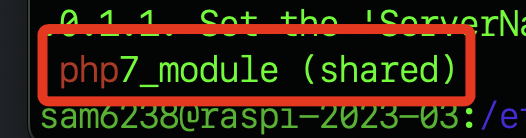

<br>

20. 安裝。

    ```bash
    sudo apt install libapache2-mod-php8.1
    ```

<br>

21. 也可以直接安裝 8.3。

    ```bash
    sudo apt install libapache2-mod-php8.3
    ```

<br>

22. 停用舊版 7.4、啟用新版 8.1。

    ```bash
    sudo a2dismod php7.4 && sudo a2enmod php8.1 && sudo systemctl restart apache2
    ```

<br>

23. 假如安裝了 8.3，可以啟用 8.3。

    ```bash
    sudo a2dismod php7.4 && sudo a2enmod php8.3 && sudo systemctl restart apache2
    ```

<br>

24. 再查看一次啟用的版本，確實已經切換。

    ```bash
    sudo apache2ctl -M | grep php
    ```

    

<br>

25. 重新啟動。

    ```bash
    sudo reboot
    ```

<br>

## 排除問題

16. (跳過) 在系統中添加一個 `ondrej/php` 的個人軟體包存檔（Personal Package Archive，簡稱PPA），主要目的是獲得更新的PHP版本，添加這個PPA後就可安裝或更新到這個 PPA 提供的 PHP 版本。。

    ```bash
    sudo add-apt-repository ppa:ondrej/php
    ```

<br>

17. (跳過) 會顯示提醒按下 `ENTER` 繼續。

    

<br>

18. (跳過) 出現關於棄用的警告，這在後續繼續安裝可能會出錯。

    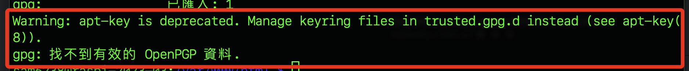

<br>

1. 執行更新指令，確實出現一些錯誤。

    ```bsh
    sudo apt update
    ```

    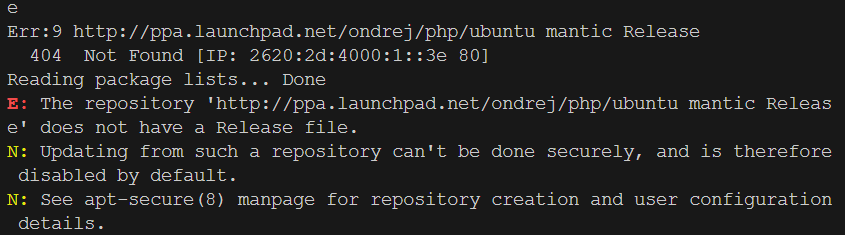

<br>

2. (跳過) 切換到套件列表管理目錄。

    ```bash
    cd /etc/apt/sources.list.d/
    ```

<br>

3. (跳過) 查看有哪些列表，假如有切換目錄，僅需 `ls` 。

    ```bash
    ls
    ```

    

<br>

4. (跳過) 編輯兩個列表，將導致錯誤的來源註解。

    ```bash
    sudo nano ondrej-ubuntu-php-noble.list
    sudo nano ondrej-ubuntu-php-noble.list.save
    ```

    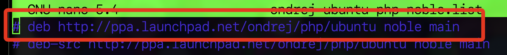

<br>


## 重新開機後

1. 先連線樹莓派。

<br>

2. 切換目錄。

    ```bash
    cd  /var/www/html
    ```

<br>

3. 授權，授權後還沒完成喔。

    ```bash
    sudo chown -R sam6238:sam6238 /var/www/html/nextcloud
    ```

<br>

4. 這時候訪問，還是沒權限的。

    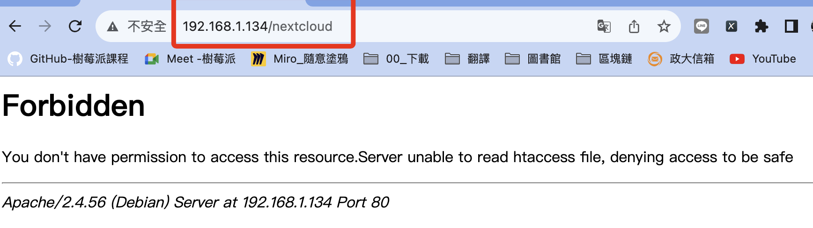

<br>

5. 確保 `.htaccess` 文件存在。

    ```bash
    ls -la /var/www/html/nextcloud | grep .htaccess
    ```

    

<br>

6. 確保 `.htaccess` 文件的權限為 `644` 。

    ```bash
    sudo chmod 644 /var/www/html/nextcloud/.htaccess
    ```

<br>

7. 確保目錄 `/var/www/html/nextcloud` 和其子目錄的權限至少為 `755` 。

    ```bash
    sudo chmod -R 755 /var/www/html/nextcloud
    ```

<br>

8. 確保 `www-data`（或 Web 伺服器的用戶）是 `/var/www/html/nextcloud` 和其子目錄的擁有者。

    ```bash
    sudo chown -R www-data:www-data /var/www/html/nextcloud
    ```

<br>

9. 訪問 `<樹莓派 IP>/nextcloud`，成功連線 `Nextcloud`。

    

<br>

## 連線以後

_請特別留意這個步驟_

<br>

1. 連線之後，請務必先點開 `儲存空間和資料庫` 。

    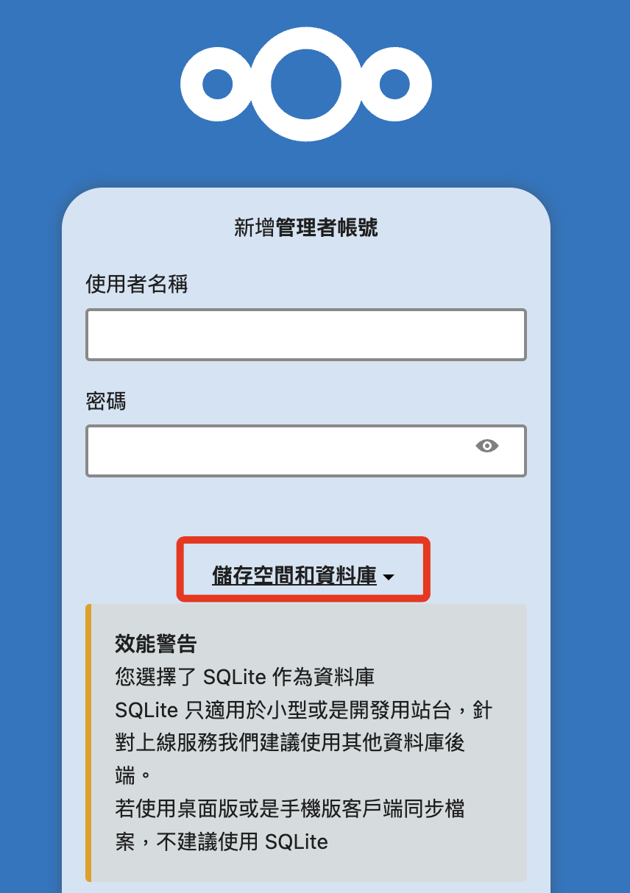

<br>

2. 選取 MySQL/MariaDB 。

    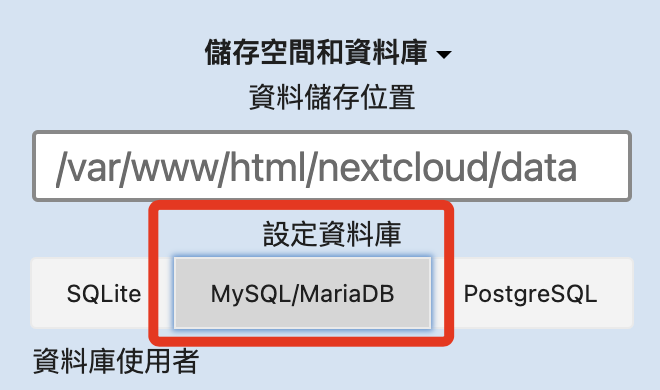

<br>

3. 資料庫儲存位置是安裝時預設的，可再核對一下。

    

<br>

4. 使用者帳號、密碼以及資料庫名稱依照設定階段的內容填入，主機則填上資料庫網址加上端口號 `<樹莓派 IP>:3306`，假如出現 `HY000` 錯誤訊息，可嘗試使用 `localhost:3306` 替代。

    

<br>

5. 然後在上方新增一組 Nextcloud 的管理者帳號密碼。

    

<br>

6. 檢查以上內容都正確後，按下下方的 `安裝`。

    

<br>

7. 完成連線設定。

    

<br>
 
8. 這裡先跳過。

    

<br>

9. 進入主控台，完成安裝。

    

<br>

10. 建議重啟樹莓派，然後再次連線確認設定都已完成。

<br>

## 環境設定

1. 察看或編輯設定檔案。

    ```bash
    sudo nano /var/www/html/nextcloud/config/config.php
    ```

<br>

2. 原本內容，將修改其中 `trusted_domains` 及 `overwrite.cli.url` 來重新設置連線的網址。

    ```php
    <?php
    $CONFIG = array (
    'instanceid' => 'ocpjouk5budk',
    'passwordsalt' => '9zvkeGqKRzaQRI4xYmy7NLxFDnunQ3',
    'secret' => '1azCxktyOkl9Ah52WQ30LrDQou2dw1/or7bNwvh9S3WZlCWt',
    'trusted_domains' => 
    array (
        0 => '192.168.1.134',
    ),
    'datadirectory' => '/var/www/html/nextcloud/data',
    'dbtype' => 'mysql',
    'version' => '27.1.4.1',
    'overwrite.cli.url' => 'http://192.168.1.134/nextcloud',
    'dbname' => 'nextcloud',
    'dbhost' => 'localhost:3306',
    'dbport' => '',
    'dbtableprefix' => 'oc_',
    'mysql.utf8mb4' => true,
    'dbuser' => 'sam6238',
    'dbpassword' => 'sam112233',
    'installed' => true,
    );
    ```

<br>

3. 首先修改白名單 `trusted_domains`，添加 `192.168.1.134:8080` ，確保即使 Nextcloud 在非標準連接埠上運行，也能正確地識別和允許存取。。

    ```php
    'trusted_domains' => 
    array (
        0 => '192.168.1.134',
        1 => 'localhost',
        2 => '192.168.1.134:8080',
    ),
    ```

<br>

4. 接著修改 Nextcloud 的基礎 URL `overwrite.cli.url`，設定後所有從 Nextcloud 產生的絕對 URL 都將以這個位址為基礎。

    ```php
    'overwrite.cli.url' => 'http://192.168.1.134:8080',
    ```

<br>

5. 修改監聽端口設定檔案 `ports.conf` 。

    ```bash
    sudo nano /etc/apache2/ports.conf
    ```

<br>

6. 添加監聽 `8080` 端口。

    ```ini
    Listen 8080
    ```

    

<br>

7. 修改 Apache2 設定檔案 `000-default.conf` 。

    ```bash
    sudo nano /etc/apache2/sites-available/000-default.conf
    ```

<br>

8. 將端口改為 `8080`，同時添加授權，完整內容如下。

    ```ini
    <VirtualHost *:8080>

            ServerAdmin webmaster@localhost
            DocumentRoot /var/www/html/nextcloud
            <Directory /var/www/html/nextcloud>
                AllowOverride All
                Require all granted
            </Directory>
            
            ErrorLog ${APACHE_LOG_DIR}/error.log
            CustomLog ${APACHE_LOG_DIR}/access.log combined

    </VirtualHost>
    ```

<br>

9. 完成以上修改後要重新啟動服務讓修改生效，每次修改後都要記得這件事。

    ```bash
    sudo systemctl restart apache2
    ```

<br>

## 安裝應用

_示範安裝 `OCC Web`，OCC 是 Nextcloud 的命令列介面，用於執行各種管理任務，例如使用者管理、檔案操作、資料庫維護、系統資訊查詢等。_

<br>

1. 點擊右側 `應用程式`。

    

<br>

2. 點擊左側 Tools。

    

<br>

3. 在右側進行搜尋。

    

<br>

4. 下載並啟用。

    

<br>

5. 安裝好之後回到終端機中，切換到安裝目錄

    ```bash
    cd /var/www/html/nextcloud
    ```

<br>

6. 我們使用 `Apache` 的使用者通常是 `www-data`，以下指令查詢 Nextcloud 狀態。

    ```bash
    sudo -u www-data php occ status
    ```

    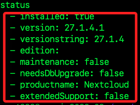

<br>

7. 檢查資料庫連接

    ```bash
    sudo -u www-data php occ db:add-missing-indices
    ```

    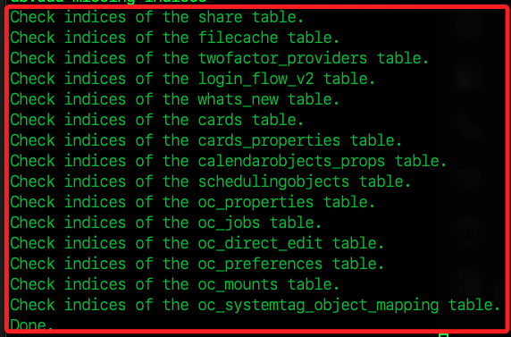

<br>

8. 查看已經註冊的使用者

    ```bash
    sudo -u www-data php occ user:list
    ```

    

<br>

## 透過 Ngrok 測試外網連線

1. [下載 Ngrok](https://ngrok.com/download) 。

    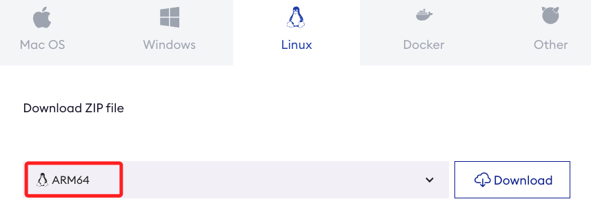

<br>

2. 授權。

    ```bash
    ./ngrok authtoken <填入自己的憑證>
    ```

<br>

3. 在樹莓派運行。

    ```bash
    ./ngrok http 8080
    ```

<br>

4. 複製其中的不包含 `https://` 的網址。

    

<br>

5. 編輯並貼到白名單內。

    ```bash
    sudo nano  /var/www/html/nextcloud/config/config.php
    ```

    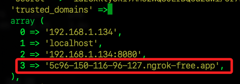

<br>

6. 可在手機上使用瀏覽器直接訪問。

    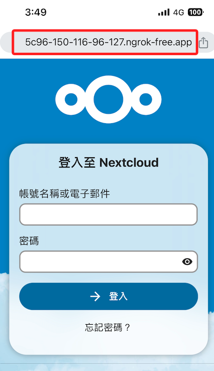

<br>

## 其他指令

1. 檢查端口。

    ```bash
    sudo netstat -tuln | grep ':80'
    ```

<br>

2. 假如有安裝 `ufw` 可查看防火牆。

    ```bash
    sudo ufw status
    ```

<br>

3. 查看 Apache 日誌。

    ```bash
    sudo cat /var/log/apache2/error.log
    ```

<br>

4. 確認 Apache 的設定語法是否正確。

    ```bash
    sudo apache2ctl configtest
    ```

    

<br>

---

_END_