# 連線 Nextcloud

_連線之前先完成配置文件修正_

<br>

## 編輯個別網站配置文件

_前面在安裝 PHP 的步驟已經編輯過全局配置文件_

<br>

1. 連線樹莓派。

    ```bash
    ssh <帳號>@<樹莓派 IP>
    ```

<br>

2. 使用編輯器開啟個別網站文件 `000-default.conf`。 

    ```bash
    sudo nano /etc/apache2/sites-available/000-default.conf
    ```

<br>

3. 原始內容如下。

    ```ini
    <VirtualHost *:80>

            ServerAdmin webmaster@localhost
            DocumentRoot /var/www/html

            ErrorLog ${APACHE_LOG_DIR}/error.log
            CustomLog ${APACHE_LOG_DIR}/access.log combined

    </VirtualHost>
    ```

<br>

4. 修改三處內容：修正端口、修改路徑、添加授權，可直接替換為以下內容。

    ```ini
    # 設置端口為 8080
    <VirtualHost *:8080>

        ServerAdmin webmaster@localhost
        # 修改路徑
        DocumentRoot /var/www/html/nextcloud
        
        # 加入授權
        <Directory /var/www/html/nextcloud>
            AllowOverride All
            Require all granted
        </Directory>

        ErrorLog ${APACHE_LOG_DIR}/error.log
        CustomLog ${APACHE_LOG_DIR}/access.log combined

    </VirtualHost>

    ```

<br>

5. 編輯配置文件之後都要重啟服務。

    ```bash
    sudo systemctl restart apache2
    ```

<br>

6. 切換到 Nextcloud 的安裝目錄。

    ```bash
    cd  /var/www/html
    ```

<br>

7. 授權：對使用者（自己）進行群組授權。

    ```bash
    sudo chown -R sam6238:sam6238 /var/www/html/nextcloud
    ```

<br>

8. 這時候若進行訪問，會發現還是沒訪問權限。

    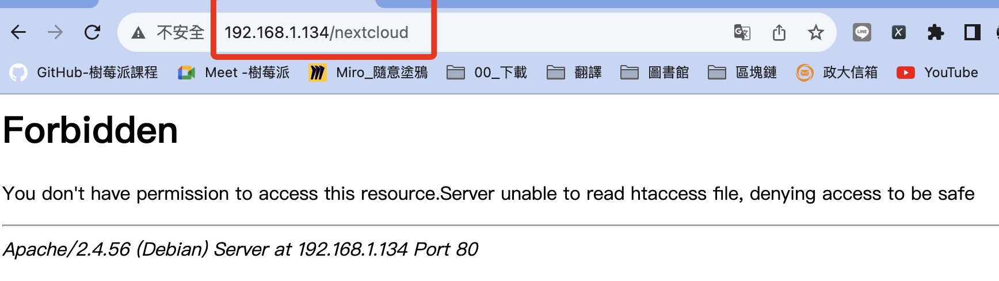

<br>

9. 透過以下指令確認 `.htaccess` 文件存在。

    ```bash
    ls -la /var/www/html/nextcloud | grep .htaccess
    ```

    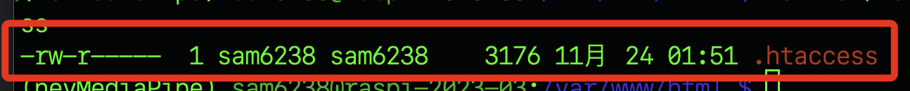

<br>

10. 授權：確保 `.htaccess` 文件的權限為 `644` 。

    ```bash
    sudo chmod 644 /var/www/html/nextcloud/.htaccess
    ```

<br>

11. 授權：確保目錄 `/var/www/html/nextcloud` 和其子目錄的權限至少為 `755` 。

    ```bash
    sudo chmod -R 755 /var/www/html/nextcloud
    ```

<br>

12. 授權：確保 `www-data`（或 Web 伺服器的用戶）是 `/var/www/html/nextcloud` 和其子目錄的擁有者。

    ```bash
    sudo chown -R www-data:www-data /var/www/html/nextcloud
    ```

<br>

13. 訪問 `<樹莓派 IP>/nextcloud`，成功連線 `Nextcloud`。

    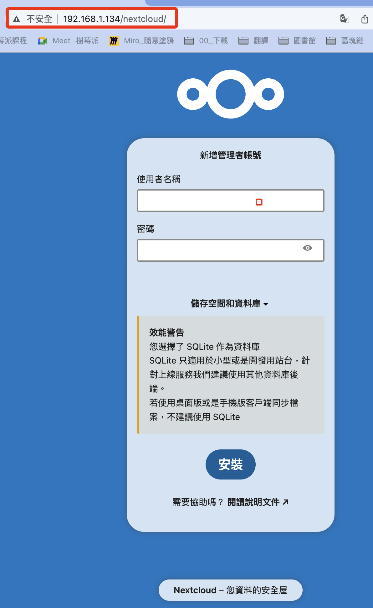

<br>

## 連線以後

_請特別留意這個步驟_

<br>

1. 連線之後，請務必先點開 `儲存空間和資料庫` 。

    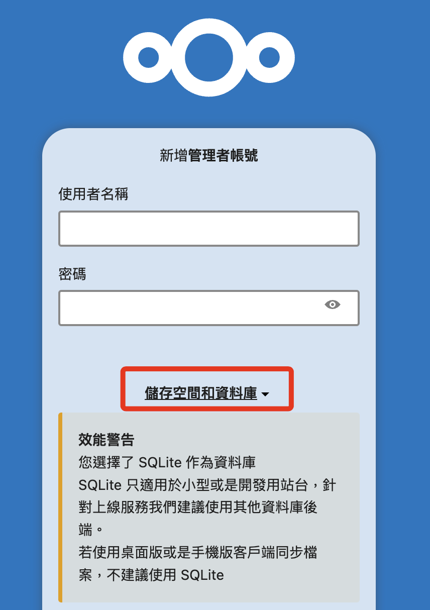

<br>

2. 選取 MySQL/MariaDB 。

    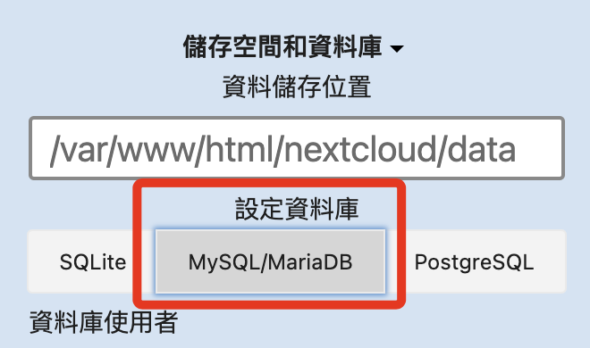

<br>

3. 資料庫儲存位置是安裝時預設的，可再核對一下。

    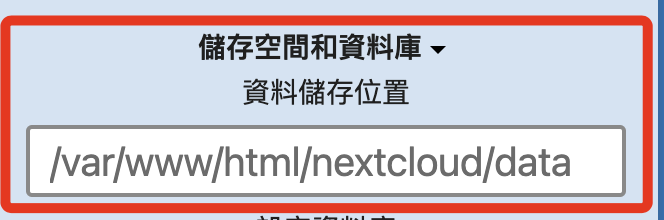

<br>

4. 使用者帳號、密碼以及資料庫名稱依照設定階段的內容填入，主機則填上資料庫網址加上端口號 `<樹莓派 IP>:3306`，假如出現 `HY000` 錯誤訊息，可嘗試使用 `localhost:3306` 替代，之後會再進行相關設定來排除這個問題。

    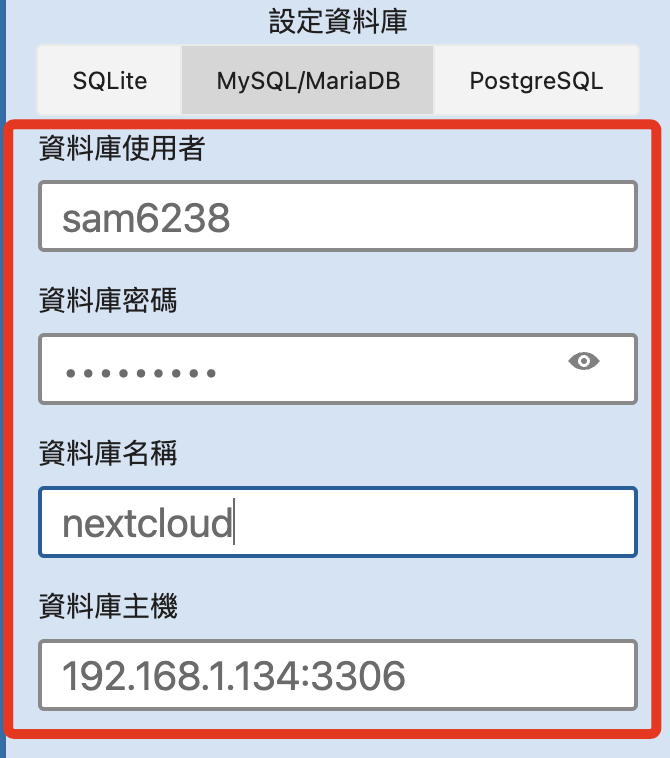
    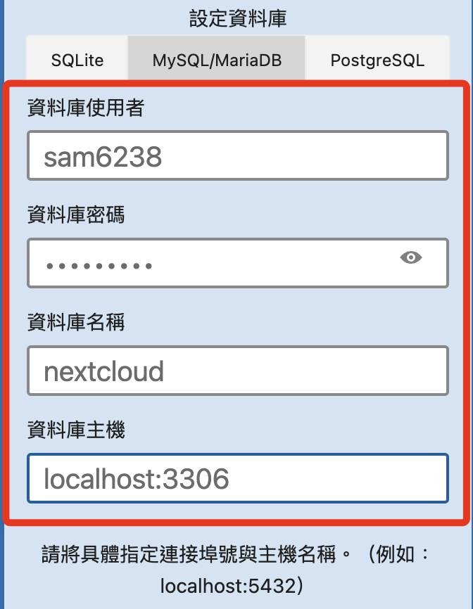

<br>

5. 然後在上方新增一組 Nextcloud 的管理者帳號密碼。

    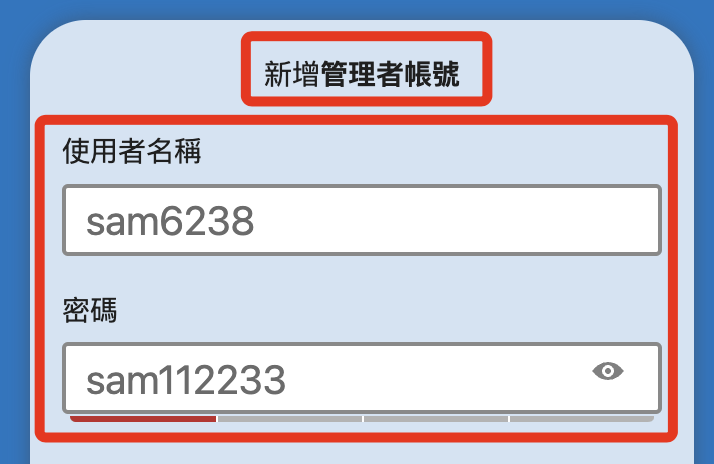

<br>

6. 檢查以上內容都正確後，按下下方的 `安裝`。

    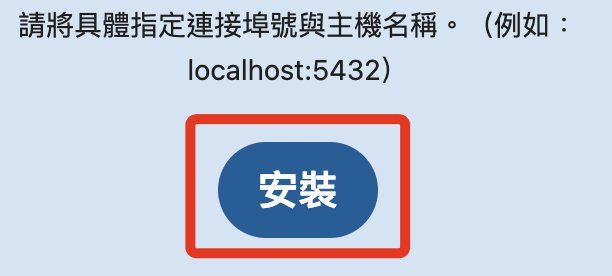

<br>

7. 顯示正在安裝。

    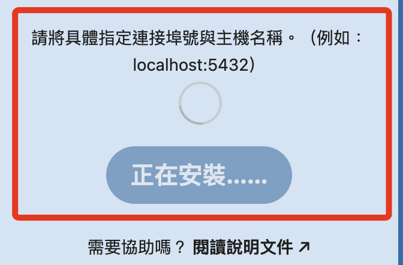

<br>

8. 完成連線設定。

    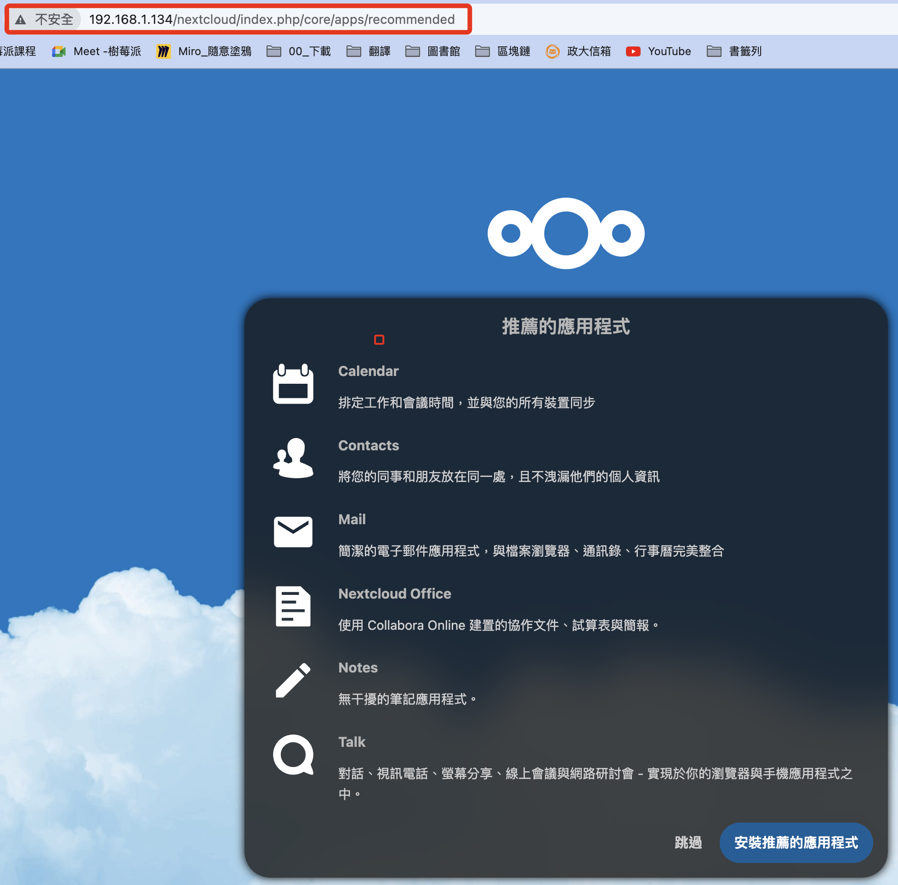

<br>
 
9. 這裡點擊 `跳過`。

    

<br>

10. 進入主控台，完成安裝。

    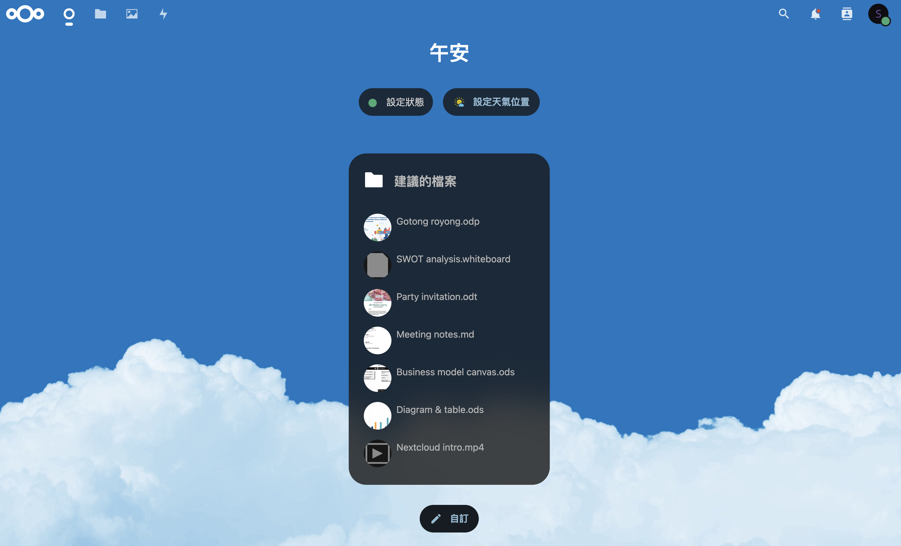

<br>

11. 建議重啟樹莓派，然後再次連線確認設定都已完成。

<br>

---

_END_
