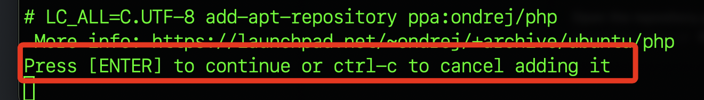
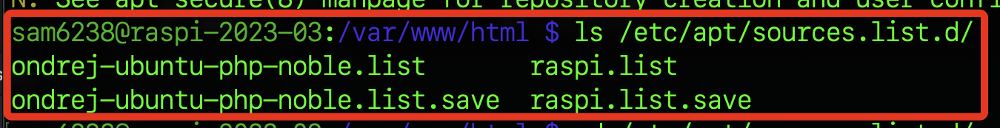

# 錯誤排除

_彙整一些過程中的錯誤_

<br>

## 添加 `ondrej/php` 出錯

1. `ondrej/php` 是個人軟體包存檔（Personal Package Archive，簡稱PPA），主要目的是獲得更新的 PHP 版本，添加這個 PPA 後，就可安裝或更新到這個 PPA 提供的 PHP 版本。

    ```bash
    sudo add-apt-repository ppa:ondrej/php
    ```

<br>

2. 發生錯誤時會顯示提醒可進行退出或按下 `ENTER` 繼續。

    

<br>

3. 出現關於棄用的警告，若不予理會繼續安裝可能會出錯。

    

<br>

4. 通常出現以上訊息時，透過執行更新指令可觀察錯誤的列表所在。

    ```bash
    sudo apt update
    ```

    

<br>

## 排除錯誤列表

1. 切換到套件列表管理目錄。

    ```bash
    cd /etc/apt/sources.list.d/
    ```

<br>

2. 查看有哪些列表，假如有切換目錄，僅需 `ls` 。

    ```bash
    ls
    ```

    

<br>

3. 編輯其中錯誤的兩個列表，將導致錯誤的來源註解。

    ```bash
    sudo nano ondrej-ubuntu-php-noble.list
    sudo nano ondrej-ubuntu-php-noble.list.save
    ```

    

<br>

---

_END_