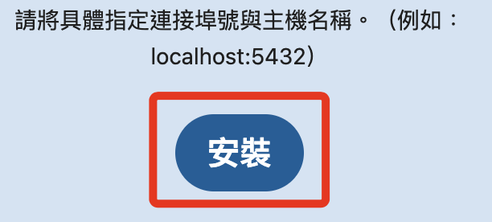

# 連線 Nextcloud

<br>

## 重新開機後

1. 先透過終端機連線樹莓派。

    ```bash
    ssh <帳號>@<樹莓派 IP>
    ```

<br>

2. 切換到 Nextcloud 的安裝目錄。

    ```bash
    cd  /var/www/html
    ```

<br>

3. 授權：對使用者進行群組授權。

    ```bash
    sudo chown -R sam6238:sam6238 /var/www/html/nextcloud
    ```

<br>

4. 這時候若進行訪問，會發現還是沒訪問權限。

    

<br>

5. 透過以下指令確認 `.htaccess` 文件存在。

    ```bash
    ls -la /var/www/html/nextcloud | grep .htaccess
    ```

    

<br>

6. 授權：確保 `.htaccess` 文件的權限為 `644` 。

    ```bash
    sudo chmod 644 /var/www/html/nextcloud/.htaccess
    ```

<br>

7. 授權：確保目錄 `/var/www/html/nextcloud` 和其子目錄的權限至少為 `755` 。

    ```bash
    sudo chmod -R 755 /var/www/html/nextcloud
    ```

<br>

8. 授權：確保 `www-data`（或 Web 伺服器的用戶）是 `/var/www/html/nextcloud` 和其子目錄的擁有者。

    ```bash
    sudo chown -R www-data:www-data /var/www/html/nextcloud
    ```

<br>

9. 訪問 `<樹莓派 IP>/nextcloud`，成功連線 `Nextcloud`。

    

<br>

## 連線以後

_請特別留意這個步驟_

<br>

1. 連線之後，請務必先點開 `儲存空間和資料庫` 。

    

<br>

2. 選取 MySQL/MariaDB 。

    

<br>

3. 資料庫儲存位置是安裝時預設的，可再核對一下。

    

<br>

4. 使用者帳號、密碼以及資料庫名稱依照設定階段的內容填入，主機則填上資料庫網址加上端口號 `<樹莓派 IP>:3306`，假如出現 `HY000` 錯誤訊息，可嘗試使用 `localhost:3306` 替代，之後會再進行相關設定來排除這個問題。

    

<br>

5. 然後在上方新增一組 Nextcloud 的管理者帳號密碼。

    

<br>

6. 檢查以上內容都正確後，按下下方的 `安裝`。

    

<br>

7. 完成連線設定。

    

<br>
 
8. 這裡點擊 `跳過`。

    

<br>

9. 進入主控台，完成安裝。

    

<br>

10. 建議重啟樹莓派，然後再次連線確認設定都已完成。

<br>

---

_END_
