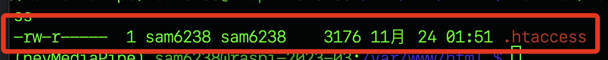
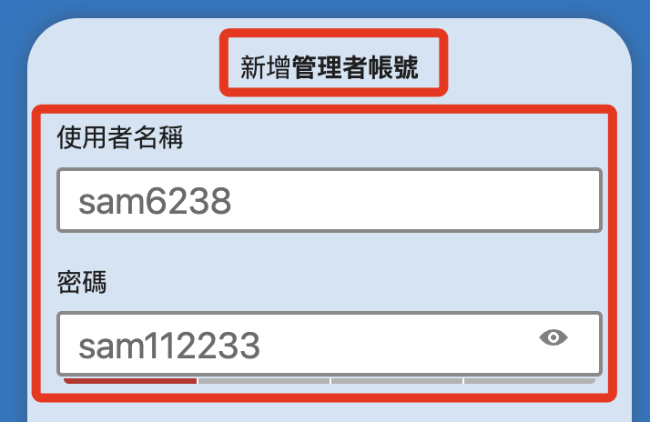
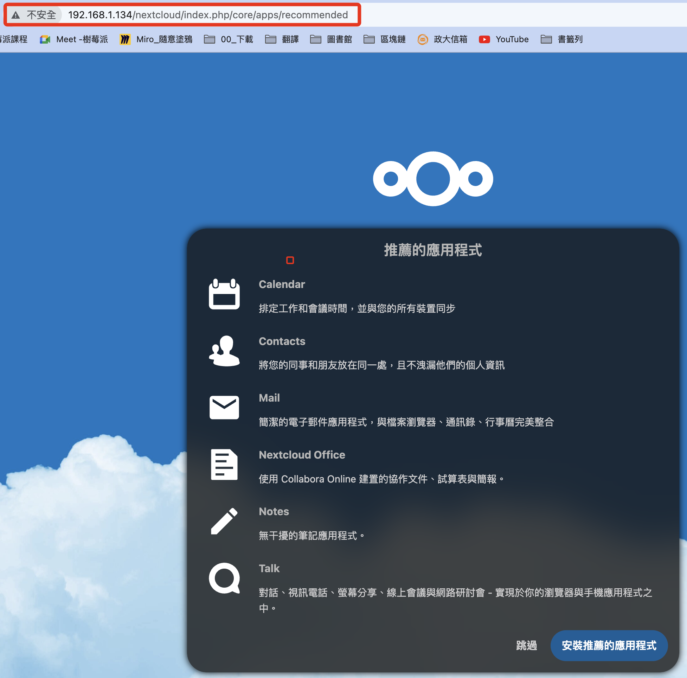
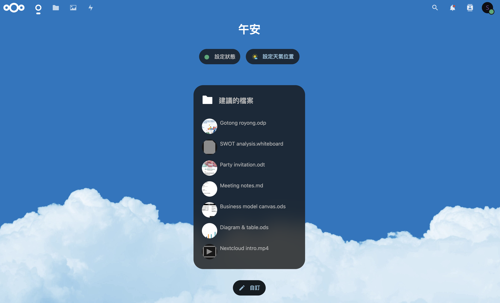

## 重新開機後

1. 先連線樹莓派。

<br>

2. 切換目錄。

    ```bash
    cd  /var/www/html
    ```

<br>

3. 授權，授權後還沒完成喔。

    ```bash
    sudo chown -R sam6238:sam6238 /var/www/html/nextcloud
    ```

<br>

4. 這時候訪問，還是沒權限的。

    

<br>

5. 確保 `.htaccess` 文件存在。

    ```bash
    ls -la /var/www/html/nextcloud | grep .htaccess
    ```

    

<br>

6. 確保 `.htaccess` 文件的權限為 `644` 。

    ```bash
    sudo chmod 644 /var/www/html/nextcloud/.htaccess
    ```

<br>

7. 確保目錄 `/var/www/html/nextcloud` 和其子目錄的權限至少為 `755` 。

    ```bash
    sudo chmod -R 755 /var/www/html/nextcloud
    ```

<br>

8. 確保 `www-data`（或 Web 伺服器的用戶）是 `/var/www/html/nextcloud` 和其子目錄的擁有者。

    ```bash
    sudo chown -R www-data:www-data /var/www/html/nextcloud
    ```

<br>

9. 訪問 `<樹莓派 IP>/nextcloud`，成功連線 `Nextcloud`。

    

<br>

## 連線以後

_請特別留意這個步驟_

<br>

1. 連線之後，請務必先點開 `儲存空間和資料庫` 。

    

<br>

2. 選取 MySQL/MariaDB 。

    

<br>

3. 資料庫儲存位置是安裝時預設的，可再核對一下。

    

<br>

4. 使用者帳號、密碼以及資料庫名稱依照設定階段的內容填入，主機則填上資料庫網址加上端口號 `<樹莓派 IP>:3306`，假如出現 `HY000` 錯誤訊息，可嘗試使用 `localhost:3306` 替代。

    

<br>

5. 然後在上方新增一組 Nextcloud 的管理者帳號密碼。

    

<br>

6. 檢查以上內容都正確後，按下下方的 `安裝`。

    

<br>

7. 完成連線設定。

    

<br>
 
8. 這裡先跳過。

    

<br>

9. 進入主控台，完成安裝。

    

<br>

10. 建議重啟樹莓派，然後再次連線確認設定都已完成。

<br>

## 環境設定

1. 察看或編輯設定檔案。

    ```bash
    sudo nano /var/www/html/nextcloud/config/config.php
    ```

<br>

2. 原本內容，將修改其中 `trusted_domains` 及 `overwrite.cli.url` 來重新設置連線的網址。

    ```php
    <?php
    $CONFIG = array (
    'instanceid' => 'ocpjouk5budk',
    'passwordsalt' => '9zvkeGqKRzaQRI4xYmy7NLxFDnunQ3',
    'secret' => '1azCxktyOkl9Ah52WQ30LrDQou2dw1/or7bNwvh9S3WZlCWt',
    'trusted_domains' => 
    array (
        0 => '192.168.1.134',
    ),
    'datadirectory' => '/var/www/html/nextcloud/data',
    'dbtype' => 'mysql',
    'version' => '27.1.4.1',
    'overwrite.cli.url' => 'http://192.168.1.134/nextcloud',
    'dbname' => 'nextcloud',
    'dbhost' => 'localhost:3306',
    'dbport' => '',
    'dbtableprefix' => 'oc_',
    'mysql.utf8mb4' => true,
    'dbuser' => 'sam6238',
    'dbpassword' => 'sam112233',
    'installed' => true,
    );
    ```

<br>

3. 首先修改白名單 `trusted_domains`，添加 `192.168.1.134:8080` ，確保即使 Nextcloud 在非標準連接埠上運行，也能正確地識別和允許存取。。

    ```php
    'trusted_domains' => 
    array (
        0 => '192.168.1.134',
        1 => 'localhost',
        2 => '192.168.1.134:8080',
    ),
    ```

<br>

4. 接著修改 Nextcloud 的基礎 URL `overwrite.cli.url`，設定後所有從 Nextcloud 產生的絕對 URL 都將以這個位址為基礎。

    ```php
    'overwrite.cli.url' => 'http://192.168.1.134:8080',
    ```

<br>

5. 修改監聽端口設定檔案 `ports.conf` 。

    ```bash
    sudo nano /etc/apache2/ports.conf
    ```

<br>

6. 添加監聽 `8080` 端口。

    ```ini
    Listen 8080
    ```

    

<br>

7. 修改 Apache2 設定檔案 `000-default.conf` 。

    ```bash
    sudo nano /etc/apache2/sites-available/000-default.conf
    ```

<br>

8. 將端口改為 `8080`，同時添加授權，完整內容如下。

    ```ini
    <VirtualHost *:8080>

            ServerAdmin webmaster@localhost
            DocumentRoot /var/www/html/nextcloud
            <Directory /var/www/html/nextcloud>
                AllowOverride All
                Require all granted
            </Directory>
            
            ErrorLog ${APACHE_LOG_DIR}/error.log
            CustomLog ${APACHE_LOG_DIR}/access.log combined

    </VirtualHost>
    ```

<br>

9. 完成以上修改後要重新啟動服務讓修改生效，每次修改後都要記得這件事。

    ```bash
    sudo systemctl restart apache2
    ```

<br>

## 安裝應用

_示範安裝 `OCC Web`，OCC 是 Nextcloud 的命令列介面，用於執行各種管理任務，例如使用者管理、檔案操作、資料庫維護、系統資訊查詢等。_

<br>

1. 點擊右側 `應用程式`。

    

<br>

2. 點擊左側 Tools。

    

<br>

3. 在右側進行搜尋。

    

<br>

4. 下載並啟用。

    

<br>

5. 安裝好之後回到終端機中，切換到安裝目錄

    ```bash
    cd /var/www/html/nextcloud
    ```

<br>

6. 我們使用 `Apache` 的使用者通常是 `www-data`，以下指令查詢 Nextcloud 狀態。

    ```bash
    sudo -u www-data php occ status
    ```

    

<br>

7. 檢查資料庫連接

    ```bash
    sudo -u www-data php occ db:add-missing-indices
    ```

    

<br>

8. 查看已經註冊的使用者

    ```bash
    sudo -u www-data php occ user:list
    ```

    

<br>

## 透過 Ngrok 測試外網連線

1. [下載 Ngrok](https://ngrok.com/download) 。

    

<br>

2. 授權。

    ```bash
    ./ngrok authtoken <填入自己的憑證>
    ```

<br>

3. 在樹莓派運行。

    ```bash
    ./ngrok http 8080
    ```

<br>

4. 複製其中的不包含 `https://` 的網址。

    

<br>

5. 編輯並貼到白名單內。

    ```bash
    sudo nano  /var/www/html/nextcloud/config/config.php
    ```

    

<br>

6. 可在手機上使用瀏覽器直接訪問。

    

<br>

## 其他指令

1. 檢查端口。

    ```bash
    sudo netstat -tuln | grep ':80'
    ```

<br>

2. 假如有安裝 `ufw` 可查看防火牆。

    ```bash
    sudo ufw status
    ```

<br>

3. 查看 Apache 日誌。

    ```bash
    sudo cat /var/log/apache2/error.log
    ```

<br>

4. 確認 Apache 的設定語法是否正確。

    ```bash
    sudo apache2ctl configtest
    ```

    

<br>

---

_END_