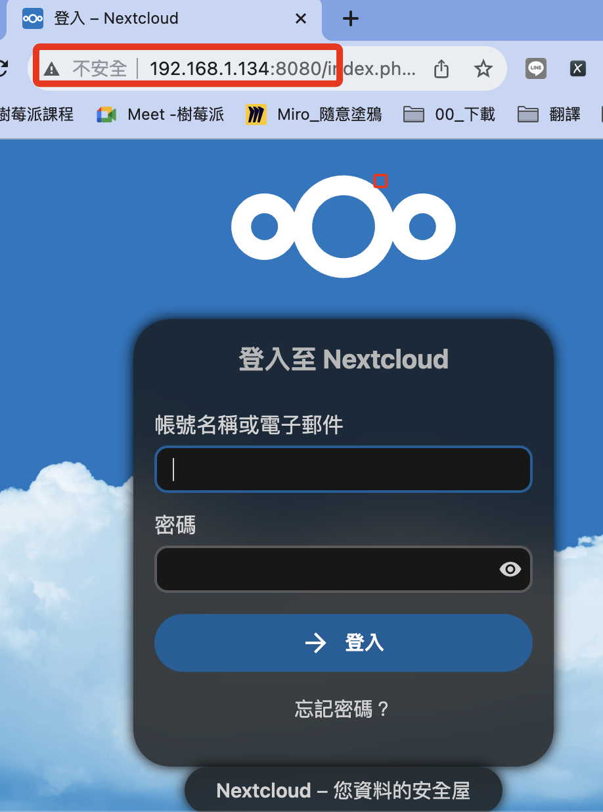

# 進階設定

_連線樹莓派進行設定_

<br>

## 說明

1. 編輯設定文件 `config.php` 。

    ```bash
    sudo nano /var/www/html/nextcloud/config/config.php
    ```

<br>

2. 原本內容：將對其中 `trusted_domains` 及 `overwrite.cli.url` 進行修改以設置連線的網址。

    ```php
    <?php
    $CONFIG = array (
    'instanceid' => 'ocpjouk5budk',
    'passwordsalt' => '9zvkeGqKRzaQRI4xYmy7NLxFDnunQ3',
    'secret' => '1azCxktyOkl9Ah52WQ30LrDQou2dw1/or7bNwvh9S3WZlCWt',
    'trusted_domains' => 
    array (
        0 => '192.168.1.134',
    ),
    'datadirectory' => '/var/www/html/nextcloud/data',
    'dbtype' => 'mysql',
    'version' => '27.1.4.1',
    'overwrite.cli.url' => 'http://192.168.1.134/nextcloud',
    'dbname' => 'nextcloud',
    'dbhost' => 'localhost:3306',
    'dbport' => '',
    'dbtableprefix' => 'oc_',
    'mysql.utf8mb4' => true,
    'dbuser' => 'sam6238',
    'dbpassword' => 'sam112233',
    'installed' => true,
    );
    ```

<br>

## 開始修改


1. 修改白名單 `trusted_domains`：添加 `192.168.1.134:8080` ，確保即使 Nextcloud 在非標準連接埠上運行，也能正確地識別和允許存取。。

    ```php
    'trusted_domains' => 
    array (
        0 => '192.168.1.134',
        1 => 'localhost',
        2 => '192.168.1.134:8080',
    ),
    ```

<br>

2. 修改 Nextcloud 的基礎 URL `overwrite.cli.url`：設定後所有從 Nextcloud 產生的絕對 URL 都將以這個位址為基礎，完成後儲存並且關閉。

    ```php
    'overwrite.cli.url' => 'http://192.168.1.134:8080',
    ```

<br>

3. 修改監聽端口設定檔案 `ports.conf`：添加自訂端口 `8080` 。

    ```bash
    sudo nano /etc/apache2/ports.conf
    ```

<br>

4. 在前一個步驟開啟的 `ports.conf` 文件中添加監聽 `8080` 端口，完成後儲存並關閉。

    ```ini
    Listen 8080
    ```

    

<br>

5. 修改 Apache2 設定檔案 `000-default.conf`：這個步驟在連線之前已經做過，這裡再做一次檢查即可。

    ```bash
    sudo nano /etc/apache2/sites-available/000-default.conf
    ```

<br>

6. 完整內容如下。

    ```ini
    <VirtualHost *:8080>

            ServerAdmin webmaster@localhost
            DocumentRoot /var/www/html/nextcloud
            <Directory /var/www/html/nextcloud>
                AllowOverride All
                Require all granted
            </Directory>
            
            ErrorLog ${APACHE_LOG_DIR}/error.log
            CustomLog ${APACHE_LOG_DIR}/access.log combined

    </VirtualHost>
    ```

<br>

7. 重啟服務：完成修改後要重新啟動服務讓修改生效，每次修改後都要記得這件事。

    ```bash
    sudo systemctl restart apache2
    ```

<br>

8. 這時便可使用樹莓派 IP 加上指定端口 `8080` 進行連線。

    

<br>

---

_END_
