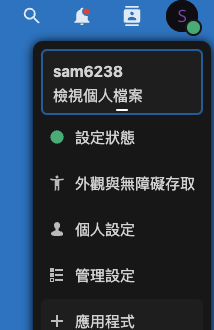
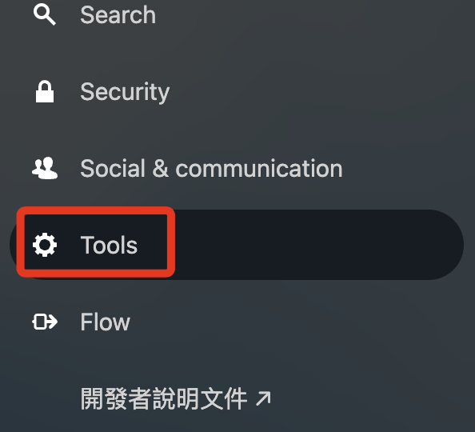
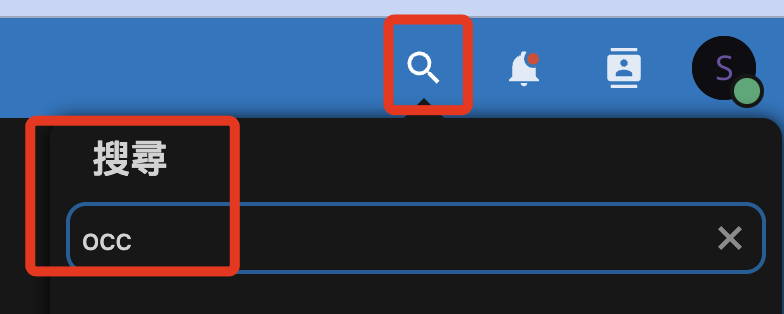
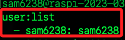

# 安裝應用

_示範安裝 `OCC Web`，OCC 是 Nextcloud 的命令列介面，用於執行各種管理任務，例如使用者管理、檔案操作、資料庫維護、系統資訊查詢等。_

<br>

## 說明

1. 點擊右側 `應用程式`。

    

<br>

2. 點擊左側 Tools。

    

<br>

3. 在右側進行搜尋。

    

<br>

4. 下載並啟用。

    

<br>

5. 安裝好之後回到終端機中，切換到安裝目錄

    ```bash
    cd /var/www/html/nextcloud
    ```

<br>

6. 我們使用 `Apache` 的使用者通常是 `www-data`，以下指令查詢 Nextcloud 狀態。

    ```bash
    sudo -u www-data php occ status
    ```

    

<br>

7. 檢查資料庫連接

    ```bash
    sudo -u www-data php occ db:add-missing-indices
    ```

    

<br>

8. 查看已經註冊的使用者

    ```bash
    sudo -u www-data php occ user:list
    ```

    

<br>

---

_END_
