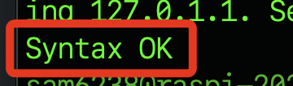

# 其他補充

<br>

## 其他指令

1. 檢查端口。

    ```bash
    sudo netstat -tuln | grep ':80'
    ```

<br>

2. 假如有安裝 `ufw` 可查看防火牆。

    ```bash
    sudo ufw status
    ```

<br>

3. 查看 Apache 日誌。

    ```bash
    sudo cat /var/log/apache2/error.log
    ```

<br>

4. 確認 Apache 的設定語法是否正確。

    ```bash
    sudo apache2ctl configtest
    ```

    

<br>

---

_END_