# 安卓系統

 

## 準備

1. 遙控器
2. 鍵盤
3. 滑鼠
4. 螢幕線（樹莓派連線顯示器）

 

## 下載相關軟件

1. 可在課程的 [雲端硬碟](https://drive.google.com/drive/folders/19Law3l1lpeaFRjaT6QH_ZSxjjIA-vVeX?usp=sharing) 中下載。

   

 

2. 這部分課程結束後可能會關閉權限，日後有需要的同學可隨時給我訊息。

 

## 軟件內容說明

1. AOSP13-20230130-KonstaKANG-rpi4.zip

   _這是由 KonstaKANG 所開發的客製化 Android 作業系統文件，可參考其 [官網](https://konstakang.com/devices/rpi4/)。_

 

2. NikGapps-SayaGapps-arm64-13-20230219.zip

   _這是一個 Google 應用程序套件，專門用於裝載到運行安卓13的 ARM16 架構設備。_

 

3. AOSP13-rpi-resize.zip

   _安裝 Android Open Source Project (AOSP) 13 之後，用於調整分區大小，使得系統可以使用全部分區空間。_

 

4. Device+ID.apk

   _安裝後可用於取得設備 ID 以驗證 Google 使用。_

 

5. 其他 APK。

   _其他任何可安裝於系統內的 APK_

 

## 開始工作

1. 下載並使用 balena Etcher 燒錄。

   

 

2. 先選取壓縮檔案，再選取目標磁碟，然後燒錄。

   

 

3. 需要一段時間。

   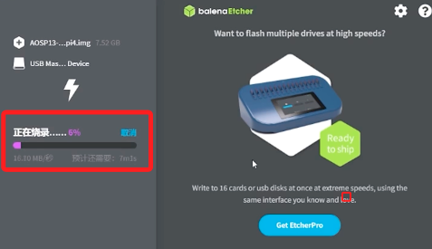

 

4. 準備另外一個 USB Disk，格式化為 FAT 格式，將另外三個檔案複製之後備用。

   

 

5. 將記憶卡插入樹莓派並且開機，要連線螢幕。

   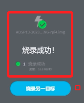

 

6. 畫面會顯示安卓圖示。

   

 

7. 開機完成後，使用滑使將畫面向上拖曳滑動，模擬像是手指滑動手機的概念。

   

 

8. 然後點擊設定。

   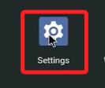

 

9. 左邊先向下滑到系統，然後點擊樹莓派設定。

   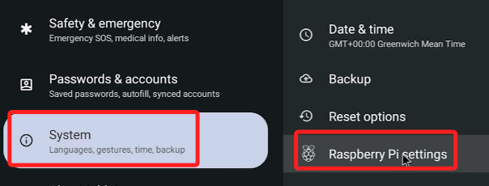

 

10. 將 recovery 打開。

   

 

11. 點擊原點先回到桌面，並且將 USB 碟插入樹莓派。

   

 

12. 點左上角的時鐘。

   

 

13. 選擇電源選項。

   

 

14. 點擊視窗中右側的重新啟動。

   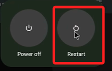

 

15. 出現七彩畫面是正常的。

   

 

16. 進入刷機畫面。

   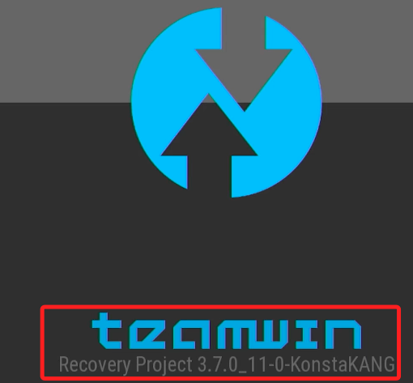

 

17. 先執行一次 Wipe 清除設備上的數據，清除緩存的意思。

   

 

18. 向右拖曳重置。

   

 

19. 接著點擊畫面左上角會返回 Recovery 畫面。

   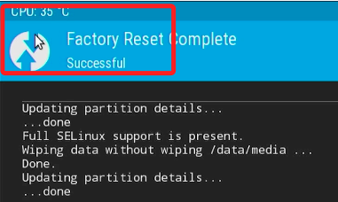

 

20. 點擊 Install。

   

 

21. 點擊右下角的 Select Storage 打開儲存設備。

   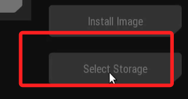

 

22. 選取 USB 碟，假如格式錯誤可能讀不到。

   

 

23. 先選取 resize.zip。

   

 

24. 拖曳到右方進行安裝。

   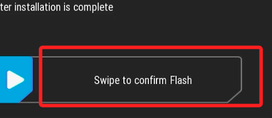

 

25. 會顯示安裝的進度。

   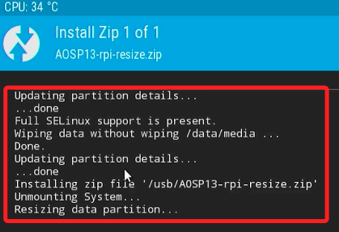

 

26. 安裝好後點擊。

   

 

27. 再拖曳一次拉條繼續安裝。

   

 

28. 完成後點左上角返回。

   

 

29. 再點擊一次 Install。

   

 

30. 接著安裝 Gapps。

   

 

31. 一樣拖曳到右邊，這裡安裝的東西很多，要等上一陣子。

   

 

32. 安裝好後一樣點擊 Dalvik。

   

 

33. 再拖曳一次拉條繼續安裝。

   

 

34. 完成後點左上角返回。

   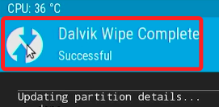

 

35. 接著要掛載。

   

 

36. 添加 Boot、System。

   

 

37. 點左上角返回。

   

 

38. 使用 System 重啟。

   

 

39. 重啟後向上拖曳後點擊設定。

   

 

40. 點擊系統，將語言設定為繁體中文，並把英文刪除。

   

 

41. 點擊網路，設定 WiFi，設定時要將區網線拔除。

   

 

42. 點擊系統的樹莓派設定。

   

 

43. 將 ADB 開啟，注意，這很重要。

   

 

44. 開啟後，會顯示 IP，請務必記清楚，之後會用到。

   

 

---

_END_
