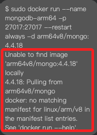

# Docker 安裝 MongoDB

_Tim Huang 提供_

<br>

1. 錯誤訊息

    

<br>

2. 處理方式：添加參數 `--platform linux/arm64`

    ```bash
    sudo docker run --name mongodb-arm64 -p 27017:27017 --restart always -d --platform linux/arm64 arm64v8/mongo:4.4.18
    ```

<br>
