# 安裝 Docker

_在三個系統的安裝皆不同，以下為 Windows 系統的安裝指引_

<br>

## 先安裝 WSL

_就是子系統 Windows Subsystem for Linux_

<br>

1. 假如是使用專案版以上。

    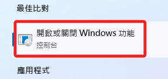

<br>

2. 可直接進入控制台勾選設定選項。

    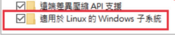

<br>

3. 假如在其他沒有這個選項的版本：如家用版。

    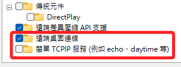

<br>

4. 可使用終端機進行安裝。

    ```bash
    wsl --install
    ```

<br>

5. 完成時需要重新開機。

    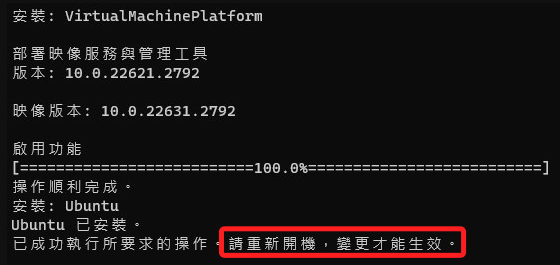

    _假如是在有還原卡的設備，進行到這個步驟就玩完了，雖然還有其他處置方式，這裡先略過。_

<br>

## 安裝 Linux 環境

_這只是補充，非必要的步驟_

<br>

1. 完成 WSL 設置後可進入商店。

    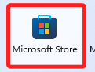

<br>

2. 搜尋 `Ubuntu` 的相關應用。

    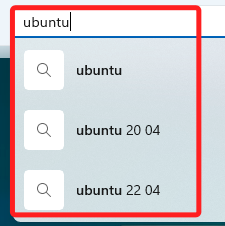

<br>

3. 任意安裝一個來測試。

    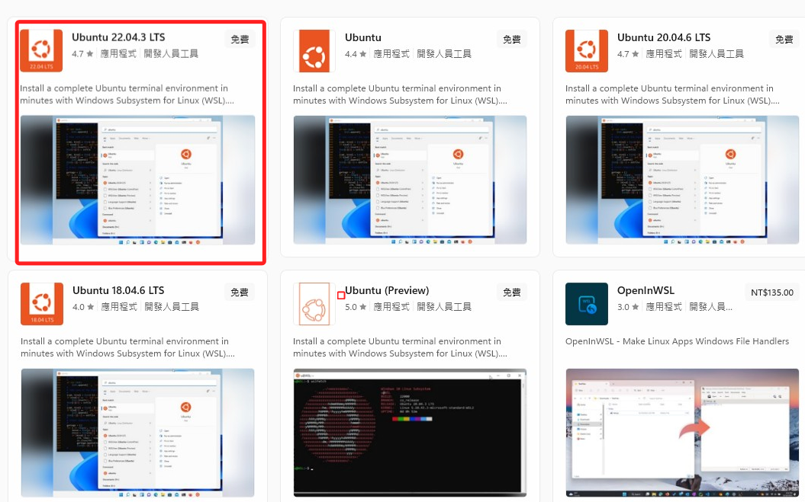

<br>

4. 會顯示要安裝一段時間，其實很快。

    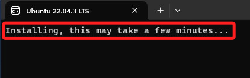

<br>

5. 接著自定義帳號並輸入兩次密碼。

    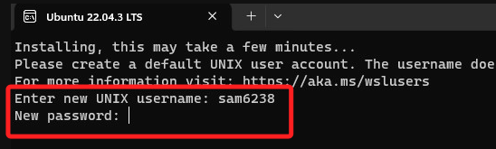

<br>

6. 至此同學就有熟悉的 Linux 系統可以使用了。

    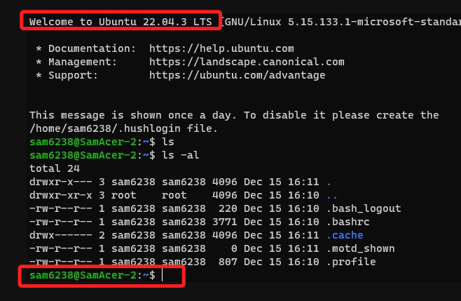

<br>

## 安裝 Docker

1. 進入 [官網](https://docs.docker.com/)

    _進入下載頁面的途徑很多，這只是其中之一。_

    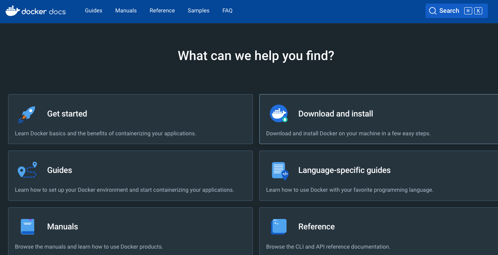

<br>

2. 選擇 Download and Install。

   

<br>

3. 選擇 Windows 版本。

   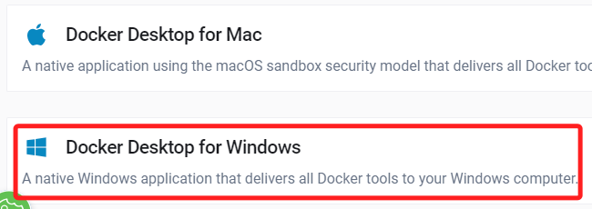

<br>

4. 下載 Desktop 桌面應用。

   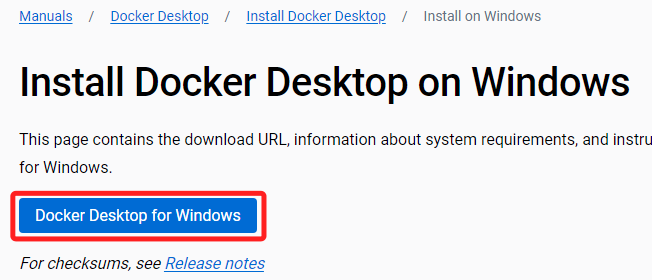

<br>

5. 下載完成，點擊 Installer 進行安裝。

   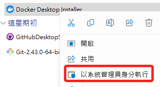

<br>

6. 這需要花一點時間，請耐心等待。

   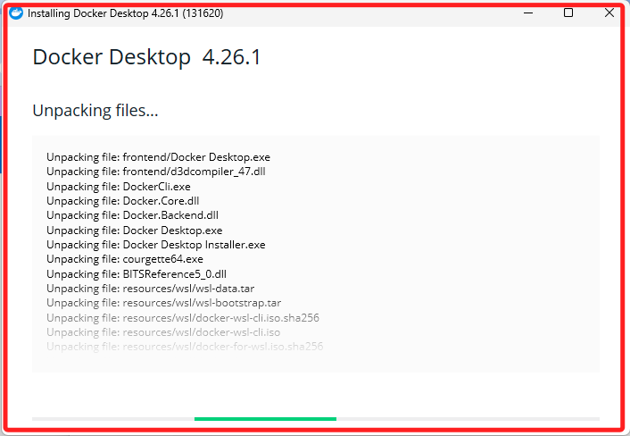

<br>

7. 安裝完成後，需要重新啟動 Windows 系統。

   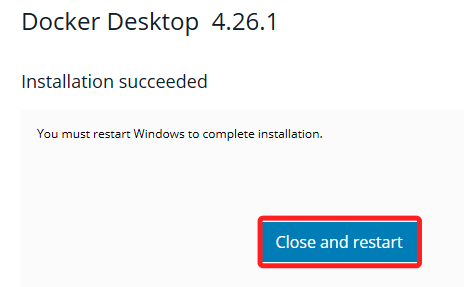

<br>

8. 重啟之後，點擊 `Accept` 即可。
    
    

<br>

9. 假如出現選項，都用預設即可，然後完成安裝。

    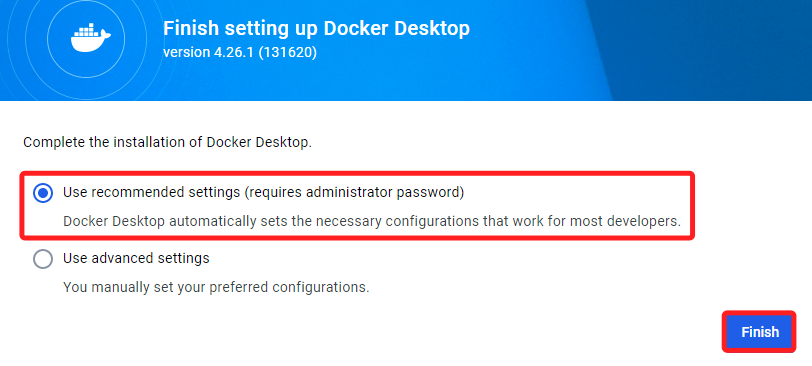

<br>

10. 接著可能會自動展開登入程序，這在不同系統或版本的安裝有所不同。

    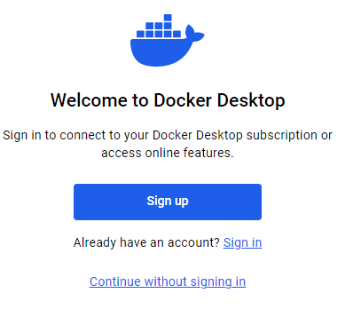

<br>

11. 可以先完成登入，或是稍後再登入。

    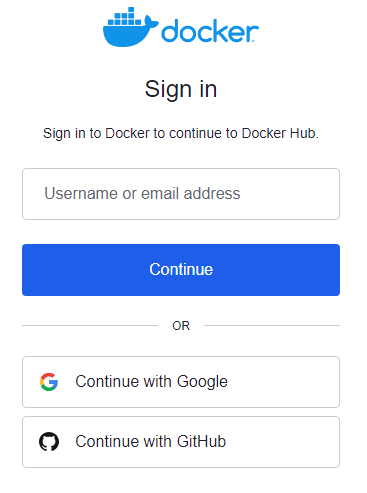

<br>

12. 可使用 Google 帳號快速登入，假如是初次登入的帳號會提示輸入使用者名稱。

    

<br>

13. 完成候選提示開啟桌面應用。

    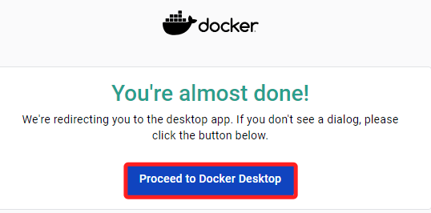

<br>

14. 或關閉視窗，回到桌面點擊開啟 Docker。

    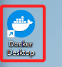

<br>

15. 進入 Docker 主控台，完成安裝。

    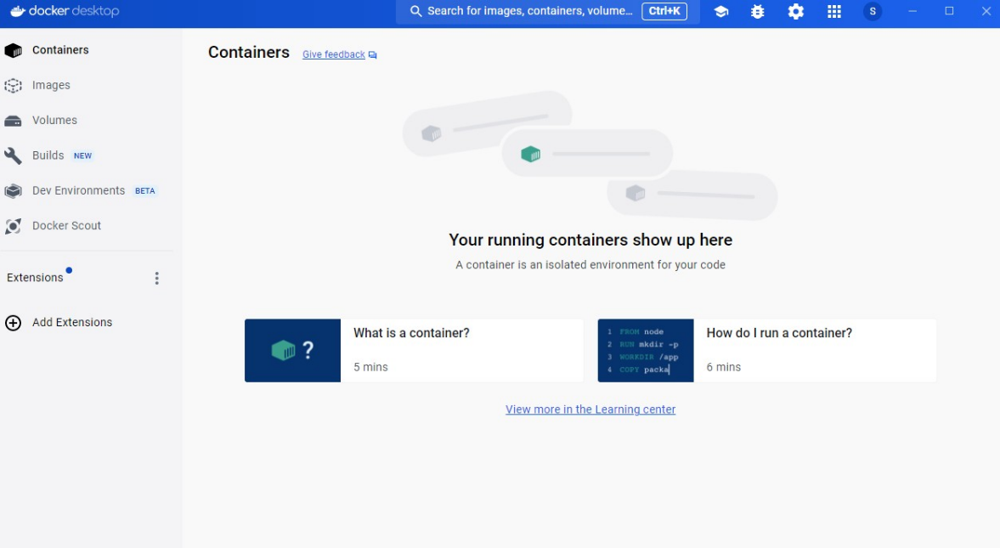

<br>

16. 可在終端機中進行相關指令。

    ```bash
    docker ps
    ```

<br>

17. 尚未安裝容器，所以結果是空的，至此確定安裝完成。

    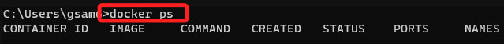

<br>

## 錯誤排除

1. 假如未完成相關安裝直接安裝 Docker 會出現錯誤訊息，請重新檢視安裝步驟。

    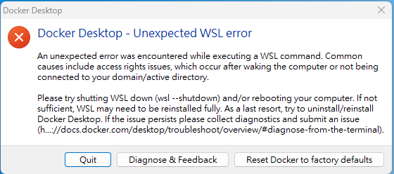

<br>

2. 假如在 Ubuntu 系統中發生 `connot connect to the docker daemon at unix` 的錯誤。

    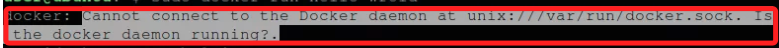

<br>

3. 進入桌面應用後勾選以下選項。

    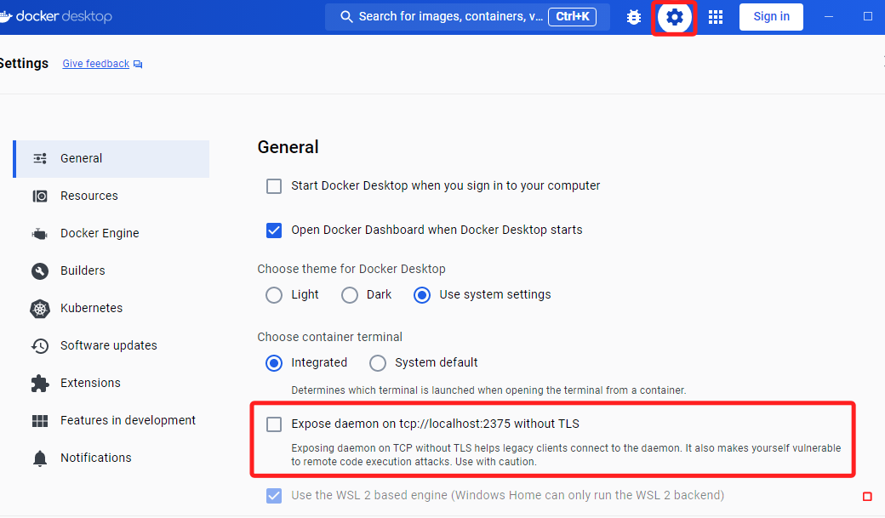

<br>

4. 套用。

    

<br>

5. 接著對環境參數進行設置。

    ```bash
    sudo nano ~/.bashrc
    ```

<br>

6. 添加以下內容。

    ```ini
    export DOCKER_HOST=127.0.0.1:"2375
    ```

<br>

7. 載入設定文件，這樣就可排除了。

    ```bash
    source ~/.bashrc
    ```

<br>

## 其他

_後補_

<br>

---

_END_