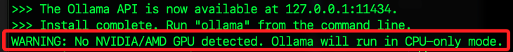
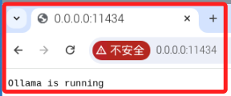
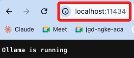
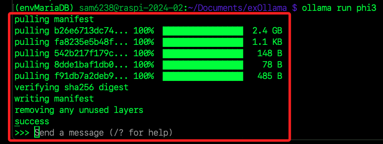
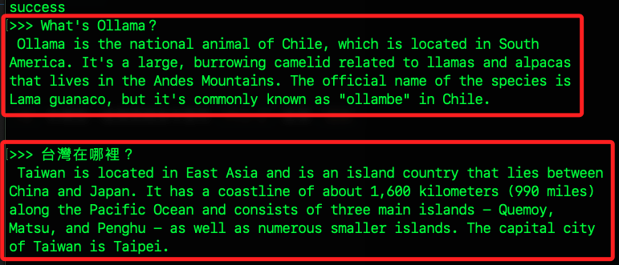
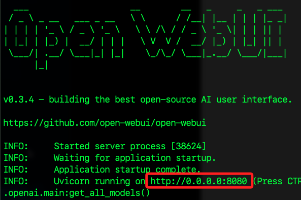
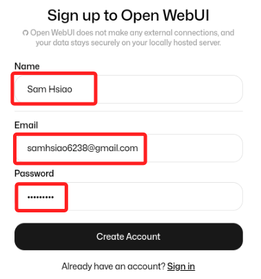
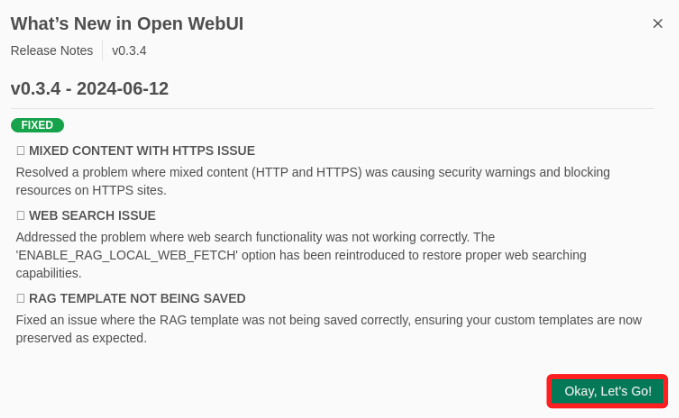

# 在樹莓派上運行本地 `LLM` 和 VLM

_迅速建立本地運行的 ChatGPT Web UI 應用_

<br>

## 參考資源

1. 本筆記 [網路文章](https://blog.yanghong.dev/ollama-on-raspberry-pi-5/)，關於在樹莓派上運行 `LLM（大型語言模型）` 及 `VLM（視覺語言模型）` 的介紹。

<br>

2. 相關技術問題可參考 [Ollama 官方 GitHub](https://github.com/Ollama)。

<br>

3. `Ollama Web UI` 的本地 ChatGPT 界面很友善，可與 `Ollama` 無縫整合，關於 Web UI 可參考 [Ollama Web UI 官方 GitHub](https://github.com/Ollama-webui)。

<br>

## 簡介

1. `Ollama` 可在個人電腦上運行 `LLM` 的解決方案之一，同時提供了一個 `REST API`，可以讓其在樹莓派上運行，並且能夠從其他應用程序和設備調用它。

<br>

2. 關於可用模型可參考 [Ollama 模型庫](https://ollama.ai/models)。

<br>

## 專案說明

1. 這個項目主要是利用現有的工具和官方提供的功能進行組合和配置，以達到本地運行 `LLM` 和 `VLM` 的目標，主要的 `Web 界面交互` 是通過 `Ollama Web UI` 來實現的，而不是自製的網頁應用。

<br>

## 安裝 Ollama

1. 在樹莓派上安裝 `Ollama`，透過以下指令可自動化 `下載並執行` 一個腳本。

    ```bash
    curl https://ollama.ai/install.sh | sh
    ```

<br>

2. 安裝完成會看到警告設備沒有 `NVIDIA/AMD GPU`，所以 `Ollama` 將會使用 `CPU` 模式運行。

    

<br>

3. 驗證 Ollama 是否正在運行，顯示 `Ollama is running` 表示服務正確啟動。

    

    ```bash
    # 訪問以下地址檢查 Ollama 是否正常運行
    0.0.0.0:11434
    ```

<br>

4. 也可透過區網內其他電腦進行訪問 `localhost:11434`。

    

<br>

## 運行 LLM

_下載模型並且在本地運行_

<br>

1. 對於 LLM 來說，8GB 樹莓派因內存和算力有限，原則上是無法運行超過 `7B` 的模型，所以使用 `Phi-3` 這個 `微軟` 的 `3B LLM` 模型；至於模型大小（7B、3B）指的是模型中參數的數量，`B` 代表 `billion（十億）`，所以 `7B 模型` 有 `70 億個參數`，而 `3B 模型` 有 `30 億個參數`。參數越多、模型的內存需求越高，模型參數的儲存和運算會占用大量內存，典型的 LLM 每個參數大約需要 `4 字節` 內存，因此 `7B 模型` 大約需要 `28 GB` 的內存來存儲參數，而 `3B 模型` 大約需要 `12 GB`，這對於樹莓派來說已經是臨界值，當內存不足時，操作系統會使用 `內存交換（swap）` 將部分數據儲存到磁盤上，這會導致讀寫速度降低。

    ```bash
    ollama run phi3
    ```

<br>

2. 初次運行會先下載模型，模型越大、輸出速度會越慢，使用 `Phi3 3B` 的生成速度約為 `每秒 4 個 token`，`Mistral 7B` 則約為 `每秒 2 個 token`。

    

<br>

3. 中英文提問皆可，但預設回覆都會是英文的，另外，嚴格說，這個模型的精準度是很低的。

    

<br>

## 安裝並運行 Ollama Web UI

1. 首先安裝 `Node.js`。

    ```bash
    curl -fsSL https://deb.nodesource.com/setup_20.x | sudo -E bash -
    sudo apt-get install -y nodejs
    ```

<br>

2. 切換到專案資料夾，運行以下指令下載並解壓縮 Ollama Web UI 的 `git` 到本地。

    ```bash
    git clone https://github.com/ollama-webui/ollama-webui.git
    ```

<br>

3. 切換到解壓縮後的目錄。

    ```bash
    cd ollama-webui
    ```

<br>

4. 在這個範例倉庫中已經準備了一個 `.env` 文件範本，可進行複製後修改。

    ```bash
    # 複製 .env 文件
    cp -RPp .env.example .env
    ```

<br>

5. 編輯複製後的 `.env 文件`。

    ```bash
    # Ollama URL for the backend to connect
    # The path '/ollama' will be redirected to the specified backend URL
    OLLAMA_BASE_URL='http://localhost:11434'

    OPENAI_API_BASE_URL='https://api.openai.com/v1'
    OPENAI_API_KEY='<連入自己的 API Key>'

    # AUTOMATIC1111_BASE_URL="http://localhost:7860"

    # DO NOT TRACK
    SCARF_NO_ANALYTICS=true
    DO_NOT_TRACK=true
    ANONYMIZED_TELEMETRY=false
    ```

<br>

6. 根據 `package.json` 文件中的依賴列表，安裝項目所需的所有依賴包。

    ```bash
    # 使用 Node.js 構建前端
    sudo npm i
    ```

<br>

7. 運行 `Node.js` 項目的構建腳本，也就是執行在 `package.json` 文件中定義的構建任務。

    ```bash
    sudo npm run build
    ```

<br>

8. 切換的資料夾 `backend` 中，接下來要安裝 `Python` 套件。

    ```bash
    cd backend
    ```

<br>

9. 先安裝依賴，這個程序很久。

    ```bash
    pip install -r requirements.txt
    ```

<br>

10. 運行腳本。

    ```bash
    bash start.sh
    ```

<br>

## 詳解腳本

_這個腳本啟動一個 WEBUI 伺服器，並配置和創建管理員用戶_

<br>

1. 腳本內容。

    ```bash
    # 指定此腳本使用 /usr/bin/env 中的 bash 解釋器來運行
    #!/usr/bin/env bash

    # 取得腳本的目錄位置，並切換到該目錄
    SCRIPT_DIR=$( cd -- "$( dirname -- "${BASH_SOURCE[0]}" )" &> /dev/null && pwd )
    cd "$SCRIPT_DIR" || exit

    # 定義儲存 WEBUI 秘鑰的檔案名稱
    KEY_FILE=.webui_secret_key

    # 設定預設的伺服器端口和主機地址
    PORT="${PORT:-8080}"
    HOST="${HOST:-0.0.0.0}"

    # 檢查環境變量是否設置了 WEBUI_SECRET_KEY 和 WEBUI_JWT_SECRET_KEY，如果沒有設置，則從文件中加載或生成
    if test "$WEBUI_SECRET_KEY $WEBUI_JWT_SECRET_KEY" = " "; then
    echo "從文件加載 WEBUI_SECRET_KEY，未作為環境變量提供。"

    # 如果文件不存在，則生成一個隨機的秘鑰並保存到文件
    if ! [ -e "$KEY_FILE" ]; then
        echo "生成 WEBUI_SECRET_KEY"
        # 生成一個隨機值作為 WEBUI_SECRET_KEY，並寫入文件
        echo $(head -c 12 /dev/random | base64) > "$KEY_FILE"
    fi

    # 從文件中加載 WEBUI_SECRET_KEY
    echo "從 $KEY_FILE 加載 WEBUI_SECRET_KEY"
    WEBUI_SECRET_KEY=$(cat "$KEY_FILE")
    fi

    # 檢查 USE_OLLAMA_DOCKER 環境變量是否設置為 true，如果是，則啟動 Ollama 服務
    if [[ "${USE_OLLAMA_DOCKER,,}" == "true" ]]; then
        echo "USE_OLLAMA 設置為 true，啟動 ollama 服務。"
        ollama serve &
    fi

    # 檢查 USE_CUDA_DOCKER 環境變量是否設置為 true，如果是，則添加 CUDA 的庫路徑到 LD_LIBRARY_PATH
    if [[ "${USE_CUDA_DOCKER,,}" == "true" ]]; then
    echo "CUDA 已啟用，將 torch/cudnn 和 cublas 庫添加到 LD_LIBRARY_PATH。"
    export LD_LIBRARY_PATH="$LD_LIBRARY_PATH:/usr/local/lib/python3.11/site-packages/torch/lib:/usr/local/lib/python3.11/site-packages/nvidia/cudnn/lib"
    fi

    # 檢查 SPACE_ID 環境變量是否設置，如果設置，則配置 HuggingFace Space 部署
    if [ -n "$SPACE_ID" ]; then
    echo "配置 HuggingFace Space 部署"
    # 如果設置了 ADMIN_USER_EMAIL 和 ADMIN_USER_PASSWORD，則創建管理員用戶
    if [ -n "$ADMIN_USER_EMAIL" ] && [ -n "$ADMIN_USER_PASSWORD" ]; then
        echo "管理員用戶已配置，正在創建"
        # 啟動 WEBUI 並等待其啟動
        WEBUI_SECRET_KEY="$WEBUI_SECRET_KEY" uvicorn main:app --host "$HOST" --port "$PORT" --forwarded-allow-ips '*' &
        webui_pid=$!
        echo "等待 WEBUI 啟動..."
        while ! curl -s http://localhost:8080/health > /dev/null; do
        sleep 1
        done
        echo "創建管理員用戶..."
        # 使用 curl 發送 POST 請求來創建管理員用戶
        curl \
        -X POST "http://localhost:8080/api/v1/auths/signup" \
        -H "accept: application/json" \
        -H "Content-Type: application/json" \
        -d "{ \"email\": \"${ADMIN_USER_EMAIL}\", \"password\": \"${ADMIN_USER_PASSWORD}\", \"name\": \"Admin\" }"
        echo "關閉 WEBUI..."
        # 關閉 WEBUI
        kill $webui_pid
    fi

    # 設置 WEBUI_URL 為 SPACE_HOST
    export WEBUI_URL=${SPACE_HOST}
    fi

    # 最後啟動 Uvicorn 伺服器，使用設定的主機和端口，並允許轉發的 IP
    WEBUI_SECRET_KEY="$WEBUI_SECRET_KEY" exec uvicorn main:app --host "$HOST" --port "$PORT" --forwarded-allow-ips '*'
    ```

<br>

## 訪問

1. 完成啟動，在樹莓派開啟瀏覽器訪問 `0.0.0.0:8080`。

    

<br>

2. 接著第一次使用先進行註冊。

    

<br>

3. 登入後顯示更新，點擊 `OK`。

    

<br>

## 通過 Ollama Web UI 運行 VLM

_待續_

<br>

1. 可運行 `LLaVA` 這個開源 `VLM`，通過界面下載 `llava` 來取得 `權重`，安裝程序需要一些時間來處理樹莓派上的圖像。

<br>

___

_END_
