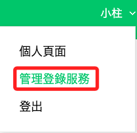
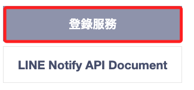
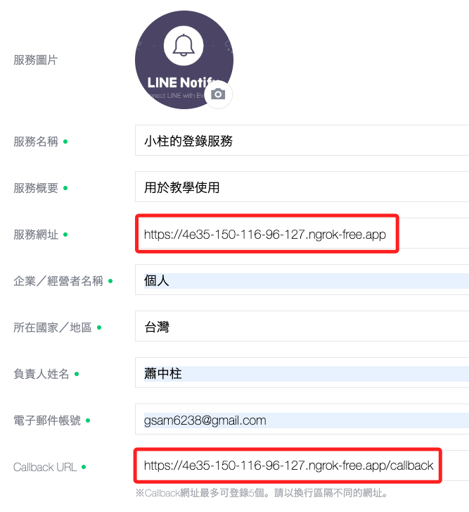
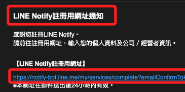
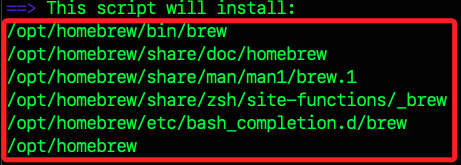
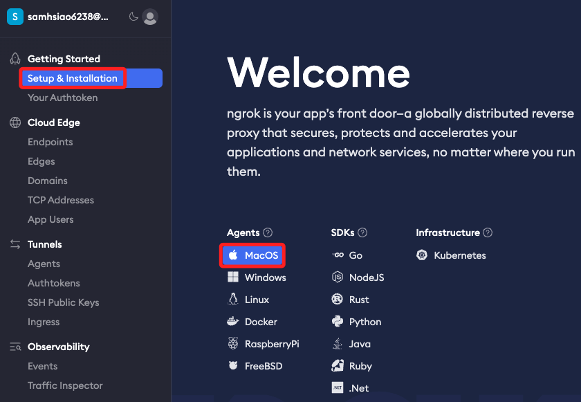
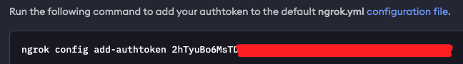
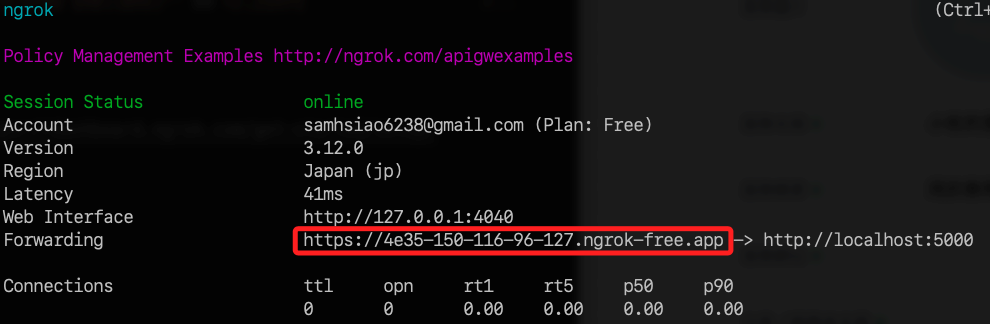

# 建立服務

<br>

## 管理登錄服務

1. 選取並點擊。

    

<br>

2. 點擊登錄服務。

    

<br>

3. 服務網址的部分，填入從 ngrok 取得的網址即可，而 `Callback URL` 則加上路由 `/callback`。

    

<br>

4. 相片部分可以任意自訂，不過要 `220x200` 以上。

    

<br>

5. 同意並前往下一步。

    

<br>

6. 接著點擊右下角 `登錄`。

    

<br>

7. 驗證信件。

    

<br>

8. 驗證完成前往服務，此即完成服務建立。

    

<br>

9. 可以看到新建的服務。

    

<br>

## 安裝 ngrok

1. 先安裝 brew

    ```bash
    /bin/bash -c "$(curl -fsSL https://raw.githubusercontent.com/Homebrew/install/HEAD/install.sh)"
    ```

<br>

2. 這是一個自動化腳本，會安裝以下項目。

    

<br>

3. 將 Homebrew 的環境變數加入到 shell 配置檔案中，若使用 zsh 的系統則是修改 `.zshrc` 文件。

    ```bash
    echo 'eval "$(/opt/homebrew/bin/brew shellenv)"' >> ~/.zshrc
    ```

<br>

## Ngrok

1. 選擇作業系統，並依據 [官網](https://dashboard.ngrok.com/get-started/setup/macos) 的指示進行。

    

<br>

2. 安裝 ngrok。

    ```bash
    brew install ngrok/ngrok/ngrok
    ```

<br>

3. 執行以下命令將 authtoken 新增到預設的 ngrok.yml 設定檔中。

    ```bash
    ngrok config add-authtoken 2hTyuB**********************
    ```

    

<br>

4. 啟動應用。

    ```bash
    ngrok http http://localhost:5000
    ```

    

<br>

___

_END_