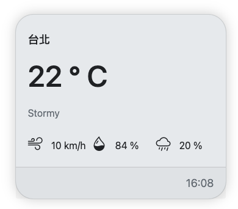
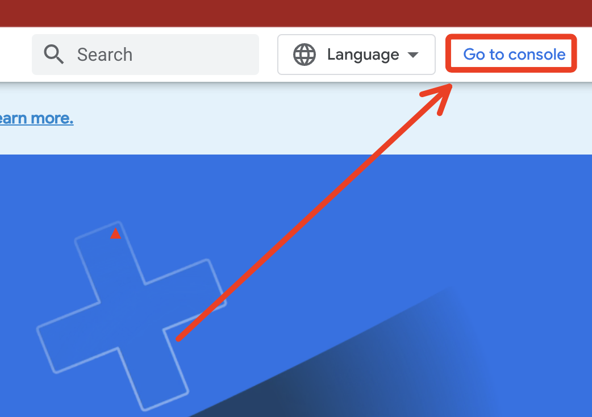
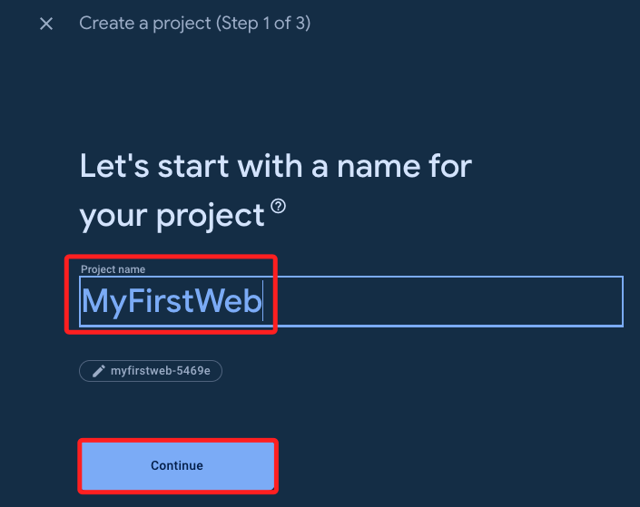
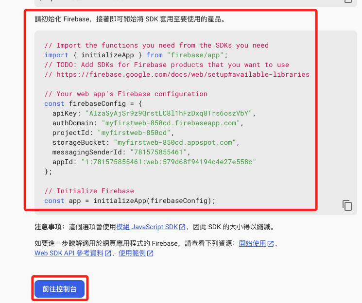
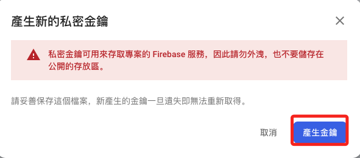
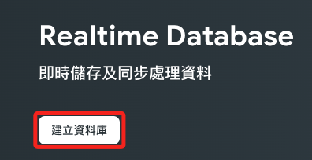

# 建立 Firebase 專案

_這是在 Firebase 主控台建立的 Google Cloud 專案，可在 [GC](https://cloud.google.com/free?utm_source=google&utm_medium=cpc&utm_campaign=japac-TW-all-zh-dr-BKWS-all-core-trial-EXA-dr-1605216&utm_content=text-ad-none-none-DEV_c-CRE_644095273672-ADGP_Hybrid%20%7C%20BKWS%20-%20EXA%20%7C%20Txt%20~%20GCP_General_core%20brand_main-KWID_43700074766895895-aud-970366092687%3Akwd-6458750523&userloc_9040379-network_g&utm_term=KW_google%20cloud&gad_source=1&gclid=CjwKCAjw7oeqBhBwEiwALyHLM6yxfxy1e1fy44bdmMAbPSBu1sJLtWigFGMS-Ye12HF5FwfpLtxOgBoCfAUQAvD_BwE&gclsrc=aw.ds&hl=zh-tw) 直接查詢_

<br>

## 完成展示



<br>

## 步驟

1. 登入 Firebase，點擊進入 `主控台 Console`

       

<br>

2. 建立專案

    

<br>

3. 輸入任意名稱、接受條款後繼續

    

<br>

4. 是否使用分析功能皆可，然後建立專案

    

<br>

5. 完成後繼續

    

<br>

6. 專案的主控台中很多應用，這裡先從 `網頁應用` 開始

    

<br>

7. 註冊應用程式，可以先不用選擇 `Hosting`。

    

<br>

8. 安裝開發工具 `Firebase JavaScript SDK`，這跟命令列工具是不同的。

    

    ```bash
    npm install firebase
    ```

<br>

9.  這段是要貼在應用中的 API 資訊，可稍後再來複製，然後往控制台。

    

<br>

10. 這時便會看到有了一個應用

    

<br>

11. 點擊專案設定

    

<br>

12. 往下滑動就可以看到剛剛的資料了，以後可以來這裡重新複製。

    

<br>

13. 切換到服務帳戶頁籤，選取 Node.js，可以產生新的私密金鑰，點擊便可下載。

    

<br>

14. 會有一些提醒，點擊產生金鑰完成下載。

    

<br>

15. 在左側建構中選取 Realtime Database

    

<br>

16. 選取過的服務會自動添加到捷徑中

    

<br>

17. 選擇建立資料庫

    

<br>

18. 選擇區域，美國新加坡皆可，然後下一步

    

<br>

19. 以鎖定模式啟動，之後還會再設定修正，選擇啟用

    

<br>

20. 切換到規則頁籤，修改兩個權限設定值為 `true`，然後點擊 `發布`

    

<br>

21. 無需在意完成時的警告，這個階段先這樣設定沒關係。

    

<br>

_至此完成初步的設定_

___

_END_