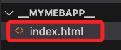
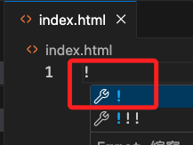
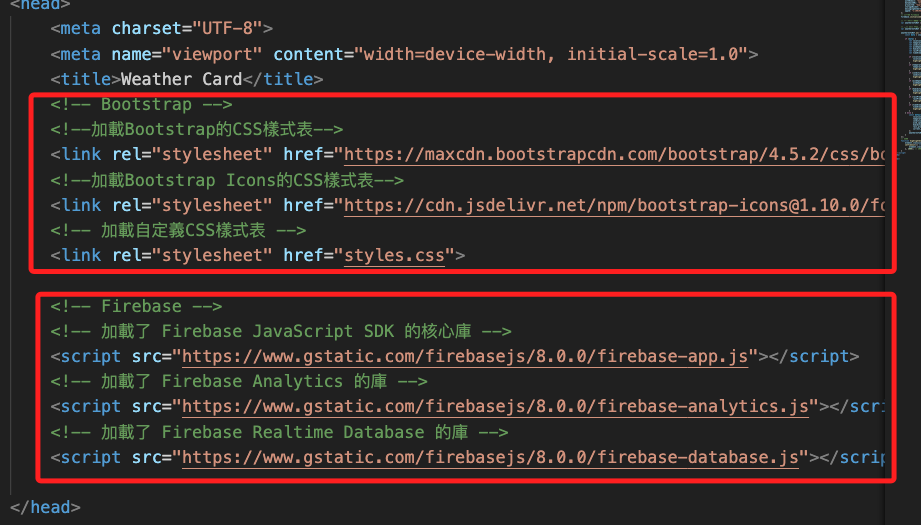
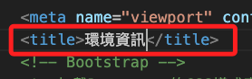
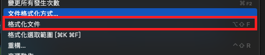
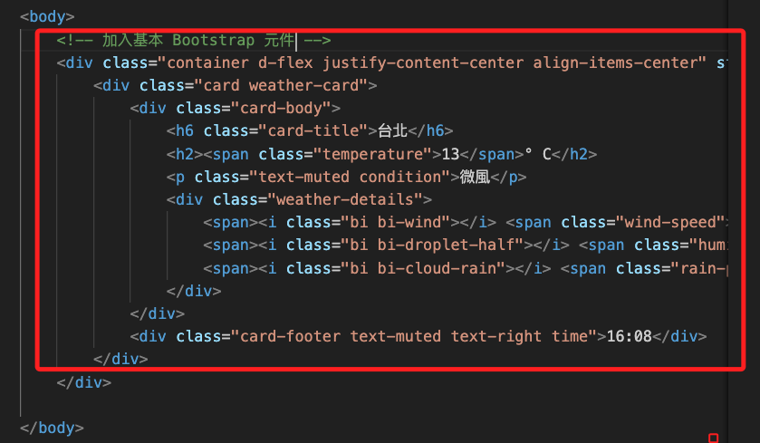
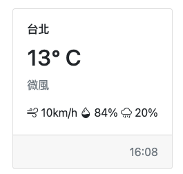
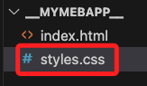
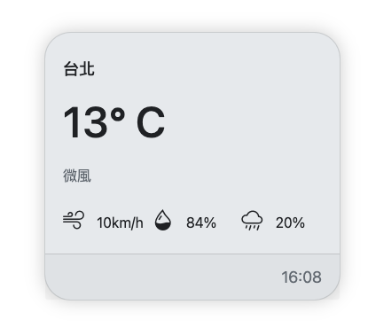

# 在本地建立 Web App

<br>

## 步驟

1. 任意資料夾，建立 `index.html`

    

<br>

2. 透過快速鍵建立網頁的初始內容

    

<br>

## 在 `head` 內

1. 因為要使用 Bootstrap，所以加載兩個 Bootstrap 樣式表，這裡使用的是 4.5.2 及 1.10.0，同學可以在官網下載更新版的樣式表。

    ```html
    <!--加載Bootstrap的CSS樣式表-->
    <link rel="stylesheet" href="https://maxcdn.bootstrapcdn.com/bootstrap/4.5.2/css/bootstrap.min.css">
    <!--加載Bootstrap Icons的CSS樣式表-->
    <link rel="stylesheet" href="https://cdn.jsdelivr.net/npm/bootstrap-icons@1.10.0/font/bootstrap-icons.css">
    <!-- 加載自定義CSS樣式表 -->
    <link rel="stylesheet" href="styles.css">
    ```

<br>

2. 因為要使用 Firebase，這裡加載了三個 Firebase JavaScript SDK 腳本。

    ```html
    <!-- Firebase -->
    <!-- 加載了 Firebase JavaScript SDK 的核心庫 -->
    <script src="https://www.gstatic.com/firebasejs/8.0.0/firebase-app.js"></script>
    <!-- 加載了 Firebase Analytics 的庫 -->
    <script src="https://www.gstatic.com/firebasejs/8.0.0/firebase-analytics.js"></script>
    <!-- 加載了 Firebase Realtime Database 的庫 -->
    <script src="https://www.gstatic.com/firebasejs/8.0.0/firebase-database.js"></script>
    ```

<br>

3. 完成時。

    

<br>

4. 可自定義網頁頁籤 Title。

    

<br>

5. `Html` 文件隨意貼上即可，貼上後全選，用快速鍵或滑鼠選擇格式化文件即可。

    

<br>

6. 在 `body` 區內加入基本 Bootstrap 元件。

    

    ```html
    <!-- 加入基本 Bootstrap 元件 -->
    <div class="container d-flex justify-content-center align-items-center" style="height: 100vh;">
        <div class="card weather-card">
            <div class="card-body">
                <h6 class="card-title">台北</h6>
                <h2><span class="temperature">13</span>° C</h2>
                <p class="text-muted condition">微風</p>
                <div class="weather-details">
                    <span><i class="bi bi-wind"></i> <span class="wind-speed">10</span>km/h</span>
                    <span><i class="bi bi-droplet-half"></i> <span class="humidity">84</span>%</span>
                    <span><i class="bi bi-cloud-rain"></i> <span class="rain-probability">20</span>%</span>
                </div>
            </div>
            <div class="card-footer text-muted text-right time">16:08</div>
        </div>
    </div>
    ```

<br>

7. 這時還沒實作 styles.css 已經可看出基本的架構。

    

<br>

8. 建立一個 `styles.css`

    

<br>

9. 這裡都是設置一些畫面的佈置，可直接貼上。

    ```css
    .weather-card {
        max-width: 400px;
        background-color: #E9ECEF;
        border-radius: 30px;
        box-shadow: 0px 0px 20px rgba(0, 0, 0, 0.2);
    }

    .weather-card h6 {
        font-size: 18px;
        margin-top: 10px;
    }

    .weather-card h2 {
        font-size: 48px;
        margin: 20px 0;
    }

    .weather-card .weather-details {
        display: grid;
        grid-template-columns: repeat(3, 1fr);
        gap: 10px;
        margin-top: 20px;
    }

    .weather-card .weather-details div {
        display: flex;
        align-items: center;
    }

    .weather-card .weather-details i {
        margin-right: 10px;
        font-size: 24px;
    }

    .weather-card .card-footer {
        font-size: 18px;
    }

    /* 高亮 */
    .highlighted {
        font-weight: bold;
        color: red;
    }
    ```

<br>

10. 這時畫面看起來更優化一些。

    

<br>

_至此已完成畫面的初步配置，下一步要進行 Javascript 的撰寫_

___

_END_